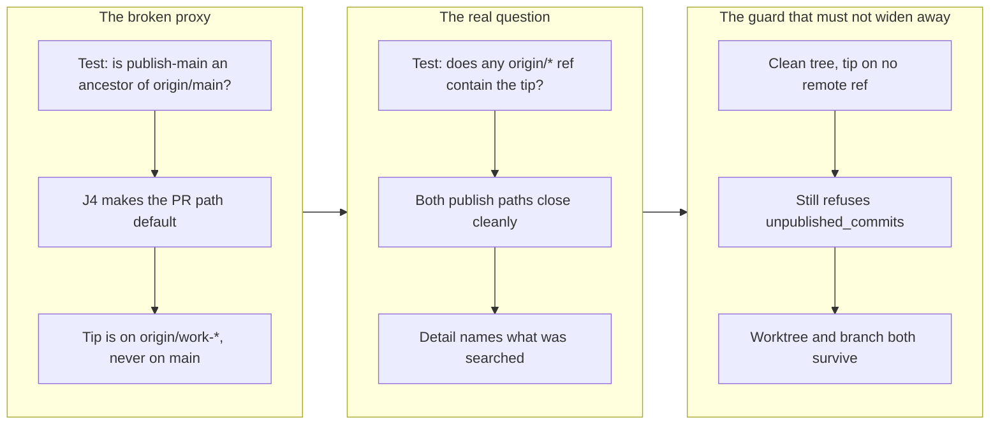

## 1. Overview

`close-publish-tree.sh` asked whether the publish tree's commits had reached `origin/main`. Since decision J4 made `publish-tree-pr.sh` the default publication path, they never have at close time — a PR-published commit sits on `origin/work-*` until a human merges it, which J4 explicitly says has no deadline. So the documented two-line publish-then-close sequence used by `/ticket`, `/mission`, `/fb` and `/propose` always ended in a refusal, and every run left a `.publish/` worktree and a `publish-main` branch behind. The predicate now asks the question the caller actually depends on — *is this tip pushed anywhere?* — while the refusal it was written for still bites.

**Highlights:**

1. Base-only ancestry becomes reachability from any `origin/*` remote-tracking ref, so both publish paths close cleanly and neither script needs state threaded in from the other.
2. The guard survives intact: a clean tree whose tip no remote ref contains still refuses `unpublished_commits` and removes nothing — the assertion this change is judged on.
3. The refusal `detail` now names what it looked for, instead of reporting "not on origin/main" to an operator who just watched a PR publish succeed.

## 2. Motivation

The refusal's *intent* was never wrong. It exists so that a genuinely unpublished commit — the shape a `diverged` publish leaves behind — is never destroyed by a bookkeeping call, and that case is the dangerous one precisely because the tree looks tidy. What was wrong was its test: it checked "did this reach the base?" as a proxy for "is this safe to delete?", and the proxy held only while every publish landed on the base.

J4 broke the proxy the day it made the PR path the default, and the failure mode compounds. A refusal that fires on the happy path is worse than untidy — it teaches every caller that this script's failures are noise, so the one refusal that actually protects an artifact gets ignored along with the rest. Meanwhile `open-publish-tree.sh` resets `publish-main` on every open, so the leftover trees were not lost work, but they were the situation in which a second artifact could ride into an unrelated publish if a caller reused a tree without reopening. Fixing the close removes that situation rather than documenting around it.

## 3. Changes

One predicate changed and the documentation around it was reconciled. `git branch --remotes --contains` answers the reachability question directly, which is why no branch name has to be passed from `publish-tree-pr.sh` into `close-publish-tree.sh`: the two scripts stay independently callable, and a tree published in one session still closes correctly in a later one. The test suite gained the case that was missing — the two publish paths are a two-case matrix, and covering only the direct one is exactly what let the defect ship.

### 3-1. close-publish-tree.sh refuses to close after the standard PR publish path ([19fd764b](https://github.com/qmu/workaholic/commit/19fd764b))

Replaced the `origin/<base>` ancestry test with containment in any `origin/*` remote-tracking ref, sharpened the refusal `detail` to name the tip and what was searched, and recorded in `branching/SKILL.md` both the new predicate's reasoning and the fact that a successful close after a PR publish leaves the artifact on the remote `work-*` branch — the intended end state, since the tree is disposable and the branch is the artifact.

## 4. Outcome

The documented lifecycle — open → write → publish → close — now completes on both destinations. `publish-tree-commit.sh`'s behavior is byte-for-byte unchanged, `dirty_publish_tree` still refuses first and ahead of everything else, closing an already-gone tree is still idempotent, and the `unpublished_commits` refusal still protects the only state it was ever meant to protect.

Callers needed no correction. `commands/ticket.md`, `commands/mission.md` and `create-ticket/SKILL.md` document the sequence without conditioning the close on the publish's success, and `commands/propose.md` explicitly says to run it either way "because it refuses rather than destroying recoverable state" — which is now true on every path rather than only on one.

## 5. Historical Analysis

This is the second defect in as many days traceable to J4 changing a destination that something downstream had quietly assumed. J4's own record states the cost it accepted — an artifact is not visible to a runner until its PR merges, so "published" and "queued" became different states — and the decision was careful about the readers it knew about, notably making the claim scan key on a `Claim <unit-id>` commit subject rather than on the branch name so a publication branch is never mistaken for a claim. `close-publish-tree.sh` was the reader nobody enumerated, because its dependency on the destination was buried inside a predicate rather than stated as an assumption.

The repository's own convention is what makes that recoverable: the script's header comment already explained *why* the refusal existed, so distinguishing "the intent is right" from "the test is wrong" took reading rather than archaeology. The same pattern held on the sibling branch merged an hour earlier, where an existing header comment's reasoning decided the shape of a new field.

## 6. Concerns

### A stale remote-tracking ref could make an unpublished tip look published

- **Severity:** low
- **Description:** The predicate reads local remote-tracking refs, so a long-lived stale `origin/*` ref that still contains the tip would satisfy it even if the branch no longer exists on the remote (see [19fd764b](https://github.com/qmu/workaholic/commit/19fd764b) in `plugins/workaholic/skills/branching/scripts/close-publish-tree.sh`). The risk is bounded in practice because `publish-tree-pr.sh` pushes immediately before the close, so the ref being relied on is the one it just wrote — but a caller that opens, publishes, and closes across sessions without fetching sits outside that bound.
- **How to Fix:** If it ever bites, fetch with `--prune` before the containment test, so deleted remote branches stop counting as places the artifact lives. This was left out deliberately: it turns a pure local read into a network operation on the teardown path, which is the wrong trade for a bookkeeping call that must work offline.

### The live end-to-end confirmation the ticket specified could not run as written

- **Severity:** low
- **Description:** The ticket asked for one live in-session run of `publish-tree-pr.sh` → `close-publish-tree.sh` on this repository, reasoning that the stubbed suite cannot demonstrate the real path. In this sandbox `gh` is not installed, and a real run would push a throwaway `work-*` branch to the shared remote. The substituted check pointed `publish-main` at this claim branch's pushed tip against the real origin and ran the real script: `merge-base --is-ancestor publish-main origin/main` was **NO**, `git branch --remotes --contains` returned `origin/work-20260731-201257`, and close returned `{"ok": true, "branch_deleted": true}` — the exact state the old predicate refused.
- **How to Fix:** Nothing is owed if that substitution is accepted as equivalent; it exercised the same predicate against a real remote in the real defect state. A developer who wants the literal sequence can run it once from a checkout with `gh` installed and let the throwaway branch be closed unmerged.

## 7. Successful Development Patterns

- **Separating a guard's intent from its test before touching either.** The header comment stated why `unpublished_commits` existed, which made the change a narrow question — is this predicate expressing that intent? — rather than a judgment call about whether to keep the refusal. Guards written with their reasoning attached can be corrected; guards written as bare conditions get deleted or worked around.
- **Proving a widened safety predicate still refuses, in the same commit that widens it.** Every acceptance bullet became one hermetic case, but the never-published case is the one the Gate named, because the failure mode of this class of fix is trading a recoverable annoyance for a destroyed artifact. The dirty-tree and idempotency cases riding along means the whole refusal ladder is now pinned, not just the rung that changed.
- **Substituting an equivalent live check rather than skipping or faking a blocked one.** The specified confirmation was unavailable for two independent reasons; reconstructing the defect state from a branch this session had already pushed exercised the real script against the real remote without littering it, and the substitution is recorded with its evidence so a reader can judge the equivalence rather than take it on trust.
- **Answering a cross-script question without threading state between the scripts.** `git branch --remotes --contains` let the close stay ignorant of which path published, which is what keeps the two independently callable across sessions — passing the branch name from the publisher would have been the obvious fix and would have coupled them permanently.

## 8. Release Preparation

**Verdict**: Ready for release

### 8-1. Concerns

- None — changes are safe for release. The change widens one predicate in a teardown script; the state it newly accepts is one where the artifact is provably on the remote, and the state it still refuses is unchanged and directly asserted.

### 8-2. Pre-release Instructions

- None — standard release process applies. `outputs/workflows` is regenerated and committed (the branching scripts ship into four skill bundles), so the `Outputs Freshness` CI gate has nothing to flag.

### 8-3. Post-release Instructions

- None. The next `/ticket`, `/mission`, `/fb` or `/propose` run closes its publish tree instead of leaving one behind. Any `.publish/` directory and `publish-main` branch left by earlier runs can be closed by running `close-publish-tree.sh` once — it will now succeed if the artifact was published, and correctly refuse if it never was.

## 9. Notes

The deferred-concern judge phase was skipped deliberately: the stream's open concerns are unrelated to this diff, so every verdict would be `still_active`, and `still_active` verdicts write nothing — skipping is byte-identical to running it.

Verification: `node scripts/test-workflow-scripts.mjs` green at 1711 assertions (14 new), `build.mjs` + `verify.mjs` + `validate-metadata.mjs` clean with no residual `outputs/` diff, `layout-doctor.sh .` reporting `conforming: true`, `scan-branch-safety.sh` reporting `{"verdict": "pass", "findings": []}`, and the live real-origin check recorded in section 6.
