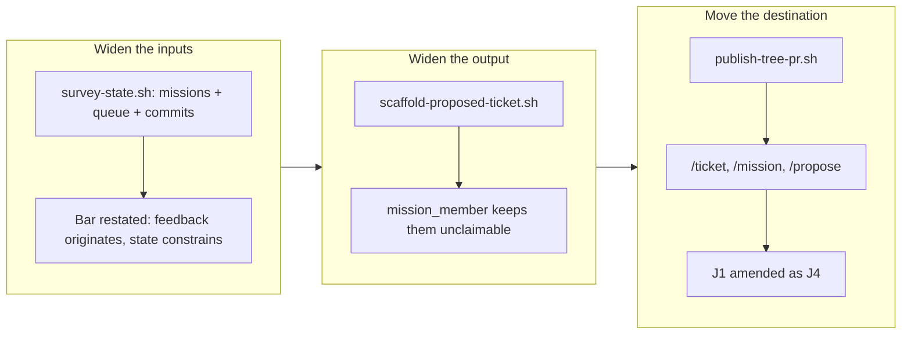

## 1. Overview

`/propose` could read one thing — feedback records — and could write to one place — `main`, directly. Neither served the question it exists to answer. This branch widens what the batch sees, makes a proposal carry the tickets it implies, and moves every artifact writer onto a `work-*` branch behind a pull request, so the merge becomes the event that can be announced.

**Highlights:**

1. The batch now reads the missions, the todo queue, and the commits since the cursor alongside the feedback window — and the judgment bar is restated so those new inputs can only *constrain* a proposal, never originate one.
2. A proposal is a draft mission **and its ordered ticket set**, which needed no new gate: `plan-units.sh` already makes any mission-related ticket unclaimable.
3. `publish-tree-pr.sh` lands artifacts on a branch behind a PR, and `/ticket`, `/mission`, and `/propose` all use it. Decision J1 is amended in writing rather than silently contradicted.

## 2. Motivation

The loop only advances when a human supplies direction, and a batch that can convert only direction already written as feedback cannot propose the next step from the state of the work itself. Separately, an artifact pushed straight to `main` produces no merge event, so nothing could announce it — the standard is that every workaholic artifact reaches `main` through a *merged* pull request.

## 3. Changes

### 3-1. Make /propose survey the whole repository state and land its proposal on a work branch ([5b2b2a7b](https://github.com/qmu/workaholic/commit/5b2b2a7b))

Three new scripts and the documentation that governs them. `survey-state.sh` composes the existing mission and queue readers rather than parsing frontmatter itself. `scaffold-proposed-ticket.sh` writes a proposed ticket carrying its `mission:` relation, refusing a mission that does not resolve. `publish-tree-pr.sh` pushes `publish-main:refs/heads/work-*` and opens the PR, leaving the publish tree's isolation property untouched. `/ticket` and `/mission` were switched to it in the same change, and `CLAUDE.md`'s J1 statement now records the amendment and what it costs.

## 4. Outcome

The batch can now propose from the state of the work, and every artifact writer produces something reviewable. The one behavioral cost is stated plainly in the decision record: an artifact is no longer visible to a runner the moment it is written — *published* and *queued* are now different states, and each source reports which one it reached.

## 5. Historical Analysis

Decision J1 (2026-07-30) made artifact creation publish to `main` and cut no ref, for immediate visibility to every runner and fresh clone. That motive was real and is now deliberately traded away, one day later, for reviewability and an announceable merge. The trade is recorded as J4 with both motives named, because a future reader finding only the new rule would not know what was given up.

## 6. Concerns

### The archive commit exceeds the per-commit changed-lines ceiling

- **Severity:** moderate
- **Description:** The branch-safety scan reports `too-large-commit` — 685 non-generated changed lines against a 500 ceiling — on [5b2b2a7b](https://github.com/qmu/workaholic/commit/5b2b2a7b). The `outputs/**` rebuild is correctly exempted, so the overage is genuine source: three new scripts totalling ~430 lines, plus documentation across five files and two new test blocks. The route is unaffected (this unit is `review`, so it stops at a PR either way), but the commit is not the comparable throughput unit the rule intends.
- **How to Fix:** `archive.sh` produces exactly one commit per ticket, so a ticket this size cannot satisfy the ceiling by construction. Either the ticket is decomposed at creation time — the scripts, the docs, and the generalization to `/ticket`//`mission` are three plausible tickets — or the ceiling acknowledges an archive commit's floor. The active mission *Make the per-commit changed-lines ceiling a rule that holds* is where that decision belongs.

### Nothing yet watches for the merge event the standard depends on

- **Severity:** moderate
- **Description:** The whole reason for moving artifacts onto pull requests is that the merge can be announced, but `notify-slack.sh` announces only when called, and a human merging in the GitHub UI calls nothing (`plugins/workaholic/skills/propose/scripts/notify-slack.sh`). The standard's stated benefit is currently unimplemented.
- **How to Fix:** A GitHub Action on `pull_request: closed` with `merged == true`, or routing every merge through `/ship` so the notifier fires from a path the project controls.

### A publication branch is a work-* branch that no claim owns

- **Severity:** low
- **Description:** Publication branches now share the `work-*` prefix with claim branches. They are correctly invisible to the claim scan — it keys on a `Claim <unit-id>` commit subject, which is pinned by a new test — but a human reading `git branch -r` can no longer tell a claim from a publication by name (`plugins/workaholic/skills/drive/scripts/lib/claims.sh`).
- **How to Fix:** If this becomes confusing in practice, `list-claims.sh` could grow a companion that lists unmerged publication branches. Not worth building before the confusion is observed.

### An unmerged proposal blocks its own mission's replan

- **Severity:** low
- **Description:** `/mission` replan works against the mission as published on `main`, so a mission still sitting in an unmerged pull request cannot be replanned. The command now says so, but the constraint is new — under J1 the mission was always on `main` by the time anyone could reference it (`plugins/workaholic/commands/mission.md`).
- **How to Fix:** Merge the proposal's PR first. If that friction proves common, replan could resolve a mission from an open PR's branch, but that is a real design question rather than an oversight.

## 7. Successful Development Patterns

- Checking whether a new requirement conflicts with a mechanism or only with its configuration. The publish tree looked like an obstacle to the branch requirement; it turned out to solve the hard half already, and only the push refspec had to change. The byte-identical-checkout test passes unchanged on the new path, which is the evidence that the isolation property survived.
- Verifying the safety property live before committing to the design. The claim that proposed tickets are unclaimable was checked by running `plan-units.sh` against a real draft mission and reading `mission_member` back, before any of the ticket-emission code was written.
- Letting a failing test state the new contract rather than deleting it. The `/ticket` publish-failure assertion pinned the old wording; it was rewritten to assert something stronger — that `pr_failed` (pushed, no PR) is reported differently from an unpublished failure — which is exactly the distinction that prevents a duplicate artifact.

## 8. Release Preparation

**Verdict**: Ready for release

### 8-1. Concerns

- The oversized archive commit above is a rule violation the project already has a mission open about; it does not affect runtime behavior.

### 8-2. Pre-release Instructions

- None — no version bump was taken; the change alters plugin behavior but not the manifest set, and a bump is a separate deliberate act.

### 8-3. Post-release Instructions

- Consumers of `/ticket`, `/mission`, and `/propose` should expect a pull request rather than an immediate `main` commit. A ticket is not claimable until its PR merges.

## 9. Notes

`outputs/` was rebuilt (`build.mjs`), so the generated bundle carries the new scripts. Verification: `node scripts/test-workflow-scripts.mjs` 1555 passed / 0 failed, `verify.mjs` and `validate-metadata.mjs` clean, `posix-lint` conforming, `layout-doctor` `conforming: true` (its three advisories are pre-existing legacy `trips/` directories).
