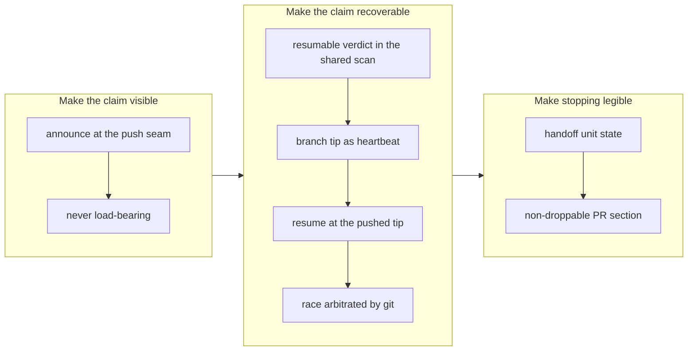

# Make a claim survivable: announce it, resume it, hand it off

## 1. Overview

The claim protocol could take work but never give it back. A claim was published within
seconds and then went silent until its pull request appeared tens of minutes later; if
the run behind it died, the unit left every future survey permanently, and a run that
knowingly stopped half-way had nowhere to say so. This branch closes all three gaps at
the one seam they share — the claim — so a unit is visible when it starts, recoverable
when its run dies, and legible when its run stops on purpose.

**Highlights:**

1. Claiming announces: one Slack line at push time, never load-bearing.
2. A dropped claim of your own is offered back as `resumable[]` and taken over at the pushed branch tip.
3. `handoff` becomes a unit state, written into a PR section that bounding never drops.
4. The branch tip is the heartbeat — no lock file, no server, nothing that leaks when a runner dies.
5. A silent TSV field-collapse bug, found en route, that would have re-offered already-claimed tickets.

## 2. Motivation

All three tickets were measured on 2026-08-01 while designing an hourly unattended
runner, and they are the same defect seen from three angles: **the claim was a one-way
door**. Publishing it told git everything and told a person nothing. Losing the runner
behind it stranded the work, because `plan-units.sh` dropped every claimed unit and
`claim.sh` refused it — so the design record's promise that "the next tick re-claims and
resumes from what is pushed" (`docs/loop-engineering-workflow.md` I5) was, in code,
false. And stopping deliberately had no vocabulary at all: a half-driven unit was
neither `blocked` (nothing further possible) nor a `review` unit at a PR (work done,
awaiting a look), so it was reported as prose in the run report.

The asymmetry that made this urgent is the cloud runner. A local runner's `.worktrees/`
survives, so a person can always `git checkout` their way out. A cloud run's worktree
dies with its sandbox: the pushed branch and its PR are the entire inheritance, and
until this branch nothing routed anybody to either.

## 3. Changes

The work ran at one seam in three passes. First the claim learned to speak, then it
learned to be taken back, then the act of stopping got a name. Each pass added its
hermetic cases before moving on, and the middle pass is where the interesting failure
was found: an empty field in the shared claim TSV silently collapsed and shifted the
survey's parse, which would have re-offered tickets a claim already held.

### 3-1. Announce a claim when it is pushed ([eca5fd9d](https://github.com/qmu/workaholic/commit/eca5fd9d))

`claim.sh` now posts one Slack line — unit id, branch, member count — after its push
succeeds, and reports `announced` / `announce_reason` in its JSON. The notice is
best-effort by construction: a missing token, an unreachable Slack, or a notifier that
exits non-zero all leave the claim intact.

### 3-2. Resume a claimed but unfinished unit ([1472f42c](https://github.com/qmu/workaholic/commit/1472f42c))

The shared claim scan derives a `resumable` verdict on every row; `plan-units.sh` offers
those units in a new `resumable[]` group and splits the old `claimed` exclusion into
`claimed_active` / `claimed_by_other` / `claimed_resumable`; `claim.sh resume <unit-id>`
takes one over at the **pushed branch tip** so the earlier run's commits and archived
tickets survive. Liveness is the branch tip, refreshed by `heartbeat.sh` (an empty
commit) and by any ordinary work commit.

### 3-3. Make handoff a first-class terminal state ([7349410d](https://github.com/qmu/workaholic/commit/7349410d))

`handoff` joins the unit classification with a boundary test that keeps it distinct from
`blocked` and from a `review` unit at a PR, and lands on the `pending` side of the
terminal token. The story gains a `## Handoff` section — done / not done / next step /
attempted command with raw output — written only for a handoff unit, placed first, and
explicitly retained by `shrink-pr-body.sh`.

## 4. Outcome

A claim is now a two-way door. It announces itself at the moment it becomes true, it can
be handed back to a later run of the same identity once its heartbeat lapses, and a run
that stops on purpose records where it stopped in the artifact a person actually opens.
Decision I5 in `docs/loop-engineering-workflow.md` is marked implemented, with the note
that it was aspirational until now — the record and the code had disagreed for days.

The three mechanisms are deliberately one story: a `handoff` unit is exactly the shape a
later run resumes, so the runbook states handoff and resumption in the same place rather
than as two recovery narratives that would drift apart.

## 5. Historical Analysis

This branch continues the pattern the claim protocol has followed since G3: **the
repository is the coordination medium, and every new signal must ride an artifact that
already exists**. Staleness reporting (2026-07) established that a claim is never
auto-broken because reclaiming can silently duplicate a colleague's work; resumption is
the narrower case that survives that objection — your own claim, heartbeat lapsed.

The rename-following fix of 2026-07-30 is the closest ancestor of this branch's field
-collapse bug: both were silent parse errors in the same shared scan that caused the
survey to offer work already in flight, and both were caught by an assertion about
*artifacts* rather than by anything failing loudly. That is now two occurrences of the
same failure mode in one file.

## 6. Concerns

### One commit exceeds the per-commit changed-lines ceiling

- **Severity:** moderate
- **Description:** The resume commit ([1472f42c](https://github.com/qmu/workaholic/commit/1472f42c)) carries 685 non-generated changed lines against a 500-line ceiling, so the branch-safety scan returns `block` with an overridable `too-large-commit` finding. The ticket is one coherent mechanism spanning the scan, the survey, the reader, the writer, the worktree creator and their tests; splitting it would either break one-ticket-one-commit or produce a commit whose tree cannot work (`plugins/workaholic/skills/drive/scripts/`).
- **How to Fix:** Either accept that a mechanism-wide ticket is legitimately over the ceiling and record the exemption criteria, or require such tickets to be decomposed at `/ticket` time rather than at drive time. The active mission *Make the per-commit changed-lines ceiling a rule that holds* is the right home for the ruling.

### A shared identity across people would let one runner take another's claims

- **Severity:** moderate
- **Description:** Resumption is scoped to the claim commit's author matching `git config user.email`. That is the intended reading of "the runner is `a@qmu.jp`" — a developer's own runner inherits their claims — but it means configuring one identity across two *people* silently grants each the other's in-flight work (`plugins/workaholic/skills/drive/scripts/lib/claims.sh`).
- **How to Fix:** Stated in `drive/SKILL.md`'s *Claims* section as a warning. If shared runners ever become real, the claim would need an explicit owner field rather than inferring it from the commit author.

### The TSV row has no structural guard against a future empty field

- **Severity:** moderate
- **Description:** A tab is an IFS whitespace character, so `read` collapses runs of tabs; an empty middle field vanishes and shifts every later field. This bit once already (an empty `resume_reason` handed `plan-units.sh` the artifact list in the reason slot and an empty artifact list) and the rule is now prose in `lib/claims.sh`, not a check (`plugins/workaholic/skills/drive/scripts/lib/claims.sh`).
- **How to Fix:** Add a hermetic assertion that every emitted row has exactly the expected field count with no empty field except the last, so a future field addition fails loudly instead of silently mis-parsing.

### Handoff retention narrows what the PR-body bounder can shed

- **Severity:** low
- **Description:** With the Handoff block exempt from shedding, a body carrying both a very large concern corpus and a handoff falls back to plain truncation. That terminates and stays under the limit, but the shedding order is worth re-checking if a third protected section is ever added (`plugins/workaholic/skills/report/scripts/shrink-pr-body.sh`).
- **How to Fix:** If a third protected section appears, replace the lift-bound-restore with an explicit priority list rather than layering another special case.

## 7. Successful Development Patterns

- Assert a rule on the path where its truth is **not** already implied by the layout. Placing Handoff first makes head-truncation preserve it by accident; the test that earns its keep is the one forcing the hard-truncation path with an oversized section 1, because the obvious test passes on positional luck alone.
- When a check-then-act spans a re-read, pin the state the decision was made on. The takeover race looked closed by the non-fast-forward push, but the worktree creator re-fetches — so a loser would have checked out the winner's tip and pushed cleanly. Comparing the created HEAD against the observed tip is what actually closes it.
- Reach for the artifact that already has a lifecycle. Making the branch tip itself the heartbeat satisfied "no lock file, no server, nothing that leaks" for free, because the merge or release that cleans up a claim cleans up its heartbeat too — where a custom ref or a heartbeat branch would each have added a new cleanup obligation.
- Batch tickets that edit the same seam. These three could not have been separate PRs: `claim.sh` and `drive/SKILL.md` each carry changes from two or three of them, and the handoff wording depends on resumption existing.

## 8. Release Preparation

**Verdict**: Ready for release

### 8-1. Concerns

- The branch-safety scan returns `block` on an overridable `too-large-commit` finding for the resume commit. No `secret` and no `leak` findings.

### 8-2. Pre-release Instructions

- None - standard release process applies. Version is bumped to v1.0.114.

### 8-3. Post-release Instructions

- Runners that want claim notices need `SLACK_BOT_TOKEN` and `WORKAHOLIC_SLACK_CHANNEL`; without them the notice is a recorded no-op and nothing else changes.
- `WORKAHOLIC_CLAIM_HEARTBEAT_STALE_MINUTES` defaults to 30. Keep it well under the interval you want a dropped unit recovered within.

## 9. Notes

`docs/drive-loop-runbook.md` §2 now documents the heartbeat knob directly beside the
stale-hours knob, because the two look alike and do opposite things: staleness is
reported and never acted on, resumability acts and is narrower by exactly the margin
that makes it safe.
