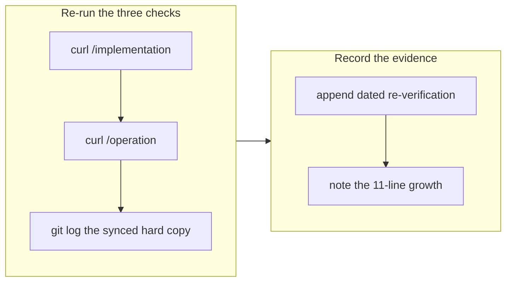

# Re-verify the containerization policy blocker

## 1. Overview

The long-running-server containerization ticket has been blocked since 2026-07-26 on an
external dependency: the canonical ruling must be published as a qmu.co.jp article and
synced down, not authored into the local hard copies. This branch re-runs the three
checks that establish the block and records the raw output on the ticket, so the block
stays a finding rather than decaying into a forecast nobody re-tests.

**Highlights:**

1. All three checks re-run; the blocker is unchanged and still external.
2. The published article grew 685 → 696 lines while still carrying none of the ruling.
3. The ticket stays queued, not abandoned; no plugin behavior changes.

## 2. Motivation

`/drive`'s failure contract is explicit that "blocked is a finding, not a forecast":
before recording it, run the thing and record what came back. The ticket itself says a
future driver should re-run its two `curl` checks before assuming the block holds — it
costs three commands. Taking that at face value and skipping the check would be exactly
the abstract verdict the contract forbids.

## 3. Changes

One pass: run the checks, read the output, write down what was actually observed
including the one number that changed.

### 3-1. Re-verify the containerization policy blocker ([30933526](https://github.com/qmu/workaholic/commit/30933526))

Appended a dated re-verification section to the ticket with the raw results:
`https://qmu.co.jp/implementation` → `200`, 696 lines, zero matches for the eight ruling
terms; `https://qmu.co.jp/operation` → `404`; and the nearest synced hard copy,
`implementation/policies/containerization.md`, still last touched by `513cd1d3`
(2026-06-17) with zero matches for the carve-out terms.

## 4. Outcome

The ticket's outcome is **blocked** — a genuinely external blocker under the failure
contract, requiring a named human's professional judgement that no local attempt can
produce. It stays queued rather than abandoned.

The one finding worth having is the line count: the published article set grew by 11
lines between 2026-07-30 and 2026-08-01 while still carrying none of the ruling. That
distinguishes a live, maintained page with a real content gap from a dead endpoint —
the difference between waiting and escalating — which a bare "still 200, still zero
matches" would not have shown.

## 5. Historical Analysis

This is the third recorded check of the same blocker (2026-07-26 developer ruling,
2026-07-30 re-verification, now 2026-08-01). The mirror model is what makes it external:
the operation policies here are English hard copies of qmu.co.jp articles refreshed by a
standards-sync controller, so authoring the ruling locally would be clobbered by the
next sync and would carry a `source:` link to an article that does not exist. That path
was considered and rejected in the 2026-07-26 ruling and should not be re-litigated.

## 6. Concerns

### The per-commit size rule counts a catch-up merge commit as authored work

- **Severity:** moderate
- **Description:** This branch changes ten lines of one ticket body, yet the branch-safety scan returns `block`. The finding is `too-large-commit` on `e129488f` — the *catch-up merge* that `/ship` itself performs to reconcile with `main`. A merge commit's changed lines against its first parent are the whole of what it merges, so any branch that catches up with a busy `main` inherits a size block for work it did not author, and the noisier `main` is the likelier it fires (`plugins/workaholic/skills/release-scan/scripts/scan-branch-safety.sh`).
- **How to Fix:** Exempt commits with more than one parent from the `too-large-commit` rule, the way the rule already exempts generated and lockfile rows. A merge commit authors nothing; its content is measured on the commits it brings in, where the ceiling already applies. The active mission *Make the per-commit changed-lines ceiling a rule that holds* is the right home for the change.

### A blocked ticket with no owner outside this repository re-costs every drive

- **Severity:** low
- **Description:** The ticket is unimplementable here and stays in the queue, so every `/drive` that surveys this backlog picks it up, re-runs the checks, and records the same answer. Three commands is cheap, but the pattern has no termination condition and no named owner for the external action (`.workaholic/tickets/todo/a-qmu-jp/20260724094304-containerize-long-running-servers-policy.md`).
- **How to Fix:** Either name the person responsible for publishing the qmu.co.jp article on the ticket, or move it to the developer-curated icebox until the article exists — the icebox is exactly the place for work the project has decided to defer, and promotion back is a developer act.

## 7. Successful Development Patterns

- Re-running a documented blocker's own checks costs almost nothing and occasionally changes the picture. Here it produced the article's line-count delta, which is the single fact distinguishing "the source of truth is alive and the ruling simply is not written" from "the endpoint is dead" — and the two call for different escalations.
- Recording raw command output rather than a verdict makes the next driver's decision cheap: they can compare numbers instead of re-deriving the whole situation.

## 8. Release Preparation

**Verdict**: Ready for release

### 8-1. Concerns

- The branch-safety scan returns `block` on an overridable `too-large-commit` finding against the **catch-up merge commit**, not against any authored change (see section 6). No `secret` and no `leak` findings. The branch itself touches one queued ticket's body and no plugin code.

### 8-2. Pre-release Instructions

- None - standard release process applies.

### 8-3. Post-release Instructions

- None - no special post-release actions needed.

## 9. Notes

The next action remains outside this repository: publish the canonical qmu.co.jp article
stating which long-running / traffic-serving server classes must run inside a container
and the loopback-only, ephemeral developer-preview carve-out.
