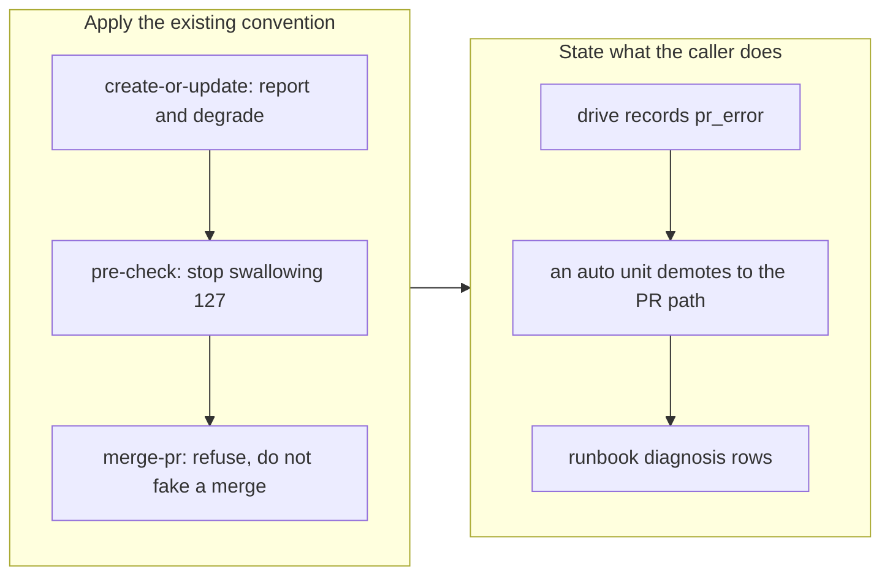

# Degrade the PR seams when `gh` is absent

## 1. Overview

The hourly unattended runner works in a Claude-Code-on-the-web container that has no
GitHub CLI. Six scripts in the plugin shell out to `gh`; three already guarded and
degraded, three did not — and one of those three is `/drive` step 5, which died at
exit 127 **after** the branch was already pushed. This branch applies the convention the
repository had already settled to the three that never adopted it.

**Highlights:**

1. `create-or-update.sh`, `pre-check.sh` and `merge-pr.sh` now report `gh_unavailable` by name.
2. `pre-check.sh` stops conflating "no GitHub CLI" with "this branch has no PR" — the dangerous variant, because it *succeeded*.
3. The read seams degrade to exit 0; the merge seam still refuses. That asymmetry is asserted, not incidental.
4. The tests remove `gh` from `PATH` rather than stubbing it, because absence is what the runner meets.

## 2. Motivation

Observed on 2026-07-31 while a cloud run resumed a unit: the work was complete and
pushed, and then the step that publishes it as a pull request exited 127 with
`gh: command not found`. A seam that only works on a developer's laptop is not a seam
the unattended loop can depend on, and this is the loop's own critical path — `/drive`
steps 5 and 6, `/ticket` and `/mission`'s publish-tree PR, and all of `/propose`.

The repository had already solved the shape of this problem twice: the Slack notifier
returns `{"notified": false, "reason": "no_token"}` and the run continues, and
`claim.sh` reports `announced`/`announce_reason` the same way. The PR seams predate that
convention. What made the gap look accidental rather than decided is that
`publish-tree-pr.sh`, `list-related-prs.sh` and `resolve-target.sh` all guard correctly
— so the fix is to apply an existing rule uniformly, not to invent one.

## 3. Changes

### 3-1. Degrade the PR seams when `gh` is absent ([a48462a8](https://github.com/qmu/workaholic/commit/a48462a8))

Contract **(a) report-and-degrade** was chosen, as the ticket recommended, and **(b) a
curl/API fallback is recorded as rejected** in `create-or-update.sh`'s header with its
reason — a second HTTP client inside the plugin would add an auth surface for a case the
caller already handles, and the *agent* can reach GitHub through its MCP server, which
no shell script can.

`drive/SKILL.md` states what the caller does with it: record `pr_error: gh_unavailable`,
never mark the unit `blocked` (the work is fine and pushed), and demote an `auto` unit to
the PR path, because `merge-pr.sh` cannot merge without the CLI either.
`docs/drive-loop-runbook.md` gains two diagnosis rows.

## 4. Outcome

A runner without `gh` now finishes its units, publishes its work to the branch, and says
precisely what it could not do — instead of dying mid-script after the push. Installing
`gh` in the runner image remains the real fix and is deliberately *not* done here: these
guards are the floor, because a container can always lose it again.

## 5. Historical Analysis

Three seams guarding and three not is the same shape as the `claimed` reason vocabulary
splitting twice in one day: a convention gets established for the case that first
demanded it, and the siblings that were written earlier never get revisited. The
repository now has three worked examples of "degrade with a named reason" (the notifier,
the claim announcement, and these), which is enough to state it as the rule for any
future external-CLI dependency rather than deciding it case by case.

## 6. Concerns

### The runner image still has no `gh`

- **Severity:** moderate
- **Description:** Every cloud tick still cannot open or merge a pull request; it can only push a branch and report why it stopped. The guards make that honest and safe, but they do not make the loop able to finish an `auto` unit on its own — such a unit is demoted to the PR path on every run (`docs/drive-loop-runbook.md`).
- **How to Fix:** Install `gh` in the Claude-Code-on-the-web container image, or provision a token and accept the API-fallback alternative that was rejected here. Until then, treat `auto` as unreachable for cloud-only units and expect a human at every merge.

### Three sibling scripts were guarded and three were not, with nothing to keep them aligned

- **Severity:** low
- **Description:** The split existed because nothing checks that every `gh` caller guards. A seventh caller added tomorrow would be unguarded by default, and the same exit-127-after-push failure returns (`plugins/workaholic/skills/`).
- **How to Fix:** A lint over the plugin's scripts asserting that any file invoking `gh` also contains a `command -v gh` guard — the same shape as the existing `posix-lint.sh`, which already walks every script.

## 7. Successful Development Patterns

- Do not apply "never load-bearing" uniformly; decide it per caller by asking whether the caller can still be correct without the result. Two of these seams are read-only and safely degrade to exit 0, while the third performs an irreversible action — reporting a merge that never happened is the one degradation that could lose work, so it still refuses. The test asserts the split so a later "make them consistent" refactor has to argue with it.
- Suspect a swallowing `||` wherever its fallback value is also a legitimate result. `pre-check.sh` was the dangerous one *because it succeeded*: an exit 127 became the same empty string an unPR'd branch produces. The two that crashed were loud, and therefore safer.
- Reproduce the environment, not your model of it. The suite stubs `gh` and would have stayed green through this entire defect; the new cases build a `PATH` of real binaries with nothing named `gh`, which is what the runner actually has.

## 8. Release Preparation

**Verdict**: Ready for release

### 8-1. Concerns

- None blocking. Version bumped to v1.0.117.

### 8-2. Pre-release Instructions

- None - standard release process applies.

### 8-3. Post-release Instructions

- Consider adding `gh` to the cloud runner image; the guards are the floor, not the fix.

## 9. Notes

This branch is itself the regression case for one of its own claims: it was driven on a
host that *has* `gh`, so the degradation paths are proven only by the hermetic cases that
remove it from `PATH`. The next cloud tick is what will exercise them for real.
