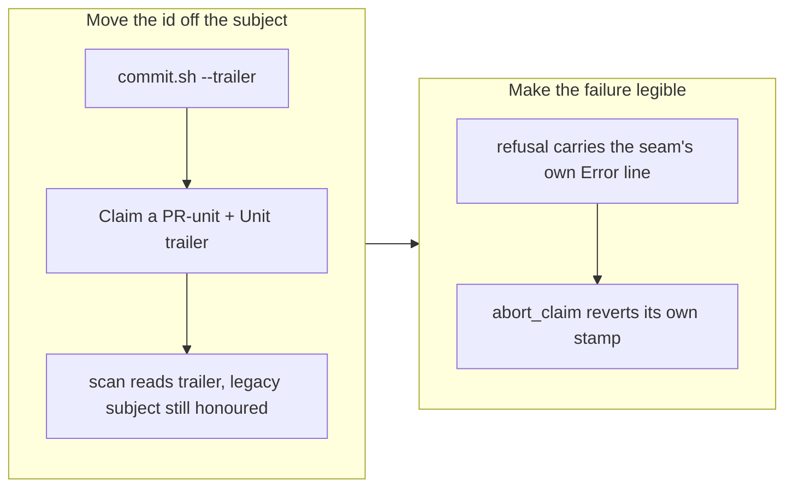

# Claim a unit by trailer, not by subject

## 1. Overview

A `/drive` run found that four of the five active missions could not be claimed at all.
`claim.sh` put the unit id in the commit subject, and a mission's unit id is its slug — so
any slug longer than 44 characters breached `commit.sh`'s 50-character subject rule, the
claim commit was refused, and the mission was permanently undrivable. The runner was told
only `commit_failed`.

**Highlights:**

1. The unit id moves to a `Unit:` trailer under a fixed short subject; slug length stops mattering.
2. A refused claim now names the reason the commit seam gave, instead of a bare `commit_failed`.
3. A refused claim leaves no worktree and no branch — the contract said so already, and was false for this path.
4. The shared claim fixture gains a long-slug mission, because knowing only `m1` is why the suite stayed green.

## 2. Motivation

Measured live, mid-run:

| Subject length | Verdict | Mission |
| -------------: | ------- | ------- |
| 77 | reject | `make-scheduled-routines-a-configurable-inspectable-part-of-a-repository` |
| 67 | reject | `make-acceptance-ticking-measure-satisfaction-not-marker-shape` |
| 65 | reject | `make-the-per-commit-changed-lines-ceiling-a-rule-that-holds` |
| 64 | reject | `adopt-a-git-flow-branching-model-with-durable-ship-records` |
| 46 | pass | `make-the-branch-story-concise-by-default` |

Two defects compounded, and the second hid the first. `claim.sh` stamps the artifact
*before* committing, so a post-stamp failure leaves the worktree dirty with the script's
own edit — and `cleanup-mission-worktree.sh` correctly refuses to discard uncommitted
work. So the failed claim stranded a worktree, and the **next** attempt failed as
`worktree_creation_failed`, which reads like an unrelated problem. The first error a
developer sees was the wrong one, and clearing it by hand needed a targeted `git checkout`
the drive contract otherwise forbids a run from performing.

## 3. Changes

### 3-1. Claim a unit by trailer, not by subject ([005c2a27](https://github.com/qmu/workaholic/commit/005c2a27))

`commit.sh` gains a general `--trailer 'Key: Value'`. `claim.sh` publishes `Claim a
PR-unit` with `Unit: <id>`, and the same for `Resume a PR-unit` — which had the identical
bug. `lib/claims.sh` reads the trailer and **still honours the legacy `Claim <unit-id>`
subject**, because claims pushed before this change are on real branches and a reader that
stopped seeing them would report those units as free.

## 4. Outcome

Every mission is claimable regardless of slug length, and nothing about slug naming had to
change. A refused claim now says why and leaves nothing behind.

## 5. Historical Analysis

This is the **third** defect today whose fixture encoded the easy case. The `gh` tests
stubbed the CLI and so never tested absence; the shell-error assertion matched bash's
`command not found` and so could not see dash; the claim suite knew only the slug `m1` and
so passed while most of the roadmap was unclaimable. Each was invisible until something
outside the fixture's imagination happened.

The pattern is specific enough to act on: **when a value has a bound, put the fixture near
the bound**, and when a test reproduces an environment, mirror it rather than enumerate it.
The shared claim fixture now carries a long slug for the whole suite, not just for the new
test.

## 6. Concerns

### The legacy subject branch has no expiry

- **Severity:** low
- **Description:** `lib/claims.sh` reads both the `Unit:` trailer and the legacy `Claim <unit-id>` subject. The legacy branch is needed only while claims pushed before this change are still unmerged, but nothing records when that stops being true, so it will simply live forever (`plugins/workaholic/skills/drive/scripts/lib/claims.sh`).
- **How to Fix:** Drop the legacy branch once no unmerged remote branch carries a pre-change claim — checkable with one `git log --all --grep`. Cheap to keep, so this is housekeeping rather than debt.

### A mission slug is still unbounded, and other consumers may have their own limits

- **Severity:** low
- **Description:** The fix removes the subject's length dependency but bounds nothing, which is deliberate. Any *other* consumer that embeds a slug in a length-limited field would hit the same wall, and none is currently known (`plugins/workaholic/skills/mission/scripts/slug.sh`).
- **How to Fix:** Nothing now. If a second such consumer appears, bound the slug at `slug.sh` rather than teaching each consumer to truncate.

## 7. Successful Development Patterns

- Do not put a value a script must read back into a length-limited field. A commit subject is capped by a rule enforced in three layers through one validator — deliberately hard to relax — so an over-long value is unrepresentable, not merely untidy. Trailers have no limit and git reads them back exactly.
- A teardown that delegates to a refuses-on-dirty cleaner must first revert what it itself wrote. `abort_claim` knows exactly which paths it stamped seconds earlier, which is what makes a targeted revert safe there and nowhere else.
- Lift the failing seam's own error into the refusal. `check-subject.sh` printed "subject is 65 characters (limit 50)" and `claim.sh` threw it away, turning a one-line diagnosis into a dead end.

## 8. Release Preparation

**Verdict**: Ready for release

### 8-1. Concerns

- None blocking. Version bumped to v1.0.118.

### 8-2. Pre-release Instructions

- None - standard release process applies.

### 8-3. Post-release Instructions

- None - the legacy subject form is read, so claims already in flight are unaffected.

## 9. Notes

The four missions in the table above are the immediate beneficiaries: they were queued with
full ticket sets and excluded from every survey for a reason no output named.
