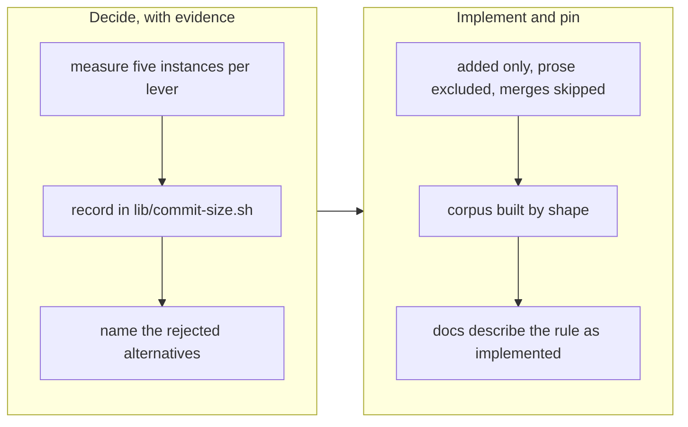

# Count added implementation, not motion

## 1. Overview

`too-large-commit` had stopped measuring anything. Three feedback records from three pull
requests said so, and one stated the conclusion outright: *"A rule that is always
overridden stops measuring anything, and this is now the pattern rather than the
exception."* This branch decides what the rule counts, once, and records the decision with
its evidence where the rule lives.

**Highlights:**

1. Added lines only — a relocation is no longer charged twice for moving content.
2. `.workaholic/` artifact prose excluded — specs and records are not implementation throughput.
3. Merge commits skipped entirely — a merge authors nothing, and `/ship` creates one itself.
4. The decision, its five measured instances and its rejected alternatives live in `lib/commit-size.sh`.

## 2. Motivation

The rule's stated purpose is to make commit count a comparable throughput unit — a claim
about *implementation* commits. Two of the three originating breaches were commits that
add no throughput at all, and two further instances measured on 2026-08-01 fire on the
catch-up merge `/ship` performs on the author's behalf. The metric was being distorted by
exactly the commits it was never meant to count.

The measurement that decided it, taken across every candidate lever (non-`outputs/`
totals):

| commit | shape | a+d | added | a+d −`.workaholic/` | **added −`.workaholic/`** |
| --- | --- | ---: | ---: | ---: | ---: |
| `fa8033d3` | spec batch | 502 | 502 | 0 | **0** |
| `1179d916` | implementation | 772 | 765 | 707 | **702** |
| `044a3f8b` | relocation | 701 | 472 | 629 | **402** |

Only the last column gives all three the intended verdict — pass, fire, pass.

## 3. Changes

### 3-1. Decide what too-large-commit counts ([3b8c1bd3](https://github.com/qmu/workaholic/commit/3b8c1bd3))

`release-scan/scripts/lib/commit-size.sh` carries the rationale, the measurement table,
and the rejected alternatives — in the scan's `lib/`, not in a commit message, because an
override is only meaningful against a stated rule.

### 3-2. Count added implementation, not motion ([84e943e0](https://github.com/qmu/workaholic/commit/84e943e0))

The scan sources the lib and applies its two predicates; `release-scan/SKILL.md` and
`CLAUDE.md`'s release-safety paragraph describe the rule as implemented. The hermetic
corpus is built **by shape** — spec prose, a rename-matched relocation, a
rename-invisible split, a delete-only commit, a merge whose merged content still fires on
its own commit, a large implementation, and a mixed code-plus-prose commit — because the
suite runs in throwaway repositories and a shape outlives the commits that motivated it.

## 4. Outcome

The gate measures what a reviewer must actually read. A spec batch, a relocation and a
merge pass without an override; a genuinely large implementation commit is still flagged.
An override in the deployment evidence means something again.

This branch is its own first test: it passes the new rule, and would have breached the old
one.

## 5. Historical Analysis

The ticket's own leading candidate turned out to be wrong, and only measurement showed it.
"Discount pure renames, which git already detects" had ridden through three feedback
records unchallenged — but `044a3f8b` is a **split**, one file's content redistributed into
two new ones, and `-M` matches whole files only. Measuring it (701 unchanged with `-M`)
retired the candidate in one command.

The pattern is the same one three other defects in this repository showed today: a claim
carried forward because it sounded right, surviving until something executed it.

## 6. Concerns

### A delete-only commit of any size now passes

- **Severity:** moderate
- **Description:** Counting additions only means a commit that removes 5,000 lines is never flagged. This is the intended reading — removing code is cheap to review and worth encouraging — but it is a genuine widening of what the gate lets through, and a very large deletion is not always trivial to review (`plugins/workaholic/skills/release-scan/scripts/lib/commit-size.sh`).
- **How to Fix:** Nothing now; it is pinned by a test so it cannot drift silently. If a large deletion ever does harm, the answer is a separate, much higher deletion ceiling rather than restoring added+deleted, which is what charged relocations twice.

### `.workaholic/` prose is exempted by path, not by nature

- **Severity:** low
- **Description:** The exclusion is a path test, so anything placed under `.workaholic/` is exempt from the commit ceiling regardless of what it is. That is currently exactly right — the tree is a closed, registered set of artifact types — but it couples the gate to the layout rather than to the content's kind (`plugins/workaholic/skills/release-scan/scripts/lib/commit-size.sh`).
- **How to Fix:** No action while the layout stays closed and registered. If executable content ever lands under `.workaholic/`, the test needs to narrow to the artifact directories rather than the tree root.

## 7. Successful Development Patterns

- Measure the candidate before adopting it. The leading fix had survived three feedback records on plausibility alone and died to one `git show -M --numstat`.
- Build a regression corpus by **shape**, not by SHA. The shapes disagreed with the paper analysis in a useful way — where rename detection matches part of a split, added-only and `-M` overlap and move the boundary — which no single real commit had revealed.
- When inverting a test that pinned an old decision, say so in the test and cite where the new decision lives. The suite asserted "deletions count toward the per-commit total"; without the note, the next reader cannot tell a deliberate inversion from a regression.

## 8. Release Preparation

**Verdict**: Ready for release

### 8-1. Concerns

- The branch-safety scan returns `pass` — including under its own new rule. Version bumped to v1.0.119.

### 8-2. Pre-release Instructions

- None - standard release process applies.

### 8-3. Post-release Instructions

- None.

## 9. Notes

The mission's board still reads `0/7` after both tickets: `tick-acceptance.sh` reports
`no_unchecked_match` because these acceptance items were authored by `/propose` without a
marker. That is precisely the defect the sibling mission
*make-acceptance-ticking-measure-satisfaction-not-marker-shape* exists to fix, observed
here rather than inferred.
