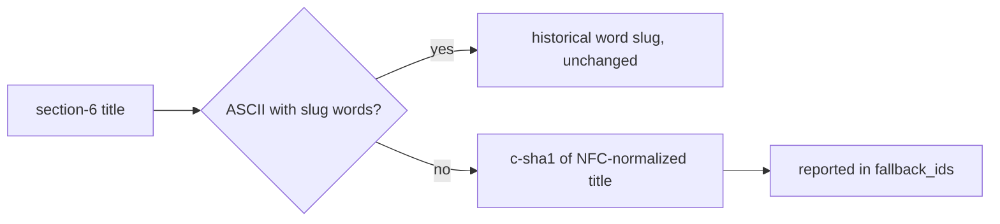

# Give non-ASCII concern titles stable hash ids

## 1. Overview

`extract-deferred-concerns.sh` — the ship-time seam that persists a story's section-6
concerns into the feedback stream — derived every `concern_id` from an ASCII word slug.
A Japanese-only title slugged to the empty string, fell back to the literal id
`concern`, and from the second such concern onward every extraction was silently
dropped as a duplicate. In a repository whose stories are written in Japanese, the
"every severity is recorded" contract was broken in practice: a real run extracted
`{"created":0}` from a story carrying two live concerns.

**Highlights:**

1. A title carrying non-ASCII characters (or yielding no slug words) now gets a stable `c-<sha1[:8]>` id from its normalized title; distinct titles get distinct ids.
2. ASCII titles keep their historical word slugs byte-identical — ids are the stream's permanent keys, so the existing rule is never re-keyed.
3. Fallback usage is reported in the output JSON as `fallback_ids`, so the divergence from the word-slug convention is visible, never silent.

## 2. Motivation

Observed live on 2026-08-01: a story whose section 6 held two Japanese-titled concerns
extracted `{"created":0,"updated":0,"extracted":0,"story_only":0}` — no record, no
error, no report. Earlier runs showed the second failure shape: a mostly-Japanese title
degenerated to its one incidental English word, minting a meaningless id like
`<ts>-concern.md` that then collided with every later degenerate title through
`existing_ids`. Both shapes end in the same place: the concern exists in the story and
nowhere else, and the feedback stream — the durable memory `/report`'s judge and
`/propose` read — never learns of it.

## 3. Changes

### 3-1. Give non-ASCII concern titles stable hash ids ([d8b9b2c5](https://github.com/qmu/workaholic/commit/d8b9b2c5))

`concern_id_for()` splits the rule in two: an ASCII title keeps the exact historical
slug path (markdown-link/backtick stripping, lowercase, 6-word/60-char truncation),
while a title with any non-ASCII character — or the pathological word-less ASCII
title that used to collapse to `'concern'` — hashes its NFC-normalized, case- and
whitespace-folded form into `c-<sha1[:8]>`. The dedup, filename, and append-only
semantics are untouched; hash ids dedup across PRs exactly like word slugs. The
output JSON gains `fallback_ids`, riding every exit including the zero-created one.
`ship/SKILL.md`'s identity paragraph records the new rule, and the test suite pins
it: two Japanese titles → two distinct `c-<hash>` ids, ASCII slug unchanged, fallback
reported, cross-PR dedup intact. The archived ticket rode to `tickets/archive/` in
[99b74991](https://github.com/qmu/workaholic/commit/99b74991).

## 4. Outcome

A Japanese-run repository now gets every section-6 concern into the feedback stream
under a stable, collision-free id, and a fallback id is a greppable, reported event.
The ASCII path is provably unchanged (the suite asserts the historical slug), so no
existing concern's identity is severed.

## 5. Historical Analysis

This is the same fixture-blindness pattern the claim-subject fix documented one branch
earlier: the extraction suite's only fixture was `### Some real concern` — an English
title — so the suite stayed green while the primary production language broke the
seam entirely. The new unicode-title test puts the fixture where the boundary is.
Silent degradation compounded the miss: the script *reported* honestly at the JSON
level (`created: 0`) but nothing distinguished "nothing to extract" from "everything
was dropped", which is why `fallback_ids` now rides the output.

## 6. Concerns

### A pre-fix degenerate record keeps its degenerate id

- **Severity:** low
- **Description:** Ids are permanent keys, so a record minted under the old rule (e.g. a literal `concern_id: concern`) is never rewritten; the same logical concern re-extracted now mints a fresh `c-<hash>` id beside it, so the two records are not linked. The one known case was already worked around manually with explicit ASCII ids (`plugins/workaholic/skills/ship/scripts/extract-deferred-concerns.sh`).
- **How to Fix:** Nothing mechanical — the reader's judgment over the stream covers a duplicate pair, and no migration should re-key permanent ids.

### The ASCII 6-word truncation collision remains by design

- **Severity:** low
- **Description:** The measured 6-word/60-char truncation collision between distinct ASCII titles (recorded in the stream, 2026-07-16) is deliberately untouched: only titles the word slug cannot represent switch to the hash, so the fix cannot re-key any existing ASCII-titled concern (`plugins/workaholic/skills/ship/scripts/extract-deferred-concerns.sh`).
- **How to Fix:** Already tracked as its own open concern; a hash suffix on truncated ASCII slugs is the sketched fix there and should be judged on its own id-stability cost.

## 7. Successful Development Patterns

- When a permanent key's derivation must change, change it only for inputs the old rule could not represent. The asymmetry is the backward-compatibility proof: no representable input's key can move.
- Put the fixture where the boundary is — a scanner-shaped test suite that only knows English titles cannot see a Japanese-language failure. The new fixture carries two Japanese titles precisely because the degenerate collision needs two to manifest.
- A fallback that changes an output's shape must announce itself in the output (`fallback_ids`), not just behave differently; "we degraded gracefully" and "there was nothing to do" must never share a JSON.
- Test fixtures for secret scanners should use the provider's documented example credentials (AWS's example access-key id from its docs): an invented key shape trips GitHub push protection on every future edit of the file, and the documented example pins the same scanner rule without the friction.

## 8. Release Preparation

**Verdict**: Ready for release

### 8-1. Concerns

- None blocking. Version bumped to v1.0.119.

### 8-2. Pre-release Instructions

- None - standard release process applies.

### 8-3. Post-release Instructions

- None - the id rule change only affects titles the old rule dropped or degenerated; existing records and ASCII ids are byte-stable.

## 9. Notes

Verification: `node scripts/test-workflow-scripts.mjs` — 1849 passed, 0 failed,
including the new `extract-deferred-concerns.sh unicode titles` suite;
`build.mjs`/`verify.mjs`/`validate-metadata.mjs` all clean, `outputs/workflows`
regenerated in the same commits as their sources.
