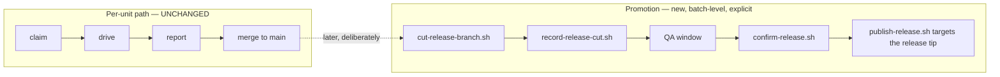

# Add a release staging tier with a durable ship record

## 1. Overview

Landing a unit on `main` **was** the production release: there was no window in which a
batch of merged units could be verified together, and "what shipped, and when" was
answerable only by reading merge commits. This branch adds exactly one tier — `release/*` —
and gives it a durable record. Nothing about how a unit lands changes.

**Highlights:**

1. `release/YYYYMMDD-HHMMSS` is cut from the base by script, as a QA window, and carries no commits of its own.
2. Promotion is a **batch-level, explicitly-invoked** phase, never a step of a per-unit ship — so `auto` units are observably unaffected.
3. `.workaholic/releases/<release-branch>.md` records what a release carried, when it was cut, and every confirmation attempt — all derived from git.
4. A failed confirmation is recorded, not erased, and its branch is kept as the rollback boundary.
5. The per-unit claim protocol is verifiably untouched: `plugins/workaholic/skills/drive/` has zero changes on this branch.

## 2. Motivation

The originating ask was to move toward Git Flow "for QA and ship traceability". The design
had already been narrowed in `#dev-workaholic` to a middle ground, but nothing recorded
*why* the rejected shapes were rejected, so the next session would have re-proposed them
blind. The first ticket was therefore exploratory by the mission's own acceptance.

Two questions had blocked the original draft, and both turn out to be answered by **not**
creating a second base:

| Question | Under full Git Flow | Under `release/*` only |
| -------- | ------------------- | ---------------------- |
| What does a claim mean against a second base? | undefined — claims are cut from one base | does not arise; a unit still has one merge target |
| What does `merge_policy` mean under two merge targets? | undefined | does not arise; a unit still merges to `main` |

A `develop`-only tier was rejected separately: it gives a staging area whose identity is
*continuous*, so there is nothing bounded to attach a record to — and the record was half
the ask.

## 3. Changes

### 3-1. Record the release-tier decision ([4db67116](https://github.com/qmu/workaholic/commit/4db67116))

A `kind: insight` feedback record carries the per-step survey of `/ship` — what each step
reads, what it writes, and the ordering constraint it imposes — plus the chosen tier set
and both rejected alternatives with their reasons. `docs/loop-engineering-workflow.md`
gains the numbered decisions L1-L3.

The survey is what placed the cut. Three constraints did it: a release branch is cut *from*
the base so it is structurally post-merge; it must add a **second** confirmation rather than
re-entering the per-unit one; and `publish-release.sh` already targets a commit, so
publishing needed re-pointing, not replacing.

### 3-2. Cut and promote a release branch ([8544e744](https://github.com/qmu/workaholic/commit/8544e744))

`branching/scripts/cut-release-branch.sh` mints `release/YYYYMMDD-HHMMSS` at the base tip,
pushes it, and never checks it out. `hooks/guard-git-branch.sh` learns the second literal
pattern and still blocks everything else — `release/v1.0.119`, `release/hotfix`, `develop`
and `hotfix/urgent` are all refused. `ship/SKILL.md` §6 documents the cut, the window, the
confirmation, what gets tagged, and the failure path.

### 3-3. Record what a release branch shipped ([f11e45f0](https://github.com/qmu/workaholic/commit/f11e45f0))

`.workaholic/releases/` is registered in both lockstep sources of truth in the same commit
as its first write. `record-release-cut.sh` writes the record at the cut;
`confirm-release.sh` appends each confirmation attempt and carries the latest verdict in
frontmatter. Both run on the base with a clean tree, derive everything from git, and reuse
the branch scanner's own secret rules so a credential cannot reach a version-controlled
record.

## 4. Outcome

A promotion is now a distinct, recorded event. `grep -l '^status: confirmed'
.workaholic/releases/*.md` names the releases that reached production; each record names
its `cut_sha` and range; `git log <since_ref>..<cut_sha>` replays exactly what it carried.
No GitHub, no merge-commit archaeology.

Every acceptance criterion this mission set is met on this branch, and the two that are
claims about *absence* were checked rather than assumed: `plugins/workaholic/skills/drive/`
has no changes at all (the claim protocol), and the existing claim and ship suites pass
**unmodified** while a new test asserts a release branch is invisible to the claim reader.

## 5. Historical Analysis

The mission's hardest two questions were dissolved rather than answered, and that is the
reusable move here: both existed only because the draft assumed a second base. Naming the
tier set precisely — one branch form, not a "model" — turned an open-ended design into
three tickets.

The second pattern is about where a decision *is* re-litigated. The rejected alternatives
were rejected weeks ago in Slack, and nothing in the repository said so, which is exactly
the condition under which they come back. A design record that states only the choice
invites the same discussion again; this one names the alternatives and the reason each
lost.

## 6. Concerns

### A mission's acceptance cannot be ticked when its items carry no artifact marker

- **Severity:** medium
- **Description:** `tick-acceptance.sh` flips an item only when it carries a trailing `(#<artifact-filename>)` marker. This mission's acceptance items are prose criteria written at proposal time and carry none, so every archive seam reported `no_unchecked_match` and the mission reads `0/8` although all eight criteria are satisfied by this branch. The derived progress therefore understates completed work, and the mission lens will keep surfacing it (`plugins/workaholic/skills/mission/scripts/tick-acceptance.sh`).
- **How to Fix:** This is precisely the subject of the active mission `make-acceptance-ticking-measure-satisfaction-not-marker-shape`; no separate fix belongs here. Until it lands, a mission whose criteria are prose has to be closed on judgment rather than on a computed count.

### The promotion has no entry point of its own

- **Severity:** medium
- **Description:** The flow is documented in `ship/SKILL.md` §6 and implemented in three scripts, but nothing invokes it: `/ship` runs §5 for one unit, `/drive` deliberately does not promote, and there is no `/promote` command or routine. So the tier is reachable only by an agent reading §6 and running the scripts in order. That is a correct starting point — an automatic promotion would have been the per-unit behaviour change this mission ruled out — but a capability nobody can trigger by name tends to go unused.
- **How to Fix:** Decide the trigger deliberately once there is operational experience: most likely a scheduled promotion routine (the `workaholify` routine templates are the natural home) or an explicit subcommand. Do not fold it into `/drive`.

### The carried range includes the promotion's own bookkeeping commits

- **Severity:** low
- **Description:** `carried_count` and the listed commits cover every base commit in `since_ref..cut_sha`, which includes the previous promotion's `Record release cut` and `Record release confirmation` commits. A reader scanning "what did this release carry" sees two rows of bookkeeping per prior release (`plugins/workaholic/skills/ship/scripts/record-release-cut.sh`).
- **How to Fix:** Leave it. The count is exactly what `git log` replays, and that verifiability is the record's only real property; a filter would have to recognise bookkeeping by commit subject and would silently mis-measure the first time it guessed wrong. If the noise ever matters, mark the commits with a trailer at write time and filter on that, never on the subject.

### The record's confirmation is not connected to the deployment contract's method list

- **Severity:** low
- **Description:** `confirm-release.sh` accepts any `<method>` string, while `.workaholic/deployments/*.md` declares a `confirmation_method` from a fixed enum. Nothing checks that a promotion's recorded method is one the target actually declares, so a typo records a confirmation that looks executed and names a method that does not exist (`plugins/workaholic/skills/ship/scripts/confirm-release.sh`).
- **How to Fix:** Validate `<method>` against `read-deployments.sh`'s reported methods, refusing an unknown one — cheap, and it turns a recorded string into a recorded fact. Left out here because the promotion's caller already reads the contract to *execute* the confirmation, so the value is a copy rather than a guess.

## 7. Successful Development Patterns

- **Dissolve a hard question by removing its premise before answering it.** Both blocking questions in the original draft were consequences of a second base. Deleting the second base deleted the questions; answering them would have been weeks of design for a tier nobody asked for.
- **A record's value is that it can be re-derived.** Everything in a release record comes from git at cut and confirm time, and the range is literal so `git log` reproduces it. The moment a record needs a filter to be readable, it stops being checkable.
- **Register a new artifact directory in the same commit as its first write.** The closed-layout policy makes a stale allowlist a hard block, not a warning, so doing it in one commit is the only order that ever works.
- **Assert absence, don't claim it.** "The claim protocol is unchanged" is a testable statement: `git diff --name-only origin/main...HEAD -- plugins/workaholic/skills/drive/` is empty, and the existing suites pass with no edits. A mission acceptance item phrased as "verified unchanged" deserves that treatment rather than a sentence.
- **When a name is minted from the clock, a test that needs two of them has to let the clock move.** Two cuts in the same second collide by design; the suite waits for the tick rather than sleeping arbitrarily or stubbing time.

## 8. Release Preparation

**Verdict**: Ready for release

### 8-1. Concerns

- None blocking. Version bumped to v1.0.119.

### 8-2. Pre-release Instructions

- None - standard release process applies.

### 8-3. Post-release Instructions

- None. The tier is additive and dormant until a promotion is run deliberately: no existing
  flow cuts a release branch, and `.workaholic/releases/` stays absent in a repository that
  has not promoted.

## 9. Notes

The tier is deliberately smaller than the phrase "Git Flow" suggests. `main` is still the
default and production branch, a unit still claims, drives, reports and merges exactly as
it did this morning, and the only new thing an operator will see is a `release/*` branch
that somebody cut on purpose.
