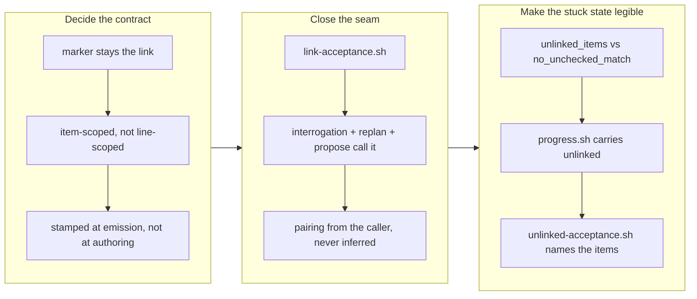

# Make acceptance ticking measure satisfaction

## 1. Overview

An acceptance item could only be checked if it carried a `(#<filename>)` marker, and nothing
ever put one there. Every mission the proposal batch has written was therefore unreachable by
`tick-acceptance.sh` — the only sanctioned writer of an `[x]` — so its board stayed at `0/N`
however much of the work landed, and the only ways out were a hand-edited checkbox or a
permanently stuck mission.

**Highlights:**

1. The link stays the marker, but it is **stamped by the seam that emits the ticket set**, never typed by an author who has no filename yet.
2. `link-acceptance.sh` is the only writer of a link, and it takes the pairing from its caller — a guessed link would eventually check a box the work did not satisfy.
3. The ticker's one negative reason splits into three: `already_checked`, `unlinked_items` (not addressable) and `no_unchecked_match` (not satisfied).
4. A stranded board can no longer read as stalled work: `progress.sh` carries an `unlinked` count and `unlinked-acceptance.sh` names the items.

## 2. Motivation

Re-measured on 2026-08-03, because the mission's own figures were two days old:

| Authoring route | Missions | Acceptance items | Linked |
| --- | ---: | ---: | ---: |
| Creation Interrogation | 4 | 19 | 19 |
| `/propose` scaffold | 6 | 37 | 0 |

The split is total, and it is not a matter of author care — it is structural. A proposal states
its criteria *before* any ticket exists, so at that moment there is no filename to link to; an
interrogation writes its criteria *after* it has emitted the ticket set, so there is. Nothing
closed the gap afterwards, and nothing ever reported that it was open.

The cost is on the record. All four interrogation-authored missions closed `achieved` at N/N.
The one proposal-scaffolded mission that has reached the archive closed **`abandoned` at 0/9** —
its board could not have moved even if every criterion had been met. The remaining five sat
active at 0/28. A gate that reports "nothing is done" about work that is being done is not slow;
it is wrong.

A second defect surfaced while implementing, one notch wider than the ticket described: the
match was **line-scoped**. A criterion long enough to wrap carried its marker on a continuation
line and was unreachable *even with a link*, which is exactly the shape-dependence this mission
exists to remove.

## 3. Changes

### 3-1. Decide the acceptance-to-artifact link ([7751bc34](https://github.com/qmu/workaholic/commit/7751bc34))

The contract is written where the convention already lived (`mission/reference/schema.md`, with
the developer-facing statement in `mission/SKILL.md`), with the rejected alternatives named:
inferring the link by title or position (a wrong guess checks a box the work did not satisfy —
a false `[x]` is worse than a stuck `[ ]`), requiring the marker at authoring time (it collides
with the structural cause, since `/propose` has no filename yet), and replacing the marker with
a mechanical satisfaction check (a criterion written at the user-experience level is a judgment;
if a check could replace it, it was written at the wrong altitude). The severable gate audit was
split out as its own queued ticket rather than folded in.

### 3-2. Establish the acceptance link at emission ([a814b099](https://github.com/qmu/workaholic/commit/a814b099))

`link-acceptance.sh` stamps one item's link per call, selected by position or by a substring that
must resolve to exactly one item. It preserves the item text byte-for-byte, places the marker at
the end of a wrapped item's **last** line, is a no-op on a repeat, and refuses `no_match`,
`ambiguous`, and `linked_to_other` rather than guessing — re-pointing a link is a plan change and
belongs in a replan. All three emitting seams now run it: the Creation Interrogation, the replan,
and the proposal batch that wrote every unlinked board measured above.

### 3-3. Make the ticker measure satisfaction ([f4084a01](https://github.com/qmu/workaholic/commit/f4084a01))

`tick-acceptance.sh` matches the link **item-scoped**, so a wrapped criterion ticks from a marker
on its continuation line, and its result names which of three things happened rather than
collapsing them into one. `progress.sh` reports `unlinked` beside `checked`/`total`, so `0/8` with
`unlinked: 8` reads as *a board nobody wired up* rather than *work nobody did*.
`unlinked-acceptance.sh` names the stranded items — per mission or across the whole active area —
with the index that repairs them.

This mission's own seven items were then linked through that path, with no checkbox touched by
hand, taking the active area from **28 stranded items to 21**; archiving the third ticket ticked
four of them automatically, which is the first time any board here has moved by itself.

### 3-4. Bump version to v1.0.119 ([e84f5f69](https://github.com/qmu/workaholic/commit/e84f5f69))

The mission skill ships in the generated `outputs/workflows` bundle, so the plugin version moves
with it.

## 4. Outcome

A mission whose ticket set is emitted starts linked, and a criterion that is satisfied gets
checked without anyone editing a checkbox. Where a board is still stranded, every reader of its
progress is told so by number, and the audit names the exact items with the selector that repairs
them. The one measured regression class — an item unreachable because of how its text was
formatted — is gone: wrapped and unwrapped criteria behave identically.

Verification: `node scripts/test-workflow-scripts.mjs` green at 1878 assertions (from 1859),
including a markerless board, the reason split, a wrapped item ticking from a continuation-line
marker, byte-identical idempotence, and the audit's empty-on-clean output; `build.mjs`,
`verify.mjs`, `validate-metadata.mjs`, `posix-lint.sh` and `layout-doctor.sh` all clean.

## 5. Historical Analysis

The defect had been fully documented and wrongly enforced for its whole life. `schema.md`
described the marker convention accurately, and the script implemented exactly that convention —
what nobody wrote down was that *no writer ever produced one* on the path that produces most
missions. Documentation agreeing with code says nothing about whether either matches the world.

What made it actionable was counting rather than asserting: 0-of-37 against 19-of-19 identifies
the authoring route as the cause and rules out author carelessness in one table, and it is what
turned "the ticker is fussy" into "the emission seam is missing a step". The same counting is now
built into the artifact, which is the durable half of this change — `unlinked` on every progress
read means the next instance of this class announces itself instead of waiting to be noticed.

The wrapped-item bug is the smaller lesson and the sharper one: the fixture had only one-line
criteria, and real missions wrap constantly. A convention tested only on its tidy form is tested
on the case that was never going to break.

## 6. Concerns

### 21 acceptance items across four other active missions are still unlinked

- **Severity:** medium
- **Description:** The repair path exists and was exercised on this mission's own board, but the other four active missions (`adopt-a-git-flow-branching-model-with-durable-ship-records` 8, `make-the-per-commit-changed-lines-ceiling-a-rule-that-holds` 7, `make-scheduled-routines-a-configurable-inspectable-part-of-a-repository` 3, `make-the-branch-story-concise-by-default` 3) were deliberately left unlinked. Linking them means deciding which ticket satisfies which criterion for plans this run never made — guessing at scale, which the contract forbids — and one of them is under an in-flight claim by a sibling unit right now, so editing its `mission.md` here would also conflict.
- **How to Fix:** Each is linked at its own replan or by the run that drives it, using `unlinked-acceptance.sh <slug>` to list the items and `link-acceptance.sh <slug> <index> <ticket>` per pair. Until then their boards are honestly reported as unlinked rather than silently stuck.

### The link-stamping step is prose, enforced only by tests over that prose

- **Severity:** medium
- **Description:** The three emitting seams are agent protocols in `mission/SKILL.md` and `propose/SKILL.md`, not scripts, so "run `link-acceptance.sh` after emitting the set" is an instruction an agent can skip. The suite pins the instruction's presence, not its execution — which is exactly the shape of the original defect, one level up.
- **How to Fix:** The cheapest real check is at the source: have the emitting flow report `progress.sh`'s `unlinked` immediately after writing a mission, so a skipped step is visible in the same output. A write-time hook is the wrong tool — a proposal is legitimately unlinked at the moment it is written.

### v1.0.119 may collide with a concurrently driven sibling unit

- **Severity:** low
- **Description:** This branch bumps to v1.0.119, and another unit is in flight on the same base. If both bump to the same number, the second merge silently goes unreleased, since the release workflow is idempotent on an existing tag. No `v1.0.119` tag exists on origin as of this writing.
- **How to Fix:** Check `git ls-remote --tags origin` and `main`'s current version before merging; if the number was taken in the interim, re-bump on this branch rather than after the merge.

### README.md still describes the retired `/mission approve` flow

- **Severity:** low
- **Description:** Pre-existing drift found while working, unrelated to this change: `README.md`'s mission row and its walkthrough still describe `status: draft → approved` and `/mission approve`, both retired by decision K1 on 2026-07-31. `CLAUDE.md` and the mission skill are correct.
- **How to Fix:** Update the two `README.md` passages to the one in-flight state and the merge-is-the-approval rule. Left out here to keep this branch's diff to the acceptance machinery.

## 7. Successful Development Patterns

- When a convention is enforced by one script and produced by several writers, count the writers' output before touching the script. The ticker was doing precisely what it was specified to do; the missing step was three files away, and no amount of reading the ticker would have shown it.
- Distinguish "not satisfied" from "not measurable" in the result vocabulary itself. A single negative reason forces every caller to guess which one it got, and the guess that gets made is the one that reads as normal.
- Refuse instead of inferring, and make the refusal name the item. `no_match` and `ambiguous` cost the caller one more explicit argument; a similarity heuristic would have cost a false `[x]` on some future mission, discoverable only by someone re-reading a board they trusted.
- Dogfood the repair on the artifact in hand. Linking this mission's own seven items proved the path end to end and made the very next `archive.sh` tick four of them — evidence no fixture could have produced.

## 8. Release Preparation

**Verdict**: Ready for release

### 8-1. Concerns

- None blocking. Version bumped to v1.0.119; confirm the tag is still free at merge time.

### 8-2. Pre-release Instructions

- None - standard release process applies.

### 8-3. Post-release Instructions

- None. Existing linked boards are unaffected: the ticker's match only widened, and `progress.sh` gained a key rather than changing one.

## 9. Notes

The mission's severable fourth unit — auditing the other gates for the same failure mode, where
green depends on an authoring shape rather than a real quality failure — was split out as
`20260803213000-audit-the-gates-for-shape-dependent-green.md` and queued rather than done here,
so the concrete fix did not wait on an open-ended survey. The mission's seventh acceptance item
links to it, which is why that item stays unchecked while the other six close.
