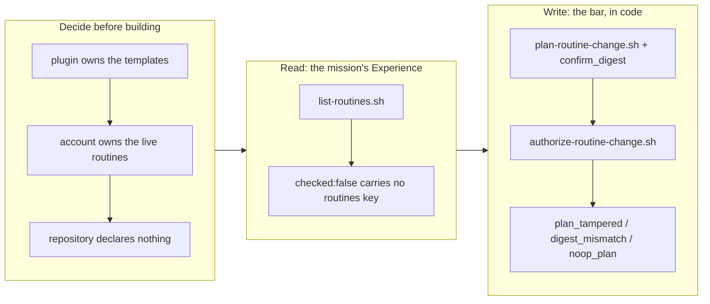

# Make a repository able to say what runs against it

## 1. Overview

Routines are how this project runs — a reported issue becomes a feedback record, a merge is
announced, the queue is driven hourly — and none of it was visible from the repository. The
schedule, the prompt and the target lived in one person's Claude Code Web account, so "what
runs against this repo" could only be answered by asking them.

**Highlights:**

1. The mission's real gap was *inspectable*, not *configurable*: the repository declares nothing, and `/setup-routines` asks the account and reports.
2. `checked: false` carries no `routines` key at all, so "I could not look" can never render as "nothing runs here".
3. Adding, refreshing and removing a routine is gated by a digest over the confirmed body — one yes, one routine.
4. "Remove" means disable, said out loud, because the routines API has no delete.

## 2. Motivation

The mission asked to make routines "a configurable, inspectable part of a repository", and
the first ticket's job was to notice that the obvious reading contradicts a design decision
already on the books. `workaholify` holds **one** set of templates applied to whichever
repository the command runs in, deliberately so that *no per-repository routine file exists
and `.workaholic/` gains nothing* — and `.workaholic/` is a closed layout where a new
directory is a registered amendment, not a mkdir.

Both loop runbooks carried the second tension in one line: *"do not install the crontab
from an agent session — applying a standing outward-facing process is the developer's
act."* That is precisely the capability the mission asked for.

## 3. Changes

### 3-1. Decide where routine configuration lives ([d7a12df4](https://github.com/qmu/workaholic/commit/d7a12df4))

Three places, one kind of fact each: the **plugin** owns what a routine should be, the
**account** owns what it is, and the **repository owns nothing new** — `{repo}`,
`{repo_slug}` and `{repo_name}` all derive from its own git remote, so a declaration file
could only cache what the account already knows. **No `.workaholic/` area was introduced**,
so no layout amendment was needed. Three alternatives were rejected in writing, the closest
call being a per-repository *selection* manifest: the selection is uniform across the fleet
today except for `[Drive]`, which is a pilot, so a manifest would freeze an unsettled pilot
into repository policy.

The unattended boundary is read versus write. Reading is safe anywhere; every mutation
needs a human looking at the exact body. The runbooks' prohibition survives, generalized
past cron: *an agent may not bring a standing outward-facing process into existence, or
re-point one, without a human seeing exactly what it will be.* Both runbooks now say so.

### 3-2. List what runs against a repository ([af936086](https://github.com/qmu/workaholic/commit/af936086))

`/setup-routines [repository name]` reports each routine with its trigger, schedule, target,
`enabled` state and template status, naming drift **per field**; plus the templates with no
routine, the untemplated one-offs (deliberate, never deletion proposals), and a summary of
drift elsewhere in the fleet. `resolve-repo-url.sh` resolves a bare name inside the
checkout's own organisation and says that it guessed.

The load-bearing part is the refusal: an absent, empty, unparseable, errored or unrecognised
response is `checked: false` **with no `routines` key at all**. An object carrying no `data`
list is not an empty account, and the audience — a developer who has just joined — cannot
tell a wrong answer from a right one. A stale `.pyc` of the comparer, tracked in git and
invalidated by this change, was dropped and `__pycache__/` ignored.

### 3-3. Add, refresh and remove a routine ([d6f39449](https://github.com/qmu/workaholic/commit/d6f39449))

`plan-routine-change.sh` renders the exact content one change would carry and stamps a
`confirm_digest` over the fields a human verifies by eye; `authorize-routine-change.sh`
re-derives it and refuses `plan_tampered` (the plan no longer hashes to its own digest — what
was read and what would be sent differ) and `digest_mismatch` (one confirmation carries
exactly one digest, so a single yes can never cover a fleet). A noop carries no digest and
so cannot be forced through: `no_drift` on an undrifted refresh, `already_exists`,
`not_present`, `already_disabled`, and `disabled_routine` rather than silently re-enabling
something somebody switched off. **Removal is disabling** — the API has no delete — and a
removal's plan shows the *live* prompt, since what is being switched off may have drifted
from the template.

## 4. Outcome

A developer who has never seen a repository can ask what runs against it and get an answer,
or a clear statement that the account could not be reached. A routine can be added,
refreshed or removed without leaving the terminal, and without any path by which a body
nobody read reaches the account. Nothing about the one-template-set model changed, and no
new `.workaholic/` directory exists.

## 5. Historical Analysis

The instructive part is that the mission's title was half wrong and the first ticket was
written to catch that. "Configurable" pointed at a file; the measured gap was that nothing
*read the account back*. Building the obvious thing would have added a per-repository
declaration beside a design that explicitly refuses one — the exact drift the closed-layout
policy exists to catch — and it would have shipped a cache with no invalidation.

Second: all three archives reported `no_unchecked_match` when rolling the mission's
acceptance. The seam matches acceptance items by ticket filename, and this mission's items
are prose, so nothing ticked and the mission reads 0/3 despite being complete. That is
already somebody's work — the active mission
`make-acceptance-ticking-measure-satisfaction-not-marker-shape` — and is left to it rather
than patched here.

## 6. Concerns

### The digest gate cannot prove a human was present

- **Severity:** medium
- **Description:** `authorize-routine-change.sh` closes substitution (confirm one body, send another) and batching (one yes, many routines), but an agent that renders a plan and computes its digest without ever showing anyone passes the gate. No script the agent itself runs can prevent that, and the headers say so rather than overselling it (`plugins/workaholic/skills/workaholify/scripts/authorize-routine-change.sh`).
- **How to Fix:** The missing layer is a blocking `PreToolUse` hook on the `RemoteTrigger` tool that refuses a `create`/`update` whose body has no matching authorization in the session — the same shape as `guard-git-commit.sh` for commits. That is a hook, not a script, and it belongs in its own change.

### Nothing here has been run against the live account

- **Severity:** medium
- **Description:** This run had no reachable routines API, so every path — listing, planning, authorizing — is verified only against fixtures built from the real routine shapes. Ticket 20260801185502's second verification method ("run it against this repository and read the output as if new to the project") was not performed, and the fixtures encode this author's belief about the response shape (`plugins/workaholic/skills/workaholify/scripts/lib/list_routines.py`).
- **How to Fix:** Run `/setup-routines` once interactively against the account and compare the real `RemoteTrigger list` response to the fixture. The shape assumption most worth checking is `data` as the item list, since an unexpected envelope now reports `unrecognised_live_shape` rather than lying — a safe failure, but a failure.

### Two commands now survey routines

- **Severity:** low
- **Description:** `/workaholify` step 4 and `/setup-routines` steps 1-5 both fetch the live list and report it. They share every script, so the logic cannot drift, but the *prose* describing the flow exists twice and can (`plugins/workaholic/commands/workaholify.md`, `plugins/workaholic/commands/setup-routines.md`).
- **How to Fix:** If it drifts once, cut `/workaholify`'s routine step down to a pointer at `/setup-routines`. It is left duplicated for now because `/workaholify` is a setup sweep that should not require a second command to complete.

## 7. Successful Development Patterns

- When a mission's title and an existing design disagree, make the disagreement the first ticket's deliverable. The decision ticket here forbade itself from writing any command, and that is why the answer ("a reader, not a directory") was reachable at all.
- An honest "could not check" needs a *shape* that cannot be misread, not just a flag. Dropping the `routines` key entirely on `checked: false` means no caller can accidentally iterate an empty list — the same move `check-slack-channel.sh` makes by never emitting `exists` unless it truly probed.
- State what a gate cannot do, in the gate. The digest closes two specific failures and cannot prove presence; writing that in the script header is what stops the next reader from treating it as an authorization system.
- A no-op that reports itself beats a write that changes nothing. Refreshing a clean routine returns `no_drift` with no digest, so "refresh everything" over a healthy fleet sends zero API calls instead of rewriting identical values.

## 8. Release Preparation

**Verdict**: Ready for release

### 8-1. Concerns

- None blocking. Version bumped to v1.0.119. The `v1.1.0` tag on origin belongs to an abandoned February line that is not an ancestor of `main`, so `v1.0.119` is the correct next version on the live line.

### 8-2. Pre-release Instructions

- None - standard release process applies.

### 8-3. Post-release Instructions

- Run `/setup-routines` once against the live account (see section 6) before relying on the output.

## 9. Notes

`/setup-routines` and `/workaholify` stage the raw `RemoteTrigger` response at a git-ignored
`.routines/live.json` rather than a scratch directory, because `guard-repo-confinement.sh`
refuses every Write outside the repository — the same constraint that moved `/explain`'s
staged HTML in-repo.

## Deployment Evidence

- **When:** 2026-08-03T22:14:34+09:00
- **By:** a@qmu.jp
- **Target:** Workaholic marketplace plugin
- **Method:** other
- **Status:** pass
- **Observed:** outputs fresh; verify+metadata pass; 1940 tests pass; v1.0.121 consistent; scan: three size too-large-commit findings (catch-up merge 1191, tickets 502/511 vs 500) overridden by developer merge instruction
