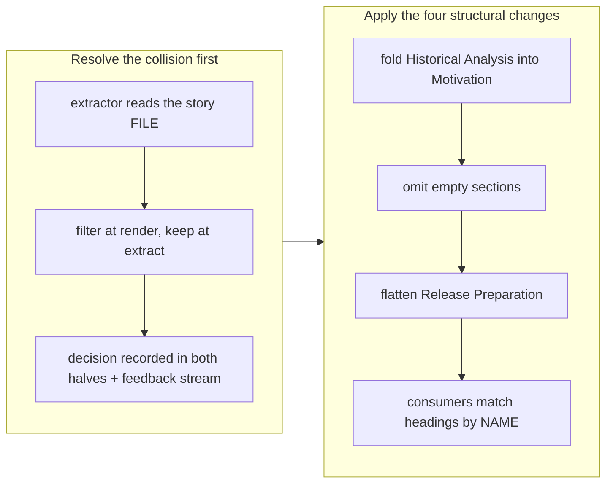

# Make the branch story concise by default

## 1. Overview

The story generator filled every section with as much as it could, so a small branch got a
long, dense write-up. Four structural changes make a section with nothing to report
**absent** rather than padded, and the one change that would have deleted knowledge —
"list only concerns above `low`" — was resolved into a render/extract split instead. This
story is written to the new template: it has no Release Preparation section and no Notes,
because there is nothing to put in either.

**Highlights:**

1. Historical Analysis folds into Motivation, Release Preparation flattens to one labelled list, and Concerns, Patterns, Release Preparation and Notes each appear only when they have something to say.
2. Low-severity concerns are dropped from the **PR body** and kept in the **story file**, so brevity never costs a record — the extractor reads the file.
3. Section numbers now run sequentially over whichever sections survive, so both consumers that matched `## 6. Concerns` were moved to match the heading **by name**.
4. Measured on a real branch: the story file went 125 → 100 lines and its PR body 120 → 85 lines, with nothing removed from the record.

## 2. Motivation

A reader who learns that every section is always present stops reading sections. That is
the cost the old template was paying: `## 5. Historical Analysis` said "No related
historical context" on most branches, `## 7. Successful Development Patterns` invited a
plausible-sounding pattern for any branch at all, and `## 8. Release Preparation` spent
four headings to say "Ready / None / None / None". Padding is not free — it teaches the
reviewer to skim past the sections that matter.

Taken literally, though, one of the four asks deletes knowledge. `extract-deferred-concerns.sh`
parses the committed story as its **only** source and records every severity into the
feedback stream, so a concern filtered out of the story is never extracted, never keyed on
a `concern_id`, and never joins the open set later readers compute. Brevity and the
extraction contract collided, and getting it wrong loses records rather than producing a
long story.

The precedent that resolved it was already in the tree. `shrink-pr-body.sh` has replaced
the Concerns section in the **PR body** with a pointer since the day a carried corpus first
breached GitHub's 65,536-character limit, while the extractor kept reading the **file**,
byte for byte. Divergence between the record and the reading experience was established
practice; this change gives it a second, deliberate instance rather than inventing a
mechanism. The same history explains why filtering at write time was never on the table:
the promotion floor that once withheld low-severity concerns from the corpus was retired
on the grounds that curation is the reader's judgment over the stream, and re-introducing
it under a different name would have re-made a decision the project had already unmade.

## 3. Changes

The decision came first on purpose: three of the four structural changes are independent
of it, but the Concerns section's is not, and a template change made before the collision
was resolved would have chosen by accident.

### 3-1. Decide the fate of low-severity concerns ([fcc1d1bf](https://github.com/qmu/workaholic/commit/fcc1d1bf))

Confirmed by reading the extractor rather than assuming: it parses
`.workaholic/stories/<branch>.md`, never the PR body. The decision — story file keeps every
severity, PR body drops `low` — is written into `report/SKILL.md` and `ship/SKILL.md` where
both halves are described, with the two rejected alternatives and their costs named, and
registered as an immutable feedback record. No template change in this commit.

### 3-2. Make the story short when there is little to say ([fea1327f](https://github.com/qmu/workaholic/commit/fea1327f))

All four structural changes applied to `report/SKILL.md` and mirrored in
`review-sections/SKILL.md` including its JSON contract (`historical_analysis` becomes
`historical_context`, a Motivation paragraph rather than a section; `concerns` and
`development_patterns` return `""` to mean "omit"). The new
`report/scripts/filter-low-concerns.sh` drops `low` blocks from the PR body and reports how
many it dropped; `shrink-pr-body.sh` and `extract-deferred-concerns.sh` both move from
number-matching to name-matching.

## 4. Outcome

Applying the new template to the most recent real story (`work-20260801-205224`) takes the
story file from 125 to 100 lines and its PR body from 120 to 85 lines — 6,242 to 4,909
characters — while the real extractor still records **both** of that branch's concerns from
the file. The PR body says `2 low-severity concerns are recorded in the story file … but
not listed here`, so what was dropped is reported rather than merely absent.

The suite is green at 1,881 assertions, including new cases that pin extraction across four
heading forms (`## 5.`, `## 6.`, bare `## Concerns`, `## 12.`), the render/extract split
asserted from both ends, and agreement between the two template mirrors.

## 5. Concerns

### Section numbers are now unstable, and nothing stops a future consumer keying on one

- **Severity:** moderate
- **Description:** Numbering runs sequentially over whichever sections a story actually has, so Concerns is section 5 on one branch and 6 on another. Both current consumers were moved to name-matching and a test pins that (`scripts/test-workflow-scripts.mjs`, "story template mirrors agree"), but the test enumerates the two consumers it knows about. A third one added later can key on a number, and the failure is silent: no heading match is indistinguishable from a branch that raised no concerns.
- **How to Fix:** If a third consumer of the story structure appears, extract the heading matcher into one shared place rather than writing the regex a third time. Until then the named test is the guard, and it should gain any new consumer in the same change that adds it.

### A mis-graded severity now hides a concern from review, not just from a sort order

- **Severity:** moderate
- **Description:** Severity used to be an honest signal that rode on the extracted record. It now also decides whether the reviewer sees the block at all, so a concern graded `low` when it is really `moderate` is recorded correctly and reviewed by nobody (`plugins/workaholic/skills/report/scripts/filter-low-concerns.sh`). The grading is a model judgment with no machine check, which is exactly the class of thing that drifts quietly.
- **How to Fix:** Both mirrors now say to grade honestly in both directions and name this consequence. If the drift shows up in practice, the measurable version is a periodic read of the stream's `low` records asking how many were later re-raised at a higher severity.

### The Motivation fold is a prose contract with no machine check

- **Severity:** low
- **Description:** `historical_context` reaches the story only if the report orchestration appends it to Motivation, which is instruction text in `report/SKILL.md` rather than code. A worker that returns the field into a story that never renders it loses the paragraph silently — the same shape of failure the section-number coupling had, minus a consumer to test.
- **How to Fix:** Nothing now; the field is optional and empty on most branches, so the blast radius is one paragraph. If stories start losing past context, the fix is to have the story writer emit Motivation from both fields explicitly rather than by instruction.

## 6. Successful Development Patterns

- Measure a formatting change against an artifact that already exists. Transforming the previous branch's real story by hand and counting both the file and the rendered body turned "the story should be shorter" from an assertion into 125 → 100 and 120 → 85, and it surfaced that the body shrinks nearly twice as much as the file — which is the split working, not a rounding artifact.
- When an instruction would delete data, look for a place the codebase already diverges the record from its rendering. `shrink-pr-body.sh` had done exactly that for a year for a different reason, which turned a contested design question into a bounded one and removed any need to invent a mechanism.
- A test that pins a prohibition must not match the prohibition's own wording. The first version of the mirror test failed on both files precisely because they now say `Never write "None"` — the fix passing the test looked identical to the bug.

## 7. Release Preparation

**Verdict**: Needs attention before release

- **Concern:** The branch-safety scan reports one `size` finding at override tier — commit `fea1327f` changed 538 non-generated lines against a 500 ceiling. It is the two-ticket implementation commit: two `SKILL.md` rewrites, a new script, and 178 lines of tests, landed together because splitting them would have renumbered the sections twice and given every heading-matching consumer two chances to break.
- **Before release:** `/ship` will ask for a conscious acceptance of the size override. Nothing was overridden here — an unattended run never overrides a gate, so the finding is reported and the decision left where it belongs.

## Deployment Evidence

- **When:** 2026-08-03T22:10:20+09:00
- **By:** a@qmu.jp
- **Target:** Workaholic marketplace plugin
- **Method:** other
- **Status:** pass
- **Observed:** outputs fresh; verify+metadata pass; 1887 tests pass; v1.0.120 consistent; scan: size too-large-commit 538>500 on fea1327f overridden by developer merge instruction, finding recorded in story
