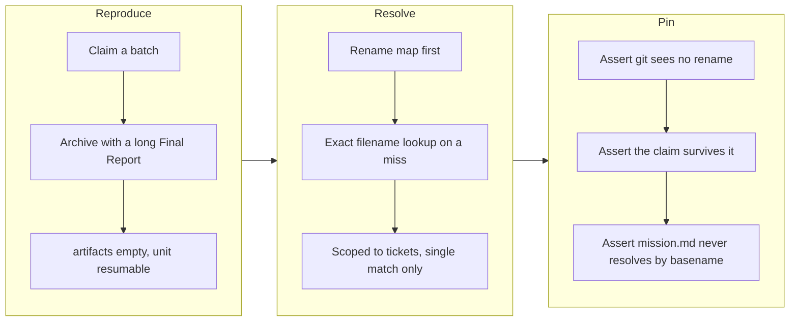

## 1. Overview

Two separately-reported defects in the claim protocol — a survey that offered
already-driven tickets as fresh backlog, and a finished unit reported as resumable —
turned out to be one cause: the claim reader resolved each artifact's tip-side path
through git's *similarity-based* rename detection, which does not fire on every real
archive. This branch replaces that single point of failure with an exact, scoped
fallback and pins both halves with hermetic tests.

**Highlights:**

1. Reproduced the failure against the real scripts before changing any of them, which is
   what revealed that the two reported symptoms were one bug rather than two.
2. Resolution no longer depends on a heuristic: when git reports no rename, the artifact
   is found by its filename, which is unique in the tree by construction.
3. The fallback is deliberately narrow — tickets only, unambiguous matches only — because
   `mission.md` is shared by every mission and an unscoped lookup would cross claims.

## 2. Motivation

`claims_scan` reads a claim's artifacts from the branch tip, and a driven ticket has been
*renamed* there by `archive.sh`. It followed that rename with
`git diff --find-renames`, which pairs a delete with an add only above 50% similarity and
abandons inexact detection entirely past `diff.renameLimit`. But `archive.sh` is not a
pure move: it stamps `effort` and appends the Final Report. A short ticket that grows a
long report therefore lands *under* the threshold, git reports a plain add + delete, and
the artifact silently leaves the claim.

That single loss is what both bug reports were looking at from different sides.
`plan-units.sh` subtracts a claim **by its artifact paths**, so it stopped subtracting —
offering a ticket already driven on a pushed branch as untouched backlog, and with no
`excluded[]` row at all, since the survey by definition only reports items it *saw* and
dropped. Meanwhile `claims_has_work` took its deliberately conservative "no artifacts
means unknown, so assume work remains" branch, flipping a drained unit to `resumable` and
inviting a takeover of a branch whose pull request was waiting on a human.

The existing rename test had been green through the whole defect, because it moves
tickets with a bare `git mv` — git pairs those at 100% similarity, so the fixture
exercised the heuristic at its easiest possible input.

## 3. Changes

The work began by reproducing the reported behavior against the real scripts in a
throwaway repository rather than reasoning from the code, which is what collapsed two
reported defects into one. The fix then went entirely into the shared claim reader; the
survey needed no change at all, because it had been reading a correct rule over incorrect
data.

### 3-1. claim サーベイが誤った座標を読む ([a9405027](https://github.com/qmu/workaholic/commit/a9405027))

Added an exact by-filename resolution to `lib/claims.sh` for the case where the rename map
has no row, scoped to `.workaholic/tickets/` and to an unambiguous single match, and wired
it in behind the existing map lookup. Added two hermetic tests: one that asserts the
premise (git really does report this archive as add + delete) before asserting the claim
survives it, and one pinning the `mission.md` scope so the fallback can never cross one
mission's claim onto another's file. `drive/SKILL.md` and `CLAUDE.md` now state why the
second resolution path is load-bearing rather than belt-and-braces.

## 4. Outcome

The reproduction that previously returned `artifacts: []`, `resumable: true /
heartbeat_lapsed` and the driven ticket back in `backlog[]` with an empty `excluded[]` now
returns the artifact at its base-side path, `queue_drained`, an empty backlog, and a
stated `claimed_reported` exclusion. `node scripts/test-workflow-scripts.mjs` reports
2051 passed, 0 failed; `build.mjs`, `verify.mjs`, `validate-metadata.mjs` and
`layout-doctor.sh` are all clean.

## 5. Concerns

### A resolution miss is still silent, and still becomes a takeover

- **Severity:** moderate
- **Description:** The fallback removes the known way an artifact list goes empty, but not
  the *consequence* of one going empty. `claims_has_work` still answers `true` for a claim
  with no surviving artifacts, so any future resolution miss converts directly into a
  spurious `resumable` verdict on a branch under review — and nothing anywhere reports
  that the miss happened (see [a9405027](https://github.com/qmu/workaholic/commit/a9405027)
  in `plugins/workaholic/skills/drive/scripts/lib/claims.sh`). This is the same gap the
  open stream concern `an-empty-artifact-list-is-now` names; this branch narrows the
  causes without closing it.
- **How to Fix:** Carry an explicit `unresolved` count on the claim row and let
  `list-claims.sh` and `plan-units.sh` report it, so "this claim holds nothing" and "I
  could not tell what this claim holds" stop rendering identically.

### The by-filename fallback assumes ticket filenames stay unique

- **Severity:** low
- **Description:** The fallback trusts the `YYYYMMDDHHMMSS-slug.md` rule to make a ticket
  filename unique tree-wide. Nothing enforces that rule across `todo/` and `archive/`
  together, and an ambiguous match falls back to the mapped path — which drops the
  artifact silently, exactly the behavior this change exists to remove.
- **How to Fix:** Either assert filename uniqueness in `layout-doctor.sh`, or report the
  ambiguous case rather than folding it into the same silent drop.

### One extra tree walk per unresolved artifact, on the five-minute path

- **Severity:** low
- **Description:** When the rename map misses, the fallback runs `git ls-tree -r` over
  `.workaholic/tickets` for that claim — a tree that already holds 600+ archived tickets
  in this repository. It is lazy (a hit costs nothing) and bounded by the number of
  unresolved artifacts, but it lands on the same hot path as the open stream concern
  `the-scan-cost-grew-by-one`.
- **How to Fix:** Cache the tip's ticket listing once per claim branch rather than once
  per unresolved artifact, if the claim count ever makes the scan measurable.

## 6. Successful Development Patterns

- Reproducing a reported defect against the real scripts *before* reading for a cause paid
  for itself twice: it collapsed two independently-filed tickets into one root cause, and
  it falsified the second ticket's stated hypothesis (that a batch's drained-queue test
  scans all of `todo/`), which the code does not do. A fix built on that hypothesis would
  have changed the right file for the wrong reason.
- Asserting a test's *premise* before its subject — here, that git genuinely reports this
  archive as add + delete — keeps a regression test honest. Without it the test would
  quietly stop exercising the defect the day git's heuristics change, and still pass.
- When a gate depends on a heuristic, the durable fix is a second path that is exact
  rather than a wider threshold. A wider threshold still fails silently at some input, and
  this failure mode is invisible by construction: the survey's `excluded[]` list means
  "saw and dropped", so a lost artifact leaves no trace anywhere.
