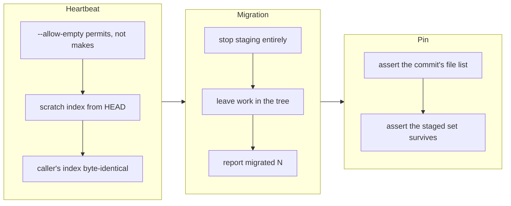

## 1. Overview

Two operations this repository documents as changing nothing — a heartbeat's "empty"
commit and a listing script's living migration — were both quietly mutating the git
index, so the caller's next commit silently grew and its message stopped describing its
own diff. Both now leave the index exactly as they found it, and the one that does write
to the working tree says so in its output.

**Highlights:**

1. `git commit --allow-empty` *permits* a changeless commit; it does not *make* one. The
   beat is now built against a scratch index seeded from `HEAD`, so its tree equals
   `HEAD`'s by construction whatever the caller had staged.
2. The concern migration stops staging entirely, because it runs as a side effect of a
   documented pure read — and reports `migrated: N` so the write it does perform is not
   silent.
3. Both defects are invisible to every gate (the commit succeeds, the content is right,
   only the message is wrong), so both tests assert on the commit's actual file list.

## 2. Motivation

The index is the caller's shared state. Two seams treated it as their own.

`heartbeat.sh` documents its commit as one that "changes no file, so it never appears in
the PR diff" — the property the whole coordination-marker design rests on. But it reaches
`git commit --allow-empty`, and that flag only *allows* an empty commit; with anything
staged it commits that instead. Mid-ticket the index is routinely non-empty, and a beat
fired over a staged `git rm` produced a commit subjected `Refresh heartbeat` carrying
three real deletions. The branch content was correct; only `git log` — and therefore the
story generated from it — attributed real work to coordination noise.

`migrate-concerns.sh` `git add`ed every record it wrote and `git rm`ed the retired tree.
It runs as a side effect of `list-open-concerns.sh`, which is documented as a pure read,
so a caller that staged two files by path and ran `git commit` got a commit of 154 files
and had to amend the message afterwards to describe a diff it never intended.

Neither is caught by any gate, and that is the shared shape: the commit succeeds, the
content is right, and only the relationship between message and diff is broken — which is
precisely the premise change history rests on.

## 3. Changes

The heartbeat fix went into `commit.sh` rather than `heartbeat.sh`, because the broken
promise belongs to the `--allow-empty` contract and the resume marker uses the same flag.
The migration fix chose *stop staging* over *commit under your own subject*, since the
caller that triggers it thinks it is only reading.

### 3-1. 「何もしない」はずのスクリプトが git index をコミットに巻き込む ([95f94705](https://github.com/qmu/workaholic/commit/95f94705))

`commit.sh --allow-empty` now builds its commit against a scratch `GIT_INDEX_FILE` seeded
from `HEAD`, so the result is empty regardless of what is staged and the real index is
untouched; a repository with no commits yet takes the plain path. `migrate-concerns.sh`
no longer stages anything and emits `{migrated, had_tree, staged, root}`, and
`list-open-concerns.sh` carries `migrated` in its envelope. Two hermetic tests assert the
commit contents directly, and `drive/SKILL.md`, `feedback/SKILL.md` and `CLAUDE.md` now
state why each behavior is what it is.

## 4. Outcome

A beat fired over a staged deletion and a staged edit now produces a commit whose tree is
identical to `HEAD`'s and whose file list is empty, while the staged work survives for the
commit whose subject explains it. A caller that stages one file by path and triggers the
migration commits exactly that file, with the migration's three written records waiting
unstaged in the tree and reported as `migrated: 3`. `node
scripts/test-workflow-scripts.mjs` reports 2055 passed, 0 failed; `build.mjs`,
`verify.mjs`, `validate-metadata.mjs` and `layout-doctor.sh` are clean.

## 5. Concerns

### A `git add -A` caller still sweeps the migration's unstaged work

- **Severity:** moderate
- **Description:** Leaving the migration's records unstaged fixes a caller that stages by
  path, but not one that stages everything — and `archive.sh` runs `git add -A` by design
  (see [95f94705](https://github.com/qmu/workaholic/commit/95f94705) in
  `plugins/workaholic/skills/feedback/scripts/migrate-concerns.sh`). In practice the tree
  is already migrated everywhere it matters, so `migrated` is `0` on every live call and
  the path is dormant; the residual is real rather than observed.
- **How to Fix:** Have the seams that *want* the migration committed (ship extraction, the
  report flow) stage and commit it under its own subject explicitly, so the only caller
  that commits it is one that named it.

### The heartbeat's guarantee is asserted in one place and relied on in two

- **Severity:** low
- **Description:** `commit.sh --allow-empty` is used by the heartbeat and by the resume
  marker, but only the heartbeat's shape is covered by a test. A future change to the flag
  would be caught, but nothing pins that the resume marker actually stays empty.
- **How to Fix:** Extend the resumption test to assert its `Resume` commit's file list is
  empty over a dirty index, the same way the heartbeat test does.

## 6. Successful Development Patterns

- When a script's header states the right intent and the code does something else, fix the
  **contract** rather than the caller. `heartbeat.sh` described its commit correctly; the
  lie was in `--allow-empty`, and putting the fix there covered the resume marker for free.
- A defect that no gate can see needs a test that asserts the *artifact*, not the outcome.
  Both bugs here produce a successful command, correct branch content, and a wrong
  message — so `git show --name-only` is the only assertion that bites, and both tests are
  built around it.
- An acceptance criterion offering two options is not a coin flip. "Refuse to beat when
  the index is dirty" was permitted and is wrong: dirty means mid-ticket, mid-ticket is
  when a missed beat makes a working unit look abandoned, and that is the failure the
  heartbeat exists to prevent.
