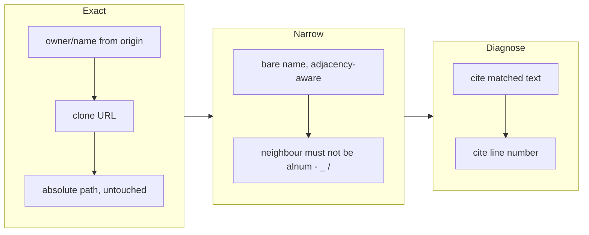

## 1. Overview

`/request`'s last mechanical backstop refused any body containing the calling repository's
basename as a plain substring, which made a repository whose name is an ordinary English
word unable to submit any request at all. The bare-name test now matches an **identifier**
rather than a substring, two exact reference forms were added to hold the true positives,
and every refusal cites the text it matched and its line.

**Highlights:**

1. The false positive was unrecoverable by design: the refusal fired *after* the developer
   had confirmed the body verbatim, and told them to mask something that could not be
   removed.
2. Adjacency-narrowing alone would have *lost* true positives — the `owner/name` remote
   form and the clone URL were caught only incidentally by the substring rule, so both are
   now matched exactly.
3. Refusals name the matched text and its line, because a mysterious refusal after a
   verbatim confirmation is what made the original defect impossible to work around.

## 2. Motivation

`submit-request.sh:50-53` refused a body that still names the calling repository, using a
case-insensitive `grep -F` over the whole body. When the caller's basename is an ordinary
English word, that word also appears inside directory names on **both** sides of a
request — including directories that belong to the *target* repository and have nothing to
do with the caller.

Observed 2026-08-02: a request whose body was roughly seventy path pairs of the form
`docs/<name>-reports/foo.md -> docs/site-<name>/foo.md`. The left side is the caller's own
output directory; the right side is the target's. Neither names the caller *as a
repository*, both contain the substring, and the path list was the ticket's entire content
— so there was nothing to remove, the refusal was unconditional, and its instruction
("mask it") named an action that did not exist.

The placement is what makes this more than an annoyance. This backstop is the only check in
the workflow that can refuse work the developer has **already approved**, verbatim, at the
non-skippable confirmation. Its false-positive rate is therefore a usability property, not
only a safety one.

## 3. Changes

The order matters: the exact forms went in *before* the loose rule was narrowed, because
the substring match had been carrying them.

### 3-1. `submit-request.sh`'s last backstop substring-matches the source repo name ([58f9f1e7](https://github.com/qmu/workaholic/commit/58f9f1e7))

Added exact `grep -F` checks for the repository's `owner/name` remote form and its clone
URL, left the absolute-path check byte-identical, and replaced the bare-name substring test
with an adjacency-aware ERE that declines only when the name is glued to a neighbouring
identifier character. Each refusal now reports the matched line and text. Fixtures cover
one body per acceptance criterion in both directions, plus a re-assertion with an origin
configured; `request/SKILL.md` §6 and CLAUDE.md record why this check's false-positive rate
is a usability property.

## 4. Outcome

A body of path segments embedding the caller's name submits; a body naming the caller
standalone, by `owner/name`, by clone URL, or by absolute path is still refused, each with
the matched text and line named. The old substring form was mutation-checked and does
refuse criterion 1, confirming the fixtures exercise the defect. `node
scripts/test-workflow-scripts.mjs` reports 2054 passed, 0 failed; `build.mjs`,
`verify.mjs` and `validate-metadata.mjs` are clean.

## 5. Concerns

### The clone-URL check matches one remote form, not the repository

- **Severity:** low
- **Description:** It compares against `origin`'s exact string, so a body citing the same
  repository through the *other* protocol form (`https://…` when origin is `git@…`, or vice
  versa) is caught only by the `owner/name` rule (see
  [58f9f1e7](https://github.com/qmu/workaholic/commit/58f9f1e7) in
  `plugins/workaholic/skills/request/scripts/submit-request.sh`). That rule does cover it,
  so the gap is redundancy rather than coverage — but the check reads as broader than it is.
- **How to Fix:** Derive both canonical forms from the parsed `owner/name` and match each,
  rather than matching the configured remote string verbatim.

### The adjacency rule encodes a judgement the ticket did not specify

- **Severity:** low
- **Description:** The ticket asked that the bare name not match when adjacent to `-`, `_`
  or `/`. The implementation also excludes an alphanumeric neighbour, so `<name>Reports`
  no longer matches. That is right — it is a different identifier — but it is a decision
  about what counts as a mention, made here rather than by the reporter.
- **How to Fix:** Nothing to change; the case is asserted in the fixtures and recorded in
  `request/SKILL.md`. Flagged so a future reader knows it was chosen, not inherited.

## 6. Successful Development Patterns

- When narrowing a check that is doing more than one job by accident, add the specific
  checks **first** and narrow the loose one **second**. Here the substring rule was the
  only thing catching the `owner/name` and clone-URL forms, so adjacency-narrowing on its
  own would have read as a neutral bug fix while quietly removing true positives.
- A gate that can refuse *already-approved* work needs its error message to name the
  evidence. The original defect was survivable as a false positive and unsurvivable as an
  unexplained one: "mask it" with no indication of what matched left the developer with no
  next action at all.
- Prefer an exact form over a pattern wherever the data offers one. The three `grep -F`
  checks need no escaping and have no false-positive mode; only the bare name needs an ERE,
  and only that one needed the repository basename regex-escaped against a dot in a
  directory name.
