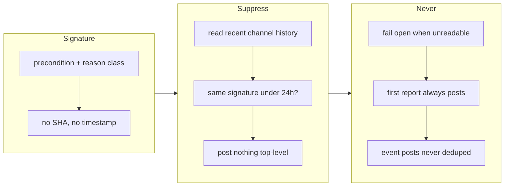

## 1. Overview

The hourly `[Drive]` routine posted a red blocked alert on every failing tick, including
every tick that failed for the condition already reported — one near-identical post per
hour for two days from a single root cause. The routine template now suppresses a repeat
carrying the same failure signature inside a 24-hour cool-down, by reading the channel it
posts to.

**Highlights:**

1. The channel is the only state that survives a fresh-container tick, so the throttle is a
   read-before-post rule rather than a stored counter — nothing new to leak.
2. It fails **open**: an unreadable history posts the alert, because a throttle that cannot
   read its evidence and stays quiet turns a notification defect into a monitoring outage.
3. The live routines are deliberately **not** refreshed here; that is a verbatim,
   one-at-a-time human act, and `/drive` issues no confirmation of any kind.

## 2. Motivation

Measured 2026-08-02〜04: the routine posted a red "drive blocked/aborted" message to
`dev-<repo>` on every tick that failed a precondition, and every one of those ticks failed
for the same already-known reason (a stale baked-in plugin install). That is roughly fifty
near-identical alerts carrying, between them, exactly one piece of information. An alert
stream like that trains the operator to stop reading alerts, which is a worse outcome than
having no alert at all.

The structural constraint shaped the fix. Each tick is a fresh cloud container, so nothing
local survives between ticks — there is no counter to keep and no file to write. But the
Slack channel *does* survive, the routine already has the Slack MCP, and it already posts
there. So the state the throttle needs is the state it is already producing, and the rule
becomes "read before you post" rather than "remember that you posted".

## 3. Changes

The whole change is the routine prompt plus its assertions; no script was involved, because
the cloud path has no notifier script — the prompt *is* the behavior.

### 3-1. Throttle repeat drive-blocked alerts for the same unresolved condition ([c27e4230](https://github.com/qmu/workaholic/commit/c27e4230))

Added a `§0a. Failure alerts are deduped` section to `routines/drive.md` defining a stable
failure signature, the read-before-post rule, the 24-hour cool-down, the fail-open clause
and the requirement that a suppressed tick name the suppression in its own terminal report,
and routed §0's precondition failures through it. Nine assertions were added to the existing
routine-template test, and `workaholify/SKILL.md` records the rule plus the fact that a
template edit necessarily drifts the whole fleet.

## 4. Outcome

The template states all four load-bearing clauses and each is pinned by its own assertion;
`node scripts/test-workflow-scripts.mjs` reports 2052 passed, 0 failed, with `build.mjs` and
`verify.mjs` clean. The orange, green and yellow event announcements are byte-identical.

## 5. Concerns

### The fleet still carries the old template, and nothing here changed that

- **Severity:** moderate
- **Description:** The ticket's third implementation step — refresh the live drive routines
  — was not performed and could not be: it is an outward-facing change to a standing
  process, confirmed verbatim one routine at a time, and `/drive` issues no confirmation of
  any kind. Until a human runs `/workaholify` or `/setup-routines`, every live `[Drive]`
  routine still posts undeduped and will report as drifted (see
  [c27e4230](https://github.com/qmu/workaholic/commit/c27e4230) in
  `plugins/workaholic/skills/workaholify/routines/drive.md`).
- **How to Fix:** Run `/workaholify`'s routine survey and confirm the refresh for each
  `[Drive]` routine. The drift report is the intended signal that this is outstanding.

### The rule is prose, so the tests prove presence rather than behavior

- **Severity:** moderate
- **Description:** The routine is a prompt executed by a cloud session; there is no hermetic
  harness for it. The nine assertions prove the four clauses are *stated*, not that a real
  session suppresses a real repeat. The ticket's own verification method calls for one live
  observation window, which has not happened.
- **How to Fix:** After the fleet refresh, wait for or induce a repeated failure and confirm
  the second tick posts nothing while its session log names the suppression and the
  signature.

### A signature is only as stable as the session that writes it

- **Severity:** low
- **Description:** The signature is composed by the model each tick from the failed
  precondition and its reason class. The template forbids volatile detail by name, but two
  sessions could still phrase the same condition differently and defeat suppression — the
  failure mode would be silent, looking exactly like a genuinely changed condition.
- **How to Fix:** If it is observed, replace the free-form signature with a short closed
  vocabulary of precondition ids that the template enumerates, so the signature is selected
  rather than written.

## 6. Successful Development Patterns

- Ask what the *throttle's own* failure mode is before designing it. Here that question
  produced the fail-open clause and made it the first thing asserted: a dedupe that goes
  quiet when it cannot read its evidence is strictly worse than the spam it replaces,
  because it converts a notification defect into a monitoring outage.
- When a mechanism needs state and the environment has none, look for state the mechanism is
  already producing. The channel was both the output and the memory, which is what let this
  be a read-before-post rule instead of a counter needing somewhere to live — the same
  reasoning that keeps the claim protocol's liveness on the branch tip.
- For a prose rule with no harness, assert the *clauses most likely to be dropped* rather
  than the rule's headline. Signature stability and fail-open are the two edits a future
  reader would make in good faith, and both would leave a feature that looks implemented and
  suppresses nothing — or everything.
