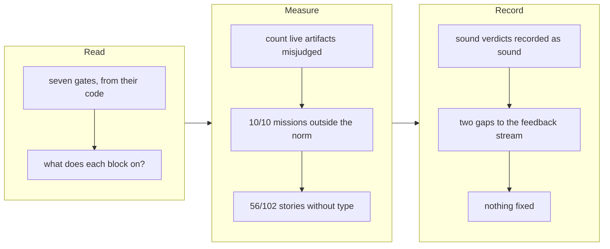

## 1. Overview

The severable fourth unit of the acceptance-ticking mission: audit the repository's other
gates for the failure mode that broke `tick-acceptance.sh` — a verdict that tracks a shape
the tooling expects rather than a real quality failure. Seven gates were audited against
their code with a live count for each. **None reproduces the failure mode**, and the reason
sharpens what that mode is.

**Highlights:**

1. Most of these gates *do* depend on a shape. What made `tick-acceptance.sh` a defect was
   narrower: the shape made a real condition **unreachable**, with no sanctioned way to
   satisfy it. Every gate here leaves its condition reachable.
2. `validate-ticket.sh` would refuse 434 of 635 tickets and refuses 0 — because it is scoped
   to `todo/<user>/`. The scoping *is* the correctness property.
3. Two measured gaps are recorded rather than fixed, per the ticket's own instruction to
   change only a measured misreport.

## 2. Motivation

`tick-acceptance.sh` could flip an acceptance item only when the line carried a
`(#<filename>)` marker, and nothing at authoring time required one — measured at 0 of 37
items across every `/propose`-scaffolded mission. That is a failure *mode*, not a one-off,
and the reporter asked for the generalization: which other gates report on a marker
convention, a file location or a formatting shape instead of on a real quality failure?

The unit was split out rather than run alongside the fix, on the reasoning recorded in
`20260801185301`: the concrete fix should not wait on an open-ended survey, and an audit run
in the same pass as the change it audits tends to grade its own homework. Completing it is
the mission's last acceptance item, which now reads 7 of 7.

The ticket set one non-negotiable condition — **cite the code, not the documentation**. The
acceptance-marker convention was documented correctly and enforced wrongly for its entire
life, so an audit argued from prose would reproduce the defect it is auditing.

## 3. Changes

### 3-1. Audit the remaining gates for shape-dependent green ([a5b254b2](https://github.com/qmu/workaholic/commit/a5b254b2))

Added `docs/gate-audit-shape-dependent-green.md`: a per-gate verdict for
`validate-mission.sh`, `validate-ticket.sh` (including its `resume-*` lint as its own
entry), `validate-story.sh`, `validate-feedback.sh`, `layout-doctor.sh` plus the allowlist,
the branch-safety `leak` rule and `mission/scripts/size.sh` — each citing the code that
implements the check, each carrying a count over live artifacts, and each recorded whether
it came back sound or not. The reproduction commands are in the document so the counts can
be re-derived rather than trusted.

## 4. Outcome

Seven gates audited, seven verdicts recorded with evidence. No gate was found to be
misreporting a real quality condition today, so no gate's behavior changed. The mission's
`## Acceptance` now reads **7 of 7 with 0 unlinked**, which was its last open item.
`node scripts/test-workflow-scripts.mjs` reports 2043 passed, 0 failed, and
`layout-doctor.sh` reports `conforming: true`.

## 5. Concerns

### The live `.workaholic/` tree is not OKF-conformant, and nothing measures it

- **Severity:** moderate
- **Description:** `CLAUDE.md` states that the `.workaholic/` tree is kept OKF-compatible as
  the workflows generate documents, with every written artifact carrying a non-empty `type`.
  Measured: **56 of 102** stories carry no `type:` at all — 55% of that area. The hook is
  not at fault (it grandfathers git-tracked history by design, `validate-story.sh:46-53`),
  and nothing checks the claim over the live tree, because `verify.mjs`'s OKF conformance
  pass covers `outputs/okf/` rather than `.workaholic/`. A green hook therefore reads as a
  conformant bundle while most stories are not one (see
  [a5b254b2](https://github.com/qmu/workaholic/commit/a5b254b2) in
  `docs/gate-audit-shape-dependent-green.md`).
- **How to Fix:** Decide between two honest options and do one: backfill `type: Story` into
  the 56 stories, or narrow the documented claim to "every artifact written since the floor
  shipped". Then add a conformance count over `.workaholic/` so the answer stops depending
  on nobody looking.

### `size.sh`'s norm is satisfied by nothing ever written

- **Severity:** moderate
- **Description:** All **10** missions in the repository — 5 active, 5 archived — report
  `within: false`, and the smallest is 2646 bytes against a 2048 ceiling. Four were closed
  as `achieved` while outside the norm. Nothing is refused (the script never blocks a human
  author) and the numbers are true, so this is neither a block nor a misreport — but a
  pass/fail field that has never once been `true` carries no discriminating power, and a
  reader learns to ignore it exactly as they learn to ignore an alert that fires every hour.
- **How to Fix:** Either raise the ceilings to a value a good mission actually meets, or
  stop rendering the measurement as a pass/fail `within` and report the numbers alone. The
  three-item acceptance norm is the rule doing the real work and should survive either way.

### The `resume-*` lint keys on a filename and has never fired

- **Severity:** low
- **Description:** `validate-ticket.sh:440-455` selects the lint by a `resume-` filename
  prefix, while the condition it guards — a completed step inside `## Implementation Steps`,
  which `/drive` would re-run verbatim — has nothing to do with the filename. It is the
  clearest shape dependence in the audited set. Measured: **3** `resume-*` tickets exist and
  **0** tickets anywhere, under that name or any other, carry the condition.
- **How to Fix:** Nothing, unless the condition is observed. Widening the key would add
  enforcement with no measured demand, which is how a gate layer grows without anyone
  deciding to grow it. Recorded so the shape dependence is known rather than latent.

## 6. Successful Development Patterns

- **Audit against the code and carry a count, or do not audit.** Every verdict here cites
  the implementing lines and a number over live artifacts, and two of the three findings only
  exist because something was counted — "0 of 10 missions meet the size norm" is actionable
  where "the ceiling might be tight" is not. The one gate whose documentation had drifted
  (the OKF `type` claim) would have passed a documentation-based audit unnoticed.
- **Record the sound verdicts too.** Four gates came back sound; writing that down with its
  evidence is what stops them being re-audited next quarter, and it is the part an audit is
  most tempted to omit because it produces no action.
- **A sharper definition beat a longer list.** The audit's most transferable result is that
  "green depends on a shape" is too wide a net — most gates qualify and most are fine. The
  defect is narrower: *the shape makes a real condition unreachable*. Framing it that way
  turned an open-ended survey into seven answerable questions.
