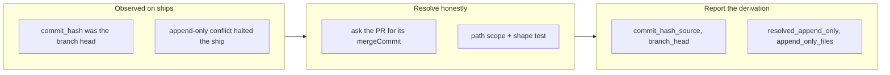

## 1. Overview

Two ship-path defects, both filed after being observed on real ships rather than in tests, and both of the same kind: a script reporting something that reads true and is not. `merge-pr.sh` named the work branch's head as the commit its merge produced, and `catchup-main.sh` called a conflict it could resolve a matter for human judgement.

**Highlights:**

1. `commit_hash` now names the commit that landed on the base, with `commit_hash_source` saying how it was obtained.
2. Append-only `.workaholic/` catch-up conflicts are reconciled by keeping both sides instead of halting the ship.
3. Scope is ruled by path and resolution by shape — neither test alone satisfies both quality gates.

## 2. Motivation

Both defects sat on the seam between what a script reports and what a caller does with it, and both were cheap to miss precisely because each was correct in the environment a developer tests from. `merge-pr.sh` derived `commit_hash` from `HEAD`, which the post-merge checkout block leaves on the base at a desk and on the work branch inside a claim worktree — the layout `/drive` always ships from. `catchup-main.sh` classified conflicts by path, so the `.workaholic/` files that a single append-only writer extends fell outside its allowlist and dragged whole catch-ups to `content`: one prompt interactively, a demotion of an `auto` unit to the PR path unattended, recurring on every concurrent pair of units.

## 3. Changes

Each fix keeps the value the caller already consumed and adds the field that says where it came from, so a derived answer is never mistaken for an authoritative one.

### 3-1. merge-pr.sh reports the branch head as commit_hash ([0e45d77f](https://github.com/qmu/workaholic/commit/0e45d77f))

`commit_hash` is resolved after the merge from the PR's own `mergeCommit`, falling back to the fetched base tip, and the branch head is kept under `branch_head` rather than dropped. Ship Flow steps 6 and 7 record the distinction and tell a tagging caller to verify a `base_tip` value first.

### 3-2. catchup-main.sh classes an append-only .workaholic/ conflict as content ([7a1e8c16](https://github.com/qmu/workaholic/commit/7a1e8c16))

A new pass reconciles append-only `.workaholic/` conflicts in place and completes the merge when nothing is left unmerged; the existing classifier then runs over what remains. The recognizer and resolver live in `skills/ship/scripts/lib/append-only.sh`, which carries the scope-and-shape reasoning.

## 4. Outcome

Concurrent units no longer demote each other over a mission changelog or a story index, and a release tag placed on `merge-pr.sh`'s `commit_hash` lands on the base's first-parent line. 2186 assertions pass, 20 of them new; the three failures are the sandbox proxy's rewritten remote URL and are present on unmodified `main`.

## 5. Concerns

### The new gh path is pinned in source, not exercised at runtime

- **Severity:** moderate
- **Description:** The container has no `gh`, so `merge-pr.sh`'s `gh pr view --json mergeCommit` branch was never executed — the new tests assert the shape of the source, not its behavior (see [0e45d77f](https://github.com/qmu/workaholic/commit/0e45d77f) in `plugins/workaholic/skills/ship/scripts/merge-pr.sh`).
- **How to Fix:** Exercise it on the next real ship and confirm `commit_hash_source` reads `pr_merge_commit`; if it reads `base_tip`, the `--jq` extraction needs checking against a null `mergeCommit`.

### Both tickets' code landed in one commit

- **Severity:** low
- **Description:** The two changes share `ship/SKILL.md`, the test file and `outputs/`, and `archive.sh` stages `-A`, so the first archive swept both; the merge-pr ticket's commit carries only its own ticket move (see [7a1e8c16](https://github.com/qmu/workaholic/commit/7a1e8c16)). `ticket-commits.sh` will therefore attribute it to a code-free commit.
- **How to Fix:** Drive entangled tickets one at a time through implement-then-archive rather than implementing both first, or accept the attribution when a batch genuinely shares files.

## 6. Successful Development Patterns

- Reaching for the merge index's three stages rather than the conflicted working file made "no existing line was modified or removed" exactly decidable — a conflict-marker parser could only have guessed, because markers show what each side has, not whether those lines are new
- Writing the failing case first exposed that the obvious gate-2 test asserted nothing: a ticked acceptance box and an appended changelog line are far enough apart that git merges them cleanly and the classifier never runs

## 8. Notes

The ticket offered path *or* shape for the classification scope and asked for one to be picked with a reason. Both were taken, because quality gate 1 and quality gate 2 cannot be satisfied by either alone; the reasoning is recorded in the library header rather than only here, so it is found next to the code.
