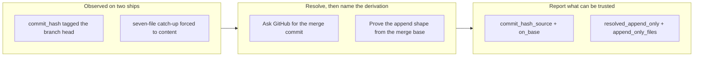

## 1. Overview

Two defects in the ship path's merge step, both filed from the same ship session and both
about a script reporting something that read true and was not. `merge-pr.sh` returned the
work branch's head under the name `commit_hash`, which the release step tags; and
`catchup-main.sh` classed a conflict it could have resolved as one needing human judgement,
which unattended costs an `auto` unit its merge rather than a prompt.

**Highlights:**

1. `commit_hash` is now the commit that landed on the base, with `commit_hash_source` and
   `on_base` naming how it was derived and whether it can be trusted as a tag target.
2. `catchup-main.sh` resolves an append-only `.workaholic/` conflict itself — by proving the
   shape, not by consulting a path list — and completes the catch-up instead of halting it.
3. A merge that never started is no longer reported as a `mechanical` conflict over an empty
   file list.

## 2. Motivation

Both defects were observed rather than predicted, and both had already survived one round of
deferral. The `commit_hash` defect appeared on two consecutive ships, each time recovered by
hand with `gh pr view --json mergeCommit` before a release tag could be placed correctly —
which is what made it deterministic rather than anecdotal. The catch-up defect was measured
on a ship where seven files conflicted: five version manifests already classed mechanical,
and two `.workaholic/` append-only files that alone forced the entire catch-up to `content`.
Both resolved by keeping both sides, neither requiring a judgement about either side.

What connects them is the failure mode, not the file: a field named for one thing carrying
another, and a classifier reporting "needs a human" for a case it could decide. The second
is the one that trains a reader to override the classifier on sight, which is how a genuine
content conflict eventually gets waved through.

## 3. Changes

Both scripts gained a resolution step and, with it, a field naming how the answer was
reached — the shape the release records already use for `since_reason`. The catch-up change
also separated "the merge failed to start" from "the merge conflicted", two states one
answer used to cover.

### 3-1. merge-pr.sh reports the branch head as commit_hash, not the commit that landed on the base ([f6f1863e](https://github.com/qmu/workaholic/commit/f6f1863e))

`merge-pr.sh` now resolves the commit that actually landed — GitHub's own `mergeCommit`
first, the fetched `origin/<base>` tip second, the branch head only as a named last resort —
and reports `commit_hash_source`, `on_base` and `branch_head` alongside it. Ship Flow steps 6
and 7 read that source and refuse to tag a target that is not on the base line.

### 3-2. catchup-main.sh classes an append-only .workaholic/ conflict as content, halting a ship it could reconcile ([a821b0e9](https://github.com/qmu/workaholic/commit/a821b0e9))

`catchup-main.sh` resolves a conflict under `.workaholic/` whose shape proves both sides only
appended, keeping both tails and completing the merge; anything it cannot prove falls through
to the existing classifier. A merge that never started now reports
`conflict: false, reason: "merge_failed"` rather than an empty mechanical conflict.

## 4. Outcome

The ship path no longer produces either wrong answer. A release tag now targets the commit on
the base's first-parent line, and a caller can refuse a target the script could not place
there. A concurrent pair of units — the case that produced the catch-up defect on every
occurrence — now catches up cleanly instead of demoting an `auto` unit to the PR path.

Seventeen new assertions cover both: the append-only resolution end to end (both sides' lines
kept, chronological order, clean tree), the two cases that must still be refused (a modified
existing line; an append-shaped conflict outside `.workaholic/`), the `merge_failed` split,
and `merge-pr.sh`'s resolution order. The suite runs 2174 passed / 3 failed, the same three
environmental failures the untouched base produces.

## 5. Concerns

### The append-shape scope is bounded by path, deliberately

- **Severity:** low
- **Description:** The shape test proves both sides only appended, but it is applied only to
  paths under `.workaholic/` (see [a821b0e9](https://github.com/qmu/workaholic/commit/a821b0e9)
  in plugins/workaholic/skills/ship/scripts/catchup-main.sh). Two branches each appending a
  function to the end of a source file have the identical shape and a real content decision
  behind it, so the bound is a ruling rather than an oversight — but it means an append-only
  file introduced outside that tree gets no help.
- **How to Fix:** Nothing, unless such a file appears. If one does, widen the path bound to
  name it explicitly rather than removing the bound.

### An aborted catch-up discards the append resolutions it computed

- **Severity:** low
- **Description:** When manifest or content conflicts remain, the merge is aborted so the
  caller acts from a clean tree, which throws away the append-only resolutions already staged
  (see [a821b0e9](https://github.com/qmu/workaholic/commit/a821b0e9) in
  plugins/workaholic/skills/ship/scripts/catchup-main.sh). The agent redoing the merge
  reproduces them deterministically, and `append_only_files` names which they are, so nothing
  is lost — but the work is done twice.
- **How to Fix:** Acceptable as is. Leaving the merge in progress would break the "caller acts
  from a clean tree" contract other callers depend on, which is the worse trade.

### merge-pr.sh cannot be exercised end to end hermetically

- **Severity:** moderate
- **Description:** The script requires `gh` and a real pull request, so the tests assert on
  the resolution logic in the source text rather than on a live merge (see
  [f6f1863e](https://github.com/qmu/workaholic/commit/f6f1863e) in
  scripts/test-workflow-scripts.mjs). Source assertions catch a regression that removes the
  resolution; they would not catch one where `gh` returns an unexpected shape.
- **How to Fix:** The next real ship through this path is the end-to-end test — read
  `commit_hash_source` and `on_base` in its output and confirm `pr_merge_commit`/`true`.

## 6. Successful Development Patterns

### Prove the shape instead of maintaining a list of paths

The catch-up fix could have been a list of the four append-only filenames the ticket named.
Instead the script proves the property — the merge base is an exact line-prefix of both sides
— which covers files added to the tree later and, more importantly, cannot be wrong about a
file it accepts. Every way the proof can fail (no merge base, a modified line, an ancestor
without a trailing newline) falls through to the conservative path by construction, so the
test needed no separate safety argument.

### Name how a value was derived, beside the value

Both fixes report the derivation next to the answer — `commit_hash_source`, `on_base`,
`since_reason`'s existing shape. That is what turns a silently-wrong field into one a caller
can refuse: Ship Flow step 7 can now decline to tag a `branch_head` target, which it could not
have done when the field simply asserted itself.

### Read grep's exit status rather than masking it

The dedupe of lines both sides appended verbatim initially used `grep ... || :`, which would
have turned a grep *error* into an empty result — silently dropping the other side's appended
work while reporting a clean catch-up. The status is now read explicitly: 1 means every line
was a duplicate, anything above means grep failed and the full other side is kept.

## Deployment Evidence

- **When:** 2026-08-05T04:43:13+09:00
- **By:** a@qmu.jp
- **Target:** workaholic marketplace (deploy-on-merge)
- **Method:** pre-merge proof per deployments/marketplace.md
- **Status:** pass
- **Observed:** tests 2177 passed 0 failed; build+verify+validate-metadata clean; outputs fresh; scan pass; version 1.0.129 free on origin/main
