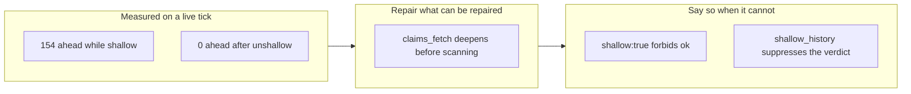

## 1. Overview

The claim scan decided "is this branch still in flight" with `git rev-list --count
base..ref`, a question that is only answerable when the merge base is inside the clone. The
cloud container the hourly runner always starts in clones **shallow**, so the range could not
be reduced, a fully merged branch counted as ahead, and the scan reported PR-units that had
shipped days earlier — offering one of them for takeover.

**Highlights:**

1. The reader **repairs** rather than works around: it deepens a shallow clone before
   anything reads ancestry, which restores the actual question at one fetch per container.
2. When origin is unreachable and it cannot deepen, it **degrades loudly** — `shallow: true`
   out to both consumers, and `resumable: false` with reason `shallow_history`.
3. The fixture gap is closed: every existing fixture was a complete clone, so nothing
   exercised the one condition the production runner is always in.

## 2. Motivation

The defect was measured on the tick that filed the ticket, not inferred. `origin/claude/sharp-rubin-xiorxm`
— merged as PR #109 on 2026-07-30 — counted **154** commits ahead while the clone was shallow
and **0** after `git fetch --unshallow`. It was offered as `resumable`, and it passed *both*
safety gates on the way: the identity matched because this runner had claimed it, and the
heartbeat had lapsed five days earlier precisely because the work had finished.

Two consequences, both landing on the unattended runner. `/drive` treats `resumable[]` as
claimable, so the next step would have been a worktree on merged history and a `Resume` commit
pushed onto shipped work — the same harm `queue_drained` was introduced to prevent, reached by
another route. And `ok` requires no untaken resumable unit, so a phantom recurring on every
fresh container pinned the terminal token at `pending` and trained the operator to ignore it.

The exposure was wide rather than incidental: roughly 180 remote branches here are merged but
never deleted, and each one carrying a `Claim` commit inside the shallow window is a candidate.
Which ones surface depends on the container's clone depth, so the symptom was intermittent —
the worst shape for diagnosis, since a tick that happened to clone deeply enough looked healthy.

## 3. Changes

The two answers are deliberately different because the condition has two different repairs
available, and only one of them is always possible.

### 3-1. The claim scan reports merged branches as in-flight claims in a shallow clone ([a3b32875](https://github.com/qmu/workaholic/commit/a3b32875))

`claims_fetch` now deepens a shallow clone before any ancestry is read; `claims_shallow` and
`claims_ancestry_ok` carry the condition out to `list-claims.sh` and `plan-units.sh`, which
report `shallow` and forbid `ok` on it. A branch whose merge base is unresolvable reports
`resumable: false` with reason `shallow_history` rather than `heartbeat_lapsed`.

## 4. Outcome

Verified against the live container, which was itself shallow when this ran: before the change
the survey offered `batch-20260730180927` in `resumable[]`; after it, the reader deepened the
clone in place and the same survey returned `resumable: []` with that unit absent from the claim
list entirely — quality gate 3, observed rather than simulated.

The suppression path is covered by a new hermetic fixture that clones at `--depth 1
--no-single-branch` from a `file://` origin, which is the production shape: every branch present,
history truncated.

## 5. Concerns

### A shallow clone with an unreachable origin suppresses every resumability verdict, not just the wrong ones

- **Severity:** moderate
- **Description:** When history cannot be deepened, no branch's merge base resolves, so a
  *genuinely* unmerged claim is also reported `shallow_history` and is not offered for
  resumption. The ticket's quality gate 4 asks that a real claim stay resumable "in both a
  shallow and a complete clone"; that holds for a complete clone and for a shallow one with a
  reachable origin (which deepens), but not for shallow-and-offline, where the question is
  genuinely unanswerable.
- **How to Fix:** Nothing, unless a runner is observed operating shallow *and* offline for long
  enough to matter — the deepening path covers the container's real condition. If it is, the
  repair is a deeper partial fetch of the base rather than relaxing the verdict.

### Deepening makes a read operation mutate the repository

- **Severity:** low
- **Description:** `list-claims.sh` documents itself as a pure read, and `claims_fetch` now
  performs `--unshallow`, which materially changes the local object store (it can be a large
  fetch on a big repository, once per container).
- **How to Fix:** Accepted deliberately: the alternative is a reader that knowingly answers the
  wrong question. It touches no working-tree file and no ref content, and the cost is bounded to
  one fetch per container lifetime.

## 6. Successful Development Patterns

### Reproduce in the container that has the defect, before writing the fix

The live checkout *was* shallow, so the before/after could be observed directly rather than
argued from the ticket. That is also what caught the fixture being wrong twice: the first
version fast-forwarded its merge, making the branch tip identical to main's tip — which every
clone reports as 0 ahead — and the second forgot that `--depth` implies `--single-branch`, so
the refs the scan reads were not there at all. Both would have passed as green tests of nothing.

### Assert that the fixture still reproduces the defect

The test asserts `rev-list --count` is greater than zero on the shallow clone *before* asserting
the scan gets the right answer. Without it, any future change that quietly stops producing
truncated history would leave the test passing while covering nothing — which is exactly how the
original gap survived, since every existing fixture was a complete clone.
