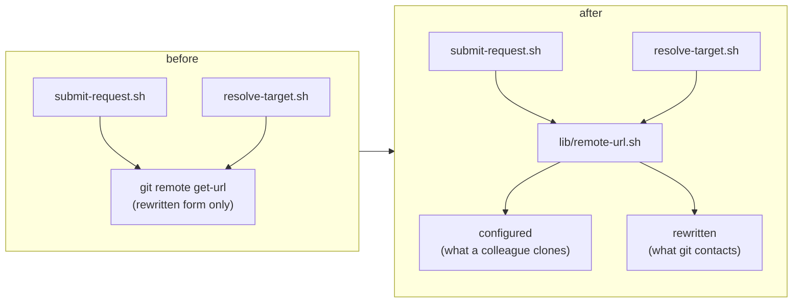

## 1. Overview

A repository's origin URL is not one string, and `/request` assumed it was. Under a git
`insteadOf` rewrite the clone-URL backstop compared the body against a form no developer
would ever paste, so a body carrying this repository's literal clone URL fell through that
rule and was refused by the unrelated `owner/name` rule instead.

- `skills/request/scripts/lib/remote-url.sh` is now the single origin-URL reader, exposing
  the configured and rewritten forms because the correct one depends on the question.
- `submit-request.sh` matches every form, all clone-URL forms before any slug.
- `resolve-target.sh` reports the URL a colleague could clone, not one a local rewrite invented.

## 2. Motivation

The hourly unattended runner found `node scripts/test-workflow-scripts.mjs` — the command
`CLAUDE.md` names under **Local Verification**, and the one tickets cite as their verification
method — red on clean `main` in its own container while CI on the same commit was green. That
matters beyond three assertions: `/drive`'s failure contract records a ticket whose checks go
red as `failed` and leaves it queued, so the runner's only local gate was condemning work it
had no quarrel with, every tick.

The cause was environmental but the defect was not. Git rewrites remotes through
`url.<replacement>.insteadOf <original>`, and a host may inject those rules through the
`GIT_CONFIG_COUNT`/`KEY`/`VALUE` environment triple — invisible to `git config --global --list`,
which is why the first diagnosis missed it.

## 3. Changes

### 3-1. The smoke suite is red under a git insteadOf rewrite ([f00a93f7](https://github.com/qmu/workaholic/commit/f00a93f7))

Fixed at the script layer rather than the assertions. `resolve-target.sh` was returning a
locally-rewritten URL as the destination a human confirms in `/request` — unreachable to anyone
else, and enough to degrade its `visibility` lookup to `unknown`. Hardening the tests alone
would have pinned that as correct.

## 4. Outcome

Suite **2187 passed / 0 failed**, from a baseline of 2176/1. The ten new cases configure the
rewrite in their own fixture rather than sensing the ambient environment, so they run on a CI
runner that has no rewrite — the coverage gap that let this survive.

## 5. Concerns

### The ticket's measured premise was already stale when the work started

**Severity:** low

**Description:** The ticket recorded three failures from one rewrite rule. At drive time the
baseline was 2176 passed / 1 failed: the container's git config had changed mid-session, the
proxy rule was gone, and the surviving failure came from a *different* rule injected through
the environment. Two rules, two provisionings of the same container, hours apart.

**How to Fix:** Nothing to fix here — the fix targets the class, so it holds under either rule.
Recorded because it is a standing hazard for this runner: a measurement taken from the ambient
container can expire before the ticket describing it is driven, so a ticket's evidence should be
re-measured at drive time rather than trusted.

## 6. Successful Development Patterns

- Reverting the fix to confirm the new test actually bites, rather than trusting a green run.
- Reproducing at the script level first, which is what exposed the second rewrite rule the
  ticket had not seen.

## 7. Notes

`outputs/` is unchanged: the `request` skill is not in the generated bundle's closure.
`build.mjs`, `verify.mjs`, `validate-metadata.mjs` and `layout-doctor` are all clean.
