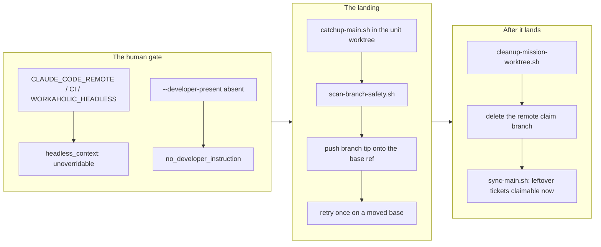

## 1. Overview

`/drive` §6 routed a finished unit two ways, and neither served a developer standing in the session asking to wrap one up now. This branch adds the third route — `land-unit.sh` — which composes the scripts that already existed for each step and refuses outright in a headless context, because the whole premise is that the present developer *is* the review.

**Highlights:**

1. `review` publishes a unit but does not make it **claimable**; landing closes that distance in one sanctioned command.
2. Two refusals guard it: an unoverridable headless backstop, then an explicit `--developer-present` so the route is never reached by omission.
3. It lands by pushing the branch tip onto the base ref, never by merging into a local `main` — a rejected push then changes nothing anywhere.

## 2. Motivation

The ask was ordinary and the plugin had no path for it: "wrap this unit up so a fresh session can resume immediately." `auto` did not apply, because the unit's recorded policy was `review` and a run must never grant itself the policy it was denied. `review` did not serve it either — it publishes the work, but tickets minted mid-run stay on the claim branch, invisible to every other session until a human merges the pull request out of band (J1). "Published" and "queued" are different states, and only the second is claimable.

What happened instead was a hand-rolled landing: a local `git merge`, a manual recovery when `origin/main` had moved underneath it, a manual worktree cleanup, a manual remote-branch delete. Every one of those steps already had a sanctioned script. Nothing composed them, so the composition was improvised under time pressure — precisely the failure mode the sanctioned scripts exist to prevent.

## 3. Changes

The gate runs before anything is fetched or read, the landing composes existing scripts rather than re-deriving their logic, and the teardown follows the land rather than preceding it. That last ordering is the **inverse** of `release-claim.sh`'s, and the asymmetry is the point: release tears down first so a refused teardown never advertises a free unit over unpushed work, while land pushes first because a failed teardown after a successful land loses nothing whereas an early one would destroy the branch still to be pushed.

### 3-1. Add a sanctioned "land this unit now" flow for developer-present sessions ([f99354b4](https://github.com/qmu/workaholic/commit/f99354b4))

Adds `skills/drive/scripts/land-unit.sh` and documents it as §6's third route in the drive skill, the `/drive` command, and `CLAUDE.md`'s claim-protocol section. 14 new assertions in `test-workflow-scripts.mjs` cover both refusals, the headless backstop outranking every flag, a base that moves under the unit mid-run, and the acceptance criterion itself — a mid-run minted ticket offered as backlog by `plan-units.sh` immediately after landing.

## 4. Outcome

The route exists, refuses correctly, and satisfies its stated acceptance criterion under test. The branch does **not** clear the pre-merge safety gate: the scan returns a hard `secret` finding on two lines that are byte-identical to content already on `main`, which is recorded as a concern below and as a queued ticket ([fd9cd18d](https://github.com/qmu/workaholic/commit/fd9cd18d)). This unit's recorded merge policy is `review`, so it stops here for a human either way.

## 5. Concerns

### The branch-safety scan hard-blocks this branch on already-merged content

- **Severity:** high
- **Description:** `land-unit.sh` composes `ship/scripts/catchup-main.sh`, which grew the `drive` and `create-ticket` bundle closures, so `build.mjs` copied all of `ship/scripts/` into two new paths under `outputs/`. Every copied line is an *added* line in the branch diff, and the scan returns `{"verdict":"block", severity "hard", rule "credential"}` on `record-evidence.sh:19` in both copies — a **comment** reading `# (cloud keys, GitHub/Slack tokens, bearer/basic auth, PEM keys, password=/token=`, identical to `plugins/workaholic/skills/ship/scripts/record-evidence.sh:19` which has been on `main` for weeks. The gate fired on the documentation of the secret guard itself. Because the trigger is "a skill gained a cross-skill script reference", any future change that grows a bundle closure inherits the same non-overridable block (see [f99354b4](https://github.com/qmu/workaholic/commit/f99354b4)).
- **How to Fix:** Exempt `linguist-generated` paths from the `secret` rule the way `commit-size.sh` already exempts them for `size` — a credential cannot enter `outputs/` except through `plugins/`, which the same scan covers on the same branch. Queued as `20260805051500-scan-reflags-merged-content-on-bundle-copy.md`, which records the two broader alternatives and why the comment-matching fix must not be taken alone.

### The land route ships to non-Claude agents that cannot use it

- **Severity:** low
- **Description:** `land-unit.sh` is interactive-only by construction, yet it and its newly-pulled `ship/scripts/` closure (+108 KB) now ride the generated `outputs/workflows` bundle to every non-Claude agent (see [f99354b4](https://github.com/qmu/workaholic/commit/f99354b4) in `outputs/workflows/skills/create-ticket/`).
- **How to Fix:** Accepted for now — composing `catchup-main.sh` rather than duplicating it is the right trade, and the build has no per-script exclusion. Revisit only if bundle size becomes a real constraint.

### `--developer-present` cannot prove a developer is present

- **Severity:** low
- **Description:** The flag is an instruction, not evidence; only the environment backstop is something a caller did not choose in the moment, which is why it is checked first and is not overridable. This is stated in the script and the skill rather than papered over.
- **How to Fix:** No fix — this is the honest bound, the same one `authorize-routine-change.sh` reaches by a different route. It is recorded so a future reader does not mistake the flag for an authorization mechanism.

## 6. Notes

Minted mid-run: `20260805051500-scan-reflags-merged-content-on-bundle-copy.md`, provoked by the scan finding above.
