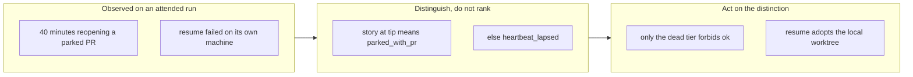

## 1. Overview

An attended `/drive` run spent its opening ~40 minutes reopening a pull request the developer
considered finished and parked, while their actual work waited — and they interrupted twice to
ask why. Two separate defects produced that: the survey could not tell a unit **stopped at its
PR** from one that **died mid-drive**, and the contract made every resumable unit a mandatory
takeover. A third, quieter one sat underneath: `claim.sh resume` failed outright in the exact
case resumption exists for.

**Highlights:**

1. `resume` **adopts** the worktree this machine already has, instead of failing through the
   creator with `worktree_creation_failed` — which it did on every same-machine resume.
2. The resumable offer is now **two tiers**: `heartbeat_lapsed` (a dead run — mandatory, still
   forbids `ok`) and `parked_with_pr` (reached its PR — reportable, does not).
3. The parked signal is the branch's own committed story file, so the verdict stays offline.

## 2. Motivation

Both halves were observed rather than predicted. The ordering defect is mechanically correct
and humanly wrong: a `review` unit stops at its PR *by design*, so its branch stays unmerged,
its tip stops advancing, and its heartbeat lapses exactly like an abandoned run's. With
follow-up tickets still in `todo/` on that branch it is genuinely resumable — but from the
operator's seat an open PR means "waiting for a human", and a runner reopening it reads as
redoing finished work.

The resume defect is narrower and sharper. Resumption's whole safe case is *your own claim* —
which is precisely when `.worktrees/<unit>/` is still on disk, so the worktree creator refused
with `worktree already exists` and resume returned `worktree_creation_failed` every time. The
run then hand-rolled the takeover — the empty commit, the push, the notifier — replicating the
script's internals, which is the failure the sanctioned scripts exist to prevent.

## 3. Changes

The ticket offered three alternatives for the ordering half; the middle one was taken, and the
reasoning is recorded below rather than left implicit.

### 3-1. /drive resume ordering overrides the operator's actual WIP, and same-machine resume fails ([5306bb07](https://github.com/qmu/workaholic/commit/5306bb07))

`claim.sh resume` adopts an existing `.worktrees/<unit>/` when it is on the claim's branch at
the tip the resumability decision observed, and an abort never tears down a worktree it did not
create. `claims.sh` splits the resumable verdict into `parked_with_pr` and `heartbeat_lapsed`;
`plan-units.sh` carries `resume_reason` into its `resumable[]` rows, and the drive contract makes
only the dead tier mandatory.

## 4. Outcome

A run can now tell the two situations apart and act differently: it still takes over a unit whose
run died before claiming anything fresh, but a unit parked at its PR no longer outranks the work
in front of it, and no longer pins the terminal token at `pending` on its own. A same-machine
resume works through the sanctioned script rather than being reconstructed by hand.

Twelve new assertions cover both halves — the story-file transition flipping the same unit from
`heartbeat_lapsed` to `parked_with_pr`, the survey carrying the tier, adoption returning the
existing worktree path and leaving it intact, and the takeover commit still being empty and
correctly subjected. Suite: 2189 passed, 1 failed — the single failure is the pre-existing
`/request` clone-URL case present on the untouched base.

## 5. Concerns

### The CARRY-ranking alternative was not implemented

- **Severity:** moderate
- **Description:** The ticket's proposal 2 listed three options and this branch took the middle
  one. The third — ranking an active mission whose next ticket is a CARRY resume ticket ahead of
  parked takeovers — is not implemented (see
  [5306bb07](https://github.com/qmu/workaholic/commit/5306bb07) in
  `plugins/workaholic/skills/drive/SKILL.md`). It changes offer *ordering across artifact kinds*
  rather than adding a distinction, which is a larger and separable design change.
- **How to Fix:** Nothing unless the complaint recurs. The measured problem was "a parked unit
  outranked my WIP", and making the parked tier non-mandatory answers exactly that; if a
  developer's CARRY ticket still loses to a genuinely dead unit, that is the case ranking would
  address, and it should be ticketed with that observation attached.

### "Parked" is inferred from the story file, not from the PR

- **Severity:** low
- **Description:** `claims_has_story` reads `.workaholic/stories/<branch>.md` at the branch tip
  (see [5306bb07](https://github.com/qmu/workaholic/commit/5306bb07) in
  `plugins/workaholic/skills/drive/scripts/lib/claims.sh`). A unit whose story was committed but
  whose PR was never opened — a `create-or-update.sh` failure after the story commit — reads as
  parked when it is closer to dead.
- **How to Fix:** Accepted. The alternative is a `gh pr view` per claim, which would break the
  scan's offline-capable property that the library spends its longest comment defending, and the
  approximation errs toward *not* forcing a takeover, which is the safe direction here.

## 6. Successful Development Patterns

### The distinction was already recorded — nothing read it

"Did this unit reach its PR?" needed no new artifact and no network call: `/report` already
commits the branch story as part of opening the pull request, so the file's presence at the tip
is durable, offline evidence. Looking for an existing record before inventing a signal kept the
whole resumability verdict offline-capable, which is a property the scan is explicitly built on.

### An abort may only destroy what this invocation created

Adoption made the existing teardown-on-abort dangerous in a way it had never been: the same
`cleanup-mission-worktree.sh` call that correctly discards a worktree this run just created would,
on an adopted one, delete local state the run did not make — possibly a developer's uncommitted
work — merely to report a race it lost. Gating the cleanup on which path ran was a two-line change
that only became necessary because the feature changed who owned the worktree.

### A test that encodes the old contract is part of the change

One existing assertion pinned the single-tier `ok` rule verbatim, so it failed the moment the
contract gained a second tier. That is the test doing its job — the rule really did change — so it
was rewritten to assert both tiers rather than relaxed, and it now pins the carve-out too.
