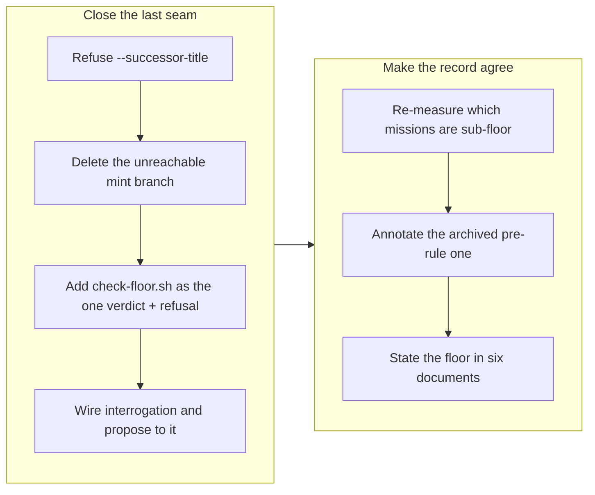

## 1. Overview

The mission ticket floor — *a mission is created with two or more tickets, or it is not a mission* — was decided and documented on a previous branch but never fully enforced: `close.sh` still minted a ticketless successor from `--successor-title`, the seam that put a zero-ticket mission on `main` hours earlier. This branch closes that seam, gives the floor a single enforcement face every creation path calls, and makes all six documents that describe a mission state its lower bound.

**Highlights:**

1. `close.sh --successor-title` is refused, and its mint branch deleted rather than left unreachable — `carried` now has exactly one route, `--successor <slug>`, which appends the predecessor's unmet items.
2. `check-floor.sh` turns `queue-size.sh`'s `meets_floor` into a verdict a seam can act on: exit 1 plus a refusal naming the alternative artifact to write.
3. Every document describing a mission now states the floor, and `.workaholic/README.md` gained a table answering which of feedback / ticket / mission to write for what you have.
4. Both sub-floor missions on record are resolved: one had already been replanned into two tickets, the other is archived pre-rule history, annotated rather than edited.

## 2. Motivation

The rule was settled and the record said so, but the code disagreed with it. Three documents described `--successor-title` as refused while `close.sh` carried a comment explaining that the refusal was *sequenced behind* a fix to the carry's inheritance — a fix that had since merged. So the branch began from an unambiguous gap rather than a design question: the blocker named in the code was gone, and a reader could not tell which of the two accounts was true.

The second half of the work was the one that decides whether a rule survives. A floor enforced in code but absent from the documents is a floor the next session breaks in good faith, because the documentation is where an agent learns what a mission *is* — and five documents still described a mission as a batch of tickets with no lower bound. That framing is what let a ticketless mission read as legitimate in the first place.

## 3. Changes

The enforcement went in first, so the cleanup could not be re-dirtied by a seam still minting violations. Deleting the mint branch — rather than gating it — was the one judgment call: a refused flag leaves sixty lines that no test exercises and that still read as a description of what the script does. The second ticket then re-measured rather than trusting its own premise, and found one of the two named instances already fixed.

### 3-1. Enforce the two-ticket floor at every seam that brings a mission into existence ([2dec878b](https://github.com/qmu/workaholic/commit/2dec878b))

Refused `close.sh --successor-title` with a refusal that names the sanctioned route, deleted the now-unreachable mint branch so `carried` has one route, and added `check-floor.sh` as the single enforcement face over `queue-size.sh`'s existing count. The Creation Interrogation and `/propose` were pointed at it; `create.sh`'s exemption was confirmed rather than assumed and its reason left in the header.

### 3-2. Resolve the two sub-floor missions on record, and make every document describing mission creation state the floor ([050881f1](https://github.com/qmu/workaholic/commit/050881f1))

Re-ran the count instead of trusting the ticket's snapshot: the live sub-floor mission had already been replanned into two tickets, so the dissolve path was never needed, and all four active missions pass at 4/4/2/4. The archived one-ticket mission is annotated as pre-rule in a new feedback record and in `mission/SKILL.md`, with its file untouched. Six documents now state the floor, and two adjacent lifecycle errors in the paragraphs being edited were repaired.

## 4. Outcome

The mission `make-a-mission-impossible-to-create-without-its-ticket-set` reaches 3/3 acceptance with this branch. All four seams that can bring a mission into existence are accounted for: two enforce the floor through `check-floor.sh`, one refuses categorically, and one documents why it cannot check. The repository's own state is clean against the rule, and the rule is stated wherever a mission is described — so the next session that reaches for `/mission` with a single unit of work is told to write a ticket instead, by the documents as well as by the scripts.

One open concern from the feedback stream is resolved by the work: `20260730111101-a-ticket-count-floor-at-emission-has-nothing-to-count` argued that a floor at emission has nothing to count and that a single-ticket mission passes every guard. Both halves are closed — the floor was placed at the publish seam rather than at emission, and `FLOOR=2` replaced the `-eq 0` guards it named.

## 5. Concerns

### The floor is prose-enforced at the two seams that matter most

- **Severity:** moderate
- **Description:** Two of the four creation seams — the Creation Interrogation and `/propose` — are agent-executed prose. `check-floor.sh` gives them one verdict and one refusal text, but nothing makes them call it; an agent that skips the call publishes a sub-floor mission exactly as before (see [2dec878b](https://github.com/qmu/workaholic/commit/2dec878b) in `plugins/workaholic/skills/mission/SKILL.md`). This is not an oversight — the decision ticket recorded why a write-time hook cannot work, since the tickets do not exist when `mission.md` is written — but it means the floor's guarantee at those seams is a convention, not a gate.
- **How to Fix:** If a violation recurs, the check belongs in the *publish* script rather than in the seam's prose: `publish-tree-pr.sh` is generic, but a thin mission-aware publish wrapper could call `check-floor.sh` on the mission being published and refuse before the push. Measure first — the seam has not yet failed with the gate available to it.

### The mission SKILL.md size ratchet has one line of headroom

- **Severity:** moderate
- **Description:** `test-workflow-scripts.mjs` asserts `mission/SKILL.md` stays under 420 lines; it sat at 419 before this branch, so the floor sentences broke the suite and had to be folded into an existing bullet to fit (see [050881f1](https://github.com/qmu/workaholic/commit/050881f1) in `scripts/test-workflow-scripts.mjs`). The next legitimate addition hits the same wall, and the obvious fix — raising the constant — is exactly what the ratchet exists to prevent.
- **How to Fix:** When it next fires, relocate a section into `skills/mission/reference/` (the pattern the skill already uses, and what took it from 562 lines to 380 originally) rather than bumping the number. The Redefinition record and the carry doctrine are the two largest reference-shaped blocks left.

### Four sibling claim branches may collide on the version bump

- **Severity:** moderate
- **Description:** Four PR-units were claimed in the same drive tick (`make-a-mission-impossible-to-create-without-its-ticket-set`, `make-routine-notifications-one-semantic-story`, `make-the-branch-story-measurably-shorter`, `make-the-feedback-loop-actually-propose`). The report flow bumps the patch version on each branch, so if the siblings do the same, whichever merges second onward conflicts in the five version files (see [14d14df2](https://github.com/qmu/workaholic/commit/14d14df2) in `.claude-plugin/marketplace.json`). The conflict is mechanical and safe, but it is guaranteed rather than incidental, and it lands on the human doing the merges.
- **How to Fix:** Move the version bump from report time to ship time, where exactly one unit is merging and the number can be derived from `main` at that moment. That is a change to the report flow's step 1, not to this branch, and it is worth deciding rather than absorbing four times.

### The root README documents a mission lifecycle that no longer exists

- **Severity:** moderate
- **Description:** `README.md` still describes `status: draft`, `/mission approve <slug>`, a worktree created at mission creation, and artifacts published straight to `main` — all retired by decisions K1, K2 and J4. The floor sentences there were corrected on this branch, but the lifecycle drift is older and wider, and the README is the one document a person reads before installing anything.
- **How to Fix:** Ticket `20260804205500-truth-up-the-root-readme-s-retired-mission-lifecycle.md` was minted for it, listing the six drifted spots and naming `CLAUDE.md` as the source to transcribe from rather than re-deriving the model a fifth time.

## 6. Successful Development Patterns

- Re-measuring a cleanup ticket's premise before acting on it turned a possible double-fix into a one-line finding. The ticket named "the two sub-floor missions" as fact; one had been replanned in the hours between writing and driving. A cleanup ticket describes the world as it was when it was written, so the first step of driving one is confirming that world still exists.
- Splitting "compute the number" from "enforce the number" into two scripts kept a pure read pure. `queue-size.sh` is called by `plan-units.sh` and `list.sh`, which survey sub-floor missions routinely — making it exit non-zero on a sub-floor verdict would have broken every reader. The enforcing face can fail loudly precisely because it is a separate script.
- When code and prose disagree about a rule that was already decided, the disagreement itself is the specification. Three documents said `--successor-title` was refused and the script said "not yet, because of X"; X had merged, so the work was to make the code true rather than to re-open the decision.

## 7. Notes

The four-ticket mission that produced this branch is now complete (3/3 acceptance, the third ticket having driven on a previous branch). One ticket was minted mid-run and is queued rather than driven here — `20260804205500-truth-up-the-root-readme-s-retired-mission-lifecycle.md`, carrying no `mission:` relation because the README's lifecycle drift belongs to the decisions that caused it, not to the floor.
