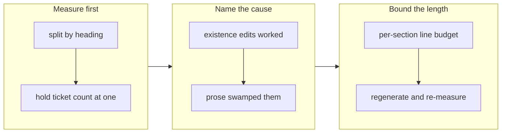

## 1. Overview

Four structural edits to the story template were made to shorten stories, and stories got 25%
longer instead. This branch measured where the lines go, found the template bounded which
sections exist but never how long one may be, and gave each section a line budget.

**Highlights:**

1. The four existence edits all worked (−23.8 lines) and were swamped by +49.8 lines of prose.
2. Concerns held its block count exactly while lines per concern rose 61% — words, not count.
3. `story-sections.sh` is the reusable instrument: it found the growth and verified the fix.

## 2. Motivation

The predecessor mission folded Historical Analysis into Motivation, dropped `low` concerns
from the PR body, made Patterns conditional and flattened the release subsections — then the
mean story grew from 127 lines to 164. The obvious next move was a fifth structural edit on
the same assumption, and the mission explicitly forbade it: measure first. That instruction
turned out to be the whole value of the branch, because the measurement exonerated all four
edits and pointed at something none of them could have fixed.

Past template work had only ever adjusted which sections exist, which is why every previous
round produced a saving and then stopped producing one.

## 3. Changes

The order was the point: the instrument was built and read before any guidance was touched,
so the second ticket's scope was decided by the first ticket's numbers.

### 3-1. Measure which story sections carry the growth ([8a271fa4](https://github.com/qmu/workaholic/commit/8a271fa4))

Added `gather/scripts/story-sections.sh`, which splits stories by heading and reports lines
and `###` blocks per section. Holding the workload at exactly one ticket per story, the two
sets came out at 101.0 → 126.7 body lines. Changes (+14.1) and Concerns (+8.8) carry most of
it, while Release Preparation (−13.8) and the Historical Analysis fold (−7.3) show the
predecessor's edits doing exactly what they were meant to do.

### 3-2. Give every story section a line budget ([ddc37f30](https://github.com/qmu/workaholic/commit/ddc37f30))

The report and review-sections skills now state a line budget per section — Overview 12,
Motivation 9, the diagram 16, each ticket block 9, Outcome 5, each Concerns block 7, Patterns
6 — every number being that section's measured mean from before the growth rather than an
invented target. Handoff and Deployment Evidence are exempt as evidence rather than prose, and
Concerns are budgeted per block so the number of concerns is never trimmed to hit a total.

## 4. Outcome

Regenerating `work-20260804-112404` under the budgets took it from 135 to 87 body lines (−36%)
with every fact, both concerns, both severities and the deployment evidence preserved intact.

## 5. Concerns

### The line budget is guidance, with no gate behind it

- **Severity:** moderate
- **Description:** Nothing rejects an over-budget story, and the same was true of "1-3 sentences"
  and "one paragraph each" — the phrases that drifted (see [ddc37f30](https://github.com/qmu/workaholic/commit/ddc37f30) in `skills/report/SKILL.md`).
- **How to Fix:** If drift recurs, have `/report` measure the story it just wrote and record over-budget sections as a concern — reported, never blocking.

### The predecessor's headline numbers were never reproducible

- **Severity:** low
- **Description:** The mission's 127 → 164 could not be reproduced from any subset of the stories
  on those dates — the file list was never recorded — so the first ticket had to define its own sets before it could measure anything.
- **How to Fix:** Any measurement quoted in a mission or ticket should carry the command that produced it; `story-sections.sh` takes its files as arguments for that reason.

## 6. Successful Development Patterns

- Calibrate a new limit to the measured value from before the regression rather than inventing a target — the number then survives the first argument about whether it is too strict.
