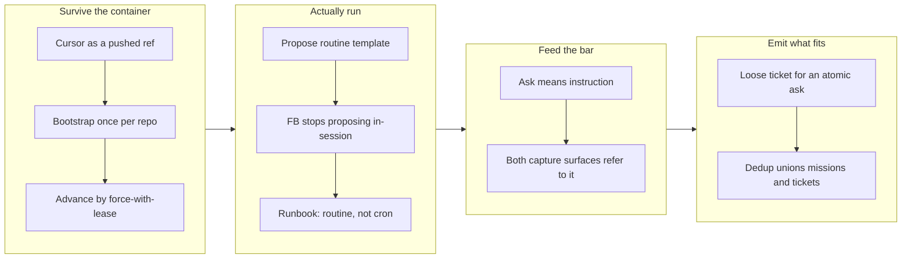

## 1. Overview

The proposal loop existed on paper and produced nothing. This branch fixes the four
independent reasons for that: the cursor could not survive the container the batch runs in,
nothing was scheduled to run the batch at all, work requests were being filed as a `kind`
the judgment bar deliberately ignores, and an atomic ask had no artifact shape to become.
All four are now closed, and the mission's three acceptance criteria read 3/3.

**Highlights:**

1. The proposal cursor is a **pushed ref** (`refs/workaholic/proposal-cursor` on origin),
   bootstrapped once per repository and advanced under `--force-with-lease`, so a fresh
   cloud container reads where the last run left off instead of cold-starting forever.
2. A **`[Propose]` routine template** ships (scheduled every 15 minutes), the `[FB]` routine
   stops attempting an in-session `/propose` it structurally cannot make, and the runbook
   describes the deployment that exists rather than a crontab nobody installed.
3. **A report that asks for something is an `instruction`** — stated once at the capture
   seam, referenced by both capture surfaces, and named as a dependency by the bar that
   relies on it.
4. **An atomic direction becomes one loose backlog ticket** instead of a reported drop, and
   the dedup set became the union of `feedback:` refs across missions *and* tickets, queued
   and archived.

## 2. Motivation

Two open concerns had said the same thing since 2026-07-30: the cursor is runner-local
state, the routine that would run the batch starts a fresh container every tick, so every
firing bootstraps to the current tip, reports `initialized: true`, and stops. Not once — 
permanently. That was the loudest failure, but fixing it alone would have changed nothing
observable, because the batch had no runner: `docs/proposal-loop-runbook.md` prescribed a
15-minute server crontab whose installation was deliberately a human act, so it was never
installed anywhere, and the only place `/propose` actually ran was inside the `[FB]`
routine's own session — where the record it had just written was still on an unmerged
branch and invisible to its own window by design.

Two quieter failures sat underneath. The judgment bar lets an `instruction` originate a
proposal and never lets a lone `concern` do so, an asymmetry that exists to stop a
15-minute batch proposing on every worry anyone has ever recorded — but the capture seam
was not aligned with it, so plain requests for work arrived as concerns and a correctly
running batch judged them to silence. And the mission-ticket floor had wired its refusal
half without its emission half: a direction the batch could not decompose into two or more
tickets was dropped with a reason, even when it was a single, obviously actionable ask.
Four different things, one symptom — a loop that never proposed anything.

## 3. Changes

The work ran in the order the mission set: make the batch able to run at all, give it
something that runs it, make sure the input it judges is classified the way the bar
expects, then let it emit the artifact an atomic direction actually needs. Each ticket's
verification ran before the next started, and the hermetic suite grew from 2134 to 2170
assertions across the four.

### 3-1. Move the proposal cursor to a shared pushed ref ([38ce6565](https://github.com/qmu/workaholic/commit/38ce6565))

`cursor.sh` now stores the cursor at `refs/workaholic/proposal-cursor` on origin and reads
it through a local ref of the same name: absent on origin it bootstraps to `origin/main`
HEAD **and pushes**, so initialization is once per repository rather than once per
container; unreachable origin degrades the read (`fetched: false`) while an unpublishable
advance fails loudly. A legacy runner-local file is folded into the ref on first read and
removed. `/propose` step 2 continues on `initialized: true` instead of stopping.

### 3-2. Give the proposal batch a routine seat ([c63d2ca8](https://github.com/qmu/workaholic/commit/c63d2ca8))

A fourth routine template, `[Propose]`, scheduled `*/15 * * * *`: one `/propose` per tick,
the same deduped red-alert rule the `[Drive]` template uses, and a Slack post only when a
proposal PR was opened. The `[FB]` template's in-session `/propose` step is gone with a
line saying where it went. The runbook is rewritten around the routine, with the cron shape
kept as a labelled predecessor.

### 3-3. Decide feedback kind at the capture seam ([9e9a178f](https://github.com/qmu/workaholic/commit/9e9a178f))

`feedback/SKILL.md` gained *Choosing the kind*: if the reporter asks for something to be
done it is an `instruction`; a `concern` is a worry with no ask attached. `/fb` and the
`[FB]` routine reference that one statement, and `propose/SKILL.md`'s bar names its
dependency on it plus the `supersedes`-based correction path for a record already misfiled.

### 3-4. Emit a loose ticket for an atomic direction ([f159e26b](https://github.com/qmu/workaholic/commit/f159e26b))

`scaffold-proposed-ticket.sh` takes a `--loose` form that writes no `mission:` key and
carries `feedback: [...]` instead, refused as `no_feedback` without refs. `list-proposed-refs.sh`
unions mission-side and ticket-side refs across `todo/` and `archive/`, through a
`read-feedback-relation.sh` generalized to any artifact and to many files at once.

## 4. Outcome

The loop can now run end to end without a human in it: a scheduled routine starts the
batch, the batch reads a cursor that survives its container, the records it reads are
classified the way its bar expects, and both an atomic ask and a decomposable direction
have an artifact to become. Two open stream concerns are recorded as resolved. What remains
before anything is actually proposed is a human act by design — creating the live routine
through `/setup-routines`' verbatim-confirmed seam, and merging this pull request.

## 5. Concerns

### The version bump was deliberately skipped

- **Severity:** moderate
- **Description:** Two sibling claim branches cut from the same base (`work-20260804-202044`
  and `work-20260804-202056`) have already bumped every version file to `1.0.127`. A third
  identical bump on this branch would give three PRs the same target version, and since the
  deploy-on-merge release is idempotent, the second and third merges would go silently
  unreleased. The correct version for this branch is unknowable until the others merge, so
  no bump was made here.
- **How to Fix:** Bump once after these branches land — the version files are a lockstep set
  (`.claude-plugin/marketplace.json` root and every `plugins[]` entry, both plugin manifests,
  then a rebuild for the generated Codex manifest) — rather than resolving three colliding
  bumps at merge time.

### The routine is a template, not a running process

- **Severity:** moderate
- **Description:** This branch ships what a `[Propose]` routine *would* be. No live routine
  exists, and `compare-routines.sh` will report `propose` as missing for every repository
  until a human creates one. So merging this changes nothing observable about the loop's
  throughput on its own.
- **How to Fix:** Run `/setup-routines` (or `/workaholify`) in the repository and confirm the
  rendered propose routine verbatim. Check the web bootstrap first — without
  `.claude/hooks/session-start.sh` the routine fires on time and stops at its own "the
  workaholic plugin must be loaded" precondition while reading as healthy.

### A loose ticket's provenance depends on the seam that wrote it

- **Severity:** low
- **Description:** A loose proposed ticket's `feedback:` refs are its only link back to the
  record it answers, and the scaffold enforces them — but a hand-written backlog ticket that
  answers a feedback record records nothing, so that record stays in the dedup window and can
  be proposed again.
- **How to Fix:** Nothing to change today; the exposure is bounded because only `/propose`
  reads the set. If hand-written tickets start answering stream records routinely, `/ticket`
  is the seam that would need to offer the same relation.

### The cardinality call is a judgment with no gate

- **Severity:** low
- **Description:** Nothing prevents the batch from dressing a decomposable direction as one
  loose ticket, which is the easy way to publish something that should have been split. The
  mission-ticket floor is machine-checked; its counterpart is not.
- **How to Fix:** Leave it. The bar itself is a written judgment for the same reason, and a
  mechanical test for "is this one thing or three" would be guessing. Watch what the batch
  actually emits over the first weeks and revisit if loose tickets dominate.

## 6. Successful Development Patterns

- Measuring git's actual behaviour before writing the script decided two design points that
  prose could not: pushes to `refs/workaholic/*` are fast-forward-checked without any force
  flag (so the cursor cannot rewind by accident), and `--force-with-lease` is consulted only
  when the update changes the ref (so a race test must advance to a *different* commit, or it
  passes while proving nothing).
- Making the single reader **variadic** rather than adding a second parser resolved a direct
  conflict between "one parser for one field" and "this scan runs over 600 files every 15
  minutes" — the two requirements looked opposed until the shared reader took a file list.

## 8. Notes

The four tickets were driven in the mission's stated order, which mattered twice: tickets 2
and 3 both edit the `[FB]` routine template, and ticket 4's documentation supersedes a hard
rule ticket 2 had written about one-ticket missions. Driving them in order meant no rebase
and no contradictory text at any commit.
