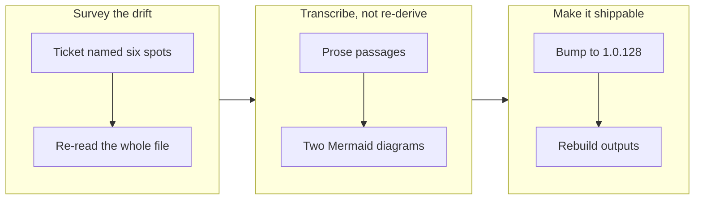

## 1. Overview

The repository's front door still taught a mission lifecycle that decisions K1, K2 and J4 retired weeks ago. This branch transcribes `README.md` onto the current model from the documents that were already correct, and bumps the version so the corrected front door actually ships.

**Highlights:**

1. The mission lifecycle rewritten to one in-flight state, with merging the artifact's pull request as the approval
2. Both Mermaid diagrams re-drawn — each encoded the retired draft-to-approved gate as topology
3. Version bumped to 1.0.128 across all five version files, with `outputs/` regenerated

## 2. Motivation

`README.md` is the one document a person reads before installing anything, and an agent reading it was being taught `/mission approve <slug>` — a command deleted on 2026-07-31. The drift was already known rather than newly discovered: an open concern from PR #173 recorded it verbatim and deferred the fix to keep that branch's diff on its own subject. Three sibling documents were corrected in the meantime, which left the front door as the last stale copy and the only one a new reader meets first.

## 3. Changes

The ticket listed six drifted lines and its third implementation step asked for a whole-file re-read, which found roughly twice that many. Every replacement was transcribed from `CLAUDE.md` and `.workaholic/README.md` rather than re-derived from the scripts, because the ticket's Considerations warned that re-deriving would produce a fifth description of one model.

### 3-1. Truth up the README's mission lifecycle ([02370686](https://github.com/qmu/workaholic/commit/02370686))

Rewrote every passage describing the retired lifecycle: the `/mission` command row, the overnight walkthrough, the sources-and-executor section, two lifecycle-table rows, and both Mermaid diagrams. Also corrected the publication model throughout — artifacts reach `main` behind a `work-*` pull request rather than being pushed straight to it.

## 4. Outcome

A reader can now follow the README's mission example end to end without meeting a command that does not exist. The ticket's acceptance grep returns only sentences meaning "merging the pull request is the approval", no `draft` lifecycle term survives, and the open concern from PR #173 is resolved with a superseding record.

## 5. Concerns

### One lifecycle model, four hand-maintained descriptions

- **Severity:** moderate
- **Description:** The mission lifecycle is stated independently in `README.md`, `CLAUDE.md`, `.workaholic/README.md` and `plugins/workaholic/skills/mission/SKILL.md`. All four were repaired separately inside one week and this branch is the fourth such repair, so the drift recurs because nothing ties them together.
- **How to Fix:** Name one canonical (`CLAUDE.md` already plays that role in practice) and have the others link rather than restate, or extend `doc-drift.sh` to flag a lifecycle-vocabulary change that reaches only some of the four.

## 6. Successful Development Patterns

- A retired model survives longest in diagrams: both Mermaid fences drew `draft → approved` as topology, which a reader absorbs faster than prose and which no wording fix reaches — so when a lifecycle changes, scan the mermaid fences as a pass of their own rather than trusting a grep over the prose.
