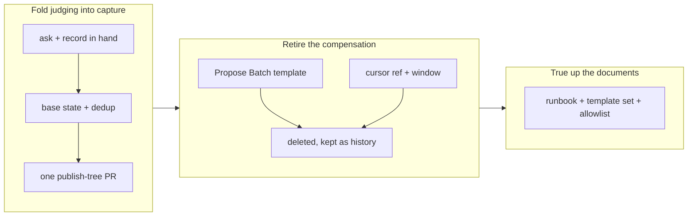

## 1. Overview

Proposing moved into the session that receives the ask. The `[Propose]` routine now writes the feedback record, judges it, and opens **one** pull request carrying the record together with whatever the judgment warranted — a mission with its ticket set, one loose ticket, or the record alone — so merging that pull request approves both halves at once. The batch seat and the merged-main window that existed to compensate for the old blindness are deleted, and every document that described them says what replaced them.

**Highlights:**

1. Record-only is now a *judgment* a reader can disagree with, not the silence of a proposer that structurally could not see the record it had just written.
2. The `[Propose Batch]` template, the shared `proposal-cursor` ref and the window reader are gone; the shipped template set is three.
3. `survey-state.sh` lost its required cursor argument for an optional range that reports how it was chosen (`since_reason`).

## 2. Motivation

`/propose` was built to read only feedback **already merged to `main`**. That made the record a capture session had just written invisible to it by construction, so a second seat had to exist purely to pick that record up later — a cron template, a shared pushed cursor, and a window reader, all compensating for a blindness the first seat never needed to have. The developer ruled the design out the same day it shipped: the judgment belongs where the information is.

The cost of the old shape was not just the machinery. "No proposal" and "could not see the record" produced the same empty result, so a reporter could not tell a considered no from a mechanical one — and neither could anyone reading the loop's output later.

## 3. Changes

The first ticket built the new seam and the second removed everything the old one needed, in that order so the branch never lacked a working propose path.

### 3-1. Judge and propose inside the capture session ([517c2d81](https://github.com/qmu/workaholic/commit/517c2d81))

The propose skill, its command, and the `[Propose]` routine template now take the ask and the just-written record as direct input, emitting the record plus whatever the judgment warrants in a single `publish-tree-pr.sh` call. The cardinality table gained record-only as its third row, `survey-state.sh` traded its required cursor for an optional range reporting `since_reason`, and three hermetic cases pin the composition, the record-only fallback, and what the dedup set can and cannot key on at this seam.

### 3-2. Retire the batch seat and the merged-main window ([a36d4d99](https://github.com/qmu/workaholic/commit/a36d4d99))

Deleted `routines/propose.md`, `cursor.sh`, `new-feedback.sh` and their hermetic cases, and stripped the skill's Cursor contract and window sections. The runbook is rewritten around the capture-seam flow with the batch as a dated history section that cites the ruling and lists both operator cleanups; every template-set enumeration across eight documents now reads three; and `proposal-cursor` left the `.workaholic/` root allowlist in all three of its sources of truth.

## 4. Outcome

The loop has one proposing seat, and it is the one holding the context. The hermetic suite is green at 2160 (2169 on `main` before the branch; the difference is 21 new assertions less the removed cursor and window cases), `build.mjs`/`verify.mjs`/`validate-metadata.mjs` are clean with `outputs/` regenerated, `layout-doctor` reports conforming, and the ticket's grep gate returns only history-labelled prose.

## 5. Concerns

### publish-tree-pr.sh's branch_collision recovery does not work

- **Severity:** moderate
- **Description:** The refusal's own detail says "the commit is intact in the publish tree and the next call succeeds", but the next call runs `commit.sh` first, which stages nothing because the commit was already made, and reports `nothing_to_commit` — so the artifact is stranded on `publish-main` with no scripted way out (measured while writing the composition test; see [517c2d81](https://github.com/qmu/workaholic/commit/517c2d81) in `plugins/workaholic/skills/branching/scripts/publish-tree-pr.sh`).
- **How to Fix:** On a re-call with an unpushed `publish-main` commit, skip the commit step and retry the push and PR against a freshly minted branch name; until then the runbook's §6 tells the operator to push and open the PR by hand.

### The live [Propose] routine still carries the retired prompt

- **Severity:** moderate
- **Description:** The shipped `fb` template changed materially — it now instructs the session to run `/propose` and forbids a second pull request — while the live routine in the account still carries the old prompt with its "do NOT run /propose here" prohibition (`plugins/workaholic/skills/workaholify/routines/fb.md`).
- **How to Fix:** After this merges, run `/setup-routines` and confirm the refreshed `[Propose]` body verbatim; until then the routine keeps capturing records and proposes nothing.

### A stale proposal-cursor file now reports as a layout finding

- **Severity:** low
- **Description:** `proposal-cursor` left the allowed `.workaholic/` root files, so a checkout that ran the batch today (this one included) reports `conforming: false` from `layout-doctor.sh` until the git-ignored file is deleted. CI clones fresh and never sees one.
- **How to Fix:** `rm -f .workaholic/proposal-cursor`, and `git push origin :refs/workaholic/proposal-cursor` if today's runs created the ref — both listed in the runbook's §7.

## 6. Successful Development Patterns

- Driving the replacement before the removal kept the branch honest at every commit: the first commit added a working seam, the second deleted a compensation that was by then genuinely unused, so no revision of the branch describes a loop with no way to propose.
- Deleting one template file failed seven assertions across four test functions, each holding a different document's idea of the shipped set — the enumeration is enforced by the suite rather than by discipline, which is why `list-routine-templates.sh` scans the directory instead of listing ids.

## 7. Release Preparation

**Verdict**: Needs attention before release

- **After release:** Refresh the live `[Propose]` routine through `/setup-routines`, confirmed verbatim — the shipped template changed and the running one has not.
- **After release:** Delete the retired cursor artifacts named in the runbook's §7 (the remote ref, and any git-ignored `.workaholic/proposal-cursor`).

## 8. Notes

The version bump was deliberately skipped. `origin/main` is at 1.0.128, no unmerged branch claims 1.0.129, but four sibling units are in flight from the same base and today's history already contains two separate commits bumping to v1.0.127 — the collision that silently leaves a merge unreleased. Bump once, after these land.
