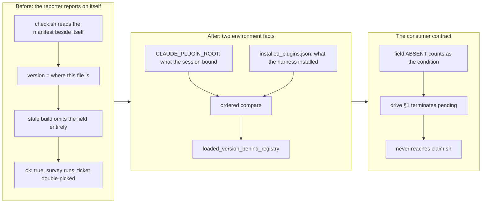

## 1. Overview

`check-deps` reported plugin staleness from inside the plugin, so a build old enough reported itself healthy — and on 2026-08-04 that silence let a tick bound to `1.0.112` claim a ticket that was already driven. The verdict now compares two facts about the *environment* rather than about the plugin, and `/drive` stops on it instead of printing it.

**Highlights:**

1. Neither operand is plugin content: the harness's binding (`${CLAUDE_PLUGIN_ROOT}`) against the harness's registry (`installed_plugins.json`).
2. `version` now describes what the session **bound**, not where `check.sh` happens to sit — the change that actually closes the blind spot.
3. Registry drift is a **stop** before the survey; checkout drift stays a warning. Different causes, different fixes.

## 2. Motivation

`plugin update` unpacks the new version beside the old one and deletes neither, so a session can bind a superseded cache directory and keep it — and it is already decided that a SessionStart hook never refreshes a running session. The existing mitigation was to make drift *legible*, which was right for the drift then known.

It had a blind spot in exactly the case it was designed for. `check.sh` ships inside the plugin, so a stale run executes the stale copy, and a copy old enough predates the drift field entirely: `{"ok": true, "version": "1.0.112", "guards_present": true}` — no drift reported, `ok: true`, a healthy-looking run. The reporter's own age was the thing being reported.

Measured on the 2026-08-04T22:58Z tick: the registry recorded `1.0.129`, updated ~85 seconds before the session's first commit; the session ran `1.0.112` anyway. That version's `claims.sh` predates the rename-following resolution and the `queue_drained` verdict, so the survey reported five already-driven tickets as fresh backlog and the tick **claimed one of them** — a double-pick reaching a pushed ref, the precise failure the claim protocol exists to prevent. It was caught only because the runner cross-checked by hand.

## 3. Changes

The fix is less about the new fields than about the input to the old one. `version` used to come from the manifest beside `check.sh`, which answers "where is this file" rather than "what is running" — and the two diverge in precisely the case worth catching. Running `check.sh` from a checkout while the session ran a stale cache produced a confident, matching pair: the reporter agreeing with itself.

### 3-1. The version-drift check ships inside the artifact whose staleness it reports ([28fd132f](https://github.com/qmu/workaholic/commit/28fd132f))

Adds `registry_version` / `registry_unreadable` / `loaded_version_behind_registry` to `check.sh`, repoints `version` at `${CLAUDE_PLUGIN_ROOT}`, and makes `/drive` §1 terminate `pending` before surveying. Docs move in the same commit: `CLAUDE.md`, `check-deps/SKILL.md`, `drive/SKILL.md`, `commands/drive.md`, `docs/drive-loop-runbook.md`. Nine new assertions cover all four Quality Gate conditions.

## 4. Outcome

All four Quality Gate conditions hold under test, including the one that matters most — a fixture reproducing the pre-fix reporter verbatim, proving it emits neither field, which is why the consumer must read their *absence* as the condition. 2256 passed, 0 failed; build, verify, metadata and layout checks green; the branch-safety scan returns `pass`.

The condition was also reproduced live: this very session bound `.../cache/workaholic/workaholic/1.0.112` while the registry recorded `1.0.129`, and the new check reports `loaded_version_behind_registry: true` against that real environment.

## 5. Concerns

### The "absence counts as the condition" rule lives in prose, not in code

- **Severity:** moderate
- **Description:** A stale build cannot report a field it does not have, so the rule that a *missing* `loaded_version_behind_registry` must gate the run necessarily lives in the consumer — `drive/SKILL.md` §1, `commands/drive.md`, `docs/drive-loop-runbook.md` — rather than in `check.sh` (see [28fd132f](https://github.com/qmu/workaholic/commit/28fd132f)). It is the part of this fix a later refactor is most likely to drop, and dropping it restores the original defect exactly.
- **How to Fix:** The legacy-reporter fixture in `testCheckDepsRegistryDrift` pins the premise (the old reporter emits neither field), but nothing asserts the consumer's behavior, because the consumer is command markdown a script cannot execute. If this class recurs, the durable answer is a tiny non-plugin shim the run invokes; that is a larger change than this ticket warranted.

### Detection closes here; the cause is harness-owned

- **Severity:** low
- **Description:** Superseded cache directories accumulate because `plugin update` deletes nothing — Claude Code harness behavior this repository does not own (see [28fd132f](https://github.com/qmu/workaholic/commit/28fd132f)). The repair for a run that hits the stop is a **fresh session**; `claude plugin update` alone will not rebind an already-loaded one.
- **How to Fix:** No action available here. Recorded so a future reader does not mistake the stop for a fix of the cause.

## 6. Notes

The stop is deliberately narrower than "any drift": checkout drift stays a warning, because a checkout that moved means the run may be missing a fix, whereas a superseded binding silently changes the survey's answer and the run's next action on that answer is a push.
