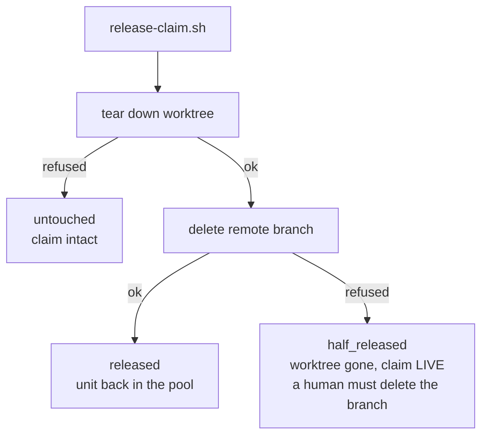

## 1. Overview

`release-claim.sh` has two steps that can disagree, and until now only one of them could be
reported. It now names the composite state, so a caller can tell "nothing happened" from
"half of it happened".

- `state: released | half_released | untouched` on every outcome.
- The refused-delete path reports which half ran, and names the human action.
- Two alternatives are recorded as rejected in the script header rather than left open.

## 2. Motivation

The order — tear the worktree down, *then* delete the remote branch — is correct: dropping
the claim first would advertise "this unit is free" over a worktree that may hold unpushed
work. But it assumes the delete can only fail transiently.

On the hourly runner it cannot succeed at all. That container may **push but not delete** a
branch (403 twice, on a remote that had accepted several pushes minutes earlier; the GitHub
MCP server offers `create_branch` and no delete), so every release ends worktree-gone /
claim-live, reported as a bare `{"released": false}` — indistinguishable from a no-op, on a
claim that is then re-offered as `resumable` every tick.

## 3. Changes

### 3-1. release-claim.sh half-releases where deletion is refused ([30680521](https://github.com/qmu/workaholic/commit/30680521))

The fix is honesty, not recovery. The ticket left two rulings open and both are decided in
the script's header: **no tombstone** (a second, weaker release channel over a protocol
resting on one invariant — an unmerged branch carrying a `Claim` commit *is* a live claim),
and **the order stays** (inverting it would publish a unit as free over possibly-unpushed
work, and the teardown is the cheap half to lose since `claim.sh resume` rebuilds it).

## 4. Outcome

Suite **2259 passed / 0 failed**. The new `testReleaseClaimDenyDeletes` sets
`receive.denyDeletes=true` on the bare origin *after* the claim is pushed, reproducing the
production asymmetry hermetically, and asserts both halves against reality rather than
against each other.

## 5. Concerns

### The leftover branch still needs a human

**Severity:** moderate

**Description:** `work-20260804-225829` — the claim that produced this ticket — is still on
the remote. No code change can remove it: this runner cannot delete a branch, and an untaken
resumable unit forbids `ok`, so the hourly loop reports `pending` until someone deletes it.

**How to Fix:** Delete the branch on the remote. It carries only a `Claim` and a `Resume`
commit over a stale base; its ticket was driven and merged elsewhere as `a3b32875`.

## 6. Successful Development Patterns

- Deciding the design questions the ticket deliberately left open, and recording the
  rejected alternatives next to the code rather than in a commit message nobody re-reads.
- Reproducing a permission boundary with `receive.denyDeletes` instead of mocking it, so the
  test exercises the same git path production does.

## 7. Notes

`drive` is in the generated bundle's closure, so `outputs/workflows/**/release-claim.sh`
moved with the source in the same commit.
