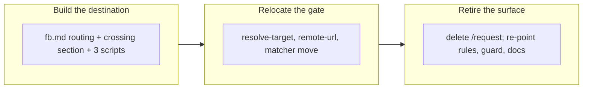

## 1. Overview

A cross-repository ask now travels as a **GitHub issue on the target** rather than a ticket
file copied into its checkout. `/fb` gained the crossing mode, `/request` is retired, and the
knowledge that carried the weight moved into the feedback skill rather than dying with it.

**Highlights:**

1. `/fb <ask> to <owner/name>` composes in the target's vocabulary, confirms verbatim once, scans, and opens an issue.
2. `/request`, `commands/request.md` and `submit-request.sh`'s file write are gone; `resolve-target.sh`, `check-outbound-body.sh` and `lib/remote-url.sh` moved into `skills/feedback/`.
3. A live defect is fixed en route: `gh api` prints its 404 body to stdout, which had been corrupting the `visibility` field the confirmation shows.

## 2. Motivation

The old crossing arrived as a file in somebody else's `git status` — an artifact its owners
had no native way to see, triage, or decline. FB `20260805101319` makes it an issue their own
`[Propose]` routine ingests like any other inbound report. What was load-bearing in `/request`
was never the file write but the judgement that no matcher can replace masking, plus two
backstops each written after a measured failure (2026-08-02's substring match, 2026-08-04's
single-URL-form check). Those moved first; the command was deleted second.

## 3. Changes

The destination existed before the old route was removed, so the retirement was a relocation.

### 3-1. Give fb a cross-repo issue mode ([4140752e](https://github.com/qmu/workaholic/commit/4140752e))

`commands/fb.md` routes an input naming another repository to a new *Crossing a repository
boundary* section in `feedback/SKILL.md`, leaving bare `/fb` untouched. `resolve-target.sh`
learned the remote-only forms an issue needs; three scripts carry the mechanics — the
identifier backstop, a body-scoped release scan, and a `gh issue create` wrapper.

### 3-2. Retire the request command and relocate its gate ([38d3b967](https://github.com/qmu/workaholic/commit/38d3b967))

`commands/request.md` and `skills/request/` are deleted, `submit-request.sh` with them, and
the three surviving scripts moved into `skills/feedback/scripts/`. `rules/general.md`, the
confinement guard's refusal, `create-ticket`, `release-scan`, `workaholify`, `CLAUDE.md` and
`README.md` name the `/fb` issue path; every remaining mention is dated history.

## 4. Outcome

The boundary has one sanctioned crossing again, and it writes into no checkout. The verbatim
confirmation, the masking judgement, the identifier-not-substring matcher and the every-URL-form
reading all survive at their new home with their tests — including the assertion that the four
real leaked sentences still pass unflagged.

## 5. Concerns

### Ticket 1's commit exceeds the per-commit size ceiling

- **Severity:** low
- **Description:** `4140752e` carries 733 added lines of implementation against a 500-line ceiling, so the branch scan returns `block` on an overridable `size` finding (see [4140752e](https://github.com/qmu/workaholic/commit/4140752e)). It is one ticket's worth of work — a skill section, three scripts and their tests — not unrelated changes batched together.
- **How to Fix:** Nothing to fix on this branch; the unit is `review`, so a human sees the finding at the PR. A future ticket of this shape could land the scripts and the prose as two commits.

### The crossing flow has never opened a real issue

- **Severity:** moderate
- **Description:** Every test mocks `gh`, deliberately — nothing here may open an issue on a real repository — so the call shape is pinned but the round trip is not. The feature ships dormant until a human uses it.
- **How to Fix:** The first real use is the test. Watch for `gh issue create` refusals (issues disabled, no access for this identity), which `open-issue.sh` reports verbatim rather than working around.

## 6. Successful Development Patterns

- Building the replacement before deleting the original turned a retirement into a relocation, and the grep gate over live docs is what proved it.
- Extracting the shared matcher while both callers existed meant no assertion had to be rewritten twice.

## 7. Notes

Version bumped to 1.0.131 (`origin/main` was at 1.0.130). `outputs/` regenerated: `request`
left every bundle closure and the moved scripts entered `feedback`'s.
