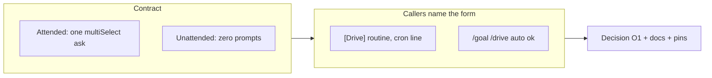

## 1. Overview

`/drive` grows a second invocation form and its first prompt: bare `/drive` is now the
**attended** form, which asks once — over the partition it already reports — which units
to take, while `/drive auto` keeps the zero-prompt contract verbatim. The drive scripts
are untouched; what changed is the contract, and it is recorded as decision O1.

**Highlights:**

1. The selection fires only above one claimable or resumable target, at most once per run; unchosen units are reported `deferred_by_operator` and still forbid `ok`.
2. Attendance is read from the invocation form alone, so every unattended caller now names `auto` explicitly.
3. Version bumped to v1.0.132 with `outputs/` regenerated.

## 2. Motivation

Decision G1–G2's "no drive-time confirmation of any kind" was written against the
per-ticket approval prompt — *may I do this* — and swept up a different question with it:
*which of these first*. The cost was measured on the morning of 2026-08-05, when an
attended run spent its first ~40 minutes reopening a pull request the developer
considered parked, because the survey's resumable-first ordering outranked the work they
were actually doing, and they interrupted twice to ask why. The ordering half shipped
earlier as the `parked_with_pr` tier, which narrowed the heuristic without moving the
decision; FB `20260805102621` ruled the other half, and this branch moves the decision.

## 3. Changes

The "no `AskUserQuestion` anywhere, in any invocation" sentence became the unattended
form's contract rather than disappearing.

### 3-1. Let an attended drive choose its units ([01a6a7cf](https://github.com/qmu/workaholic/commit/01a6a7cf))

Defines both forms in `commands/drive.md`, inserts the selection into the Unified Run's
partition step, adds `deferred_by_operator` to the run report and its `pending` row to
the token table, and carries the amendment into the routine template, `CLAUDE.md`,
`README.md`, the runbook and the ledger. Fourteen doc pins hold both forms in place.

## 4. Outcome

An attended developer is asked once and gets the order they picked; a cron tick and a
`/goal /drive auto ok` loop behave exactly as before. Nothing below the selection changed
— same claim, drive, report, route and token — and there is still no per-ticket prompt in
either form.

## 5. Concerns

### The unattended contract now depends on callers spelling `auto`

- **Severity:** moderate
- **Description:** Attendance is deliberately not inferred, so a caller that keeps the bare form silently becomes an attended run and parks on a prompt nobody will answer. This branch updated every caller it could see (the `[Drive]` routine template, the runbook cron line, five `/goal /drive ok` references), but a routine already live in the account still carries the old prompt text until a human refreshes it, and a caller in another repository is invisible from here.
- **How to Fix:** Refresh the live `[Drive]` routine through `/setup-routines` once this merges — the template edit ships in-repo and does not touch the running routine. The doc pins added in `scripts/test-workflow-scripts.mjs` catch a regression in this repo's own callers.

### The selection is prose, enforced only by sentinel pins

- **Severity:** low
- **Description:** The gate lives in a command and a skill, not in a script, so nothing mechanical stops a future edit from letting a prompt leak into the unattended path or from quietly dropping the selection and returning the choice to the heuristic.
- **How to Fix:** The `testDriveAttendedSelection` pins cover both directions today. If the selection ever grows structure — an ordering key, a persisted choice — that structure belongs in a script where it can be tested directly.

## 6. Successful Development Patterns

- A doc pin that slices a document by a heading stops testing anything the moment the heading is renumbered — `cmd.split("0. **Freshen**")[1]` had been `undefined` since the step became `0b.`, so its negative regex passed for free; assert the slice exists before searching it.

## 7. Notes

The version bump to v1.0.132 rides in this branch, so merging it publishes a GitHub
Release from the latest existing release note — no new note was written here.
