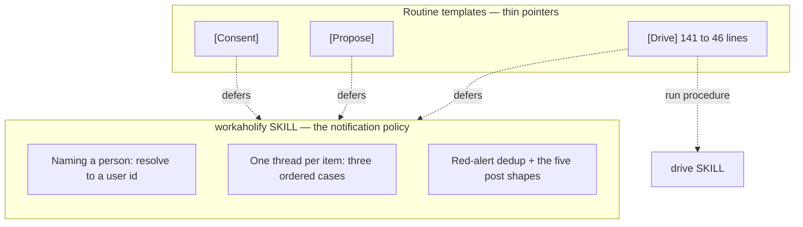

## 1. Overview

Three tickets against the routine templates, batched because they edit the same four
files. A routine post now **mentions** the person it names instead of writing inert
`@name` text, **lands in the thread the run was triggered from** instead of founding a
second root for the same item, and the `[Drive]` template stops restating a run procedure
`/drive` already owns.

**Highlights:**

1. `@<developer>` is gone from all three templates; five message formats carry the `<@U…>` mention token, with a non-blocking fallback to the plain name.
2. Thread-finding is now three ordered cases — trigger message, `fb:` key search, keyed new root — with the reason case 1 cannot reduce to case 2 written down beside it.
3. `routines/drive.md` goes 141 → 46 lines; the relocated blocks keep their measurements verbatim in the skills that own them.
4. Version bumped to v1.0.133 with `outputs/` regenerated.

## 2. Motivation

All three defects were reported from the channel the routines post into, which is the
useful part: the notification surface is where its own faults are visible first.

The mention was inert because nothing in the repository ever turned an identity a routine
session holds — a GitHub login, a git author email — into a Slack user id, so five formats
appeared to call someone out while pinging nobody. The second root appeared on 2026-08-05:
the `fb:<stem>` key is minted by the very session that posts, so a developer's own message
predates it and no key search can ever match it — the routine fell through to its new-root
fallback with the item's real thread sitting in the channel. And `[Drive]` had grown to
141 lines against the other two templates' ~55 by restating what `/drive` enforces, which
had already drifted: it instructed a hand-filter for mission ownership that `plan-units.sh`
had been performing for weeks, in a sentence still using a mission status word retired on
2026-07-31.

## 3. Changes

- **`workaholify/SKILL.md`** gains *Naming a person means mentioning them* (resolution
  through the Slack connector, email as the reliable key since a GitHub login is not a
  Slack handle, and a non-blocking fallback), rewrites the thread-finding paragraph as
  three ordered cases, and becomes the home of the red-alert dedup rule and the five
  `[Drive]` post shapes.
- **`routines/fb.md` / `merged-pr.md`** carry the mention token in their formats and route
  through the ordered cases; each points at the rule rather than restating it.
- **`routines/drive.md`** is rewritten as six numbered policy points that defer: the run to
  `workaholic:drive`, the notification rules to the `workaholify` skill, the standing
  prohibitions to the always-loaded `rules/`.
- **`drive/SKILL.md`** receives the claim-one-unit-at-a-time rule with its heartbeat-cost
  justification and the no-per-run-limit counterpart.
- **`scripts/test-workflow-scripts.mjs`** re-points the ten dedup assertions at the rule's
  new home and adds one that the template still points there.

## 4. Outcome

2332 tests pass, `verify.mjs` reports every built skill self-contained, the OKF bundle is
fresh, `layout-doctor` is conforming, and the branch-safety scan returns `pass` with no
findings. `wc -l` over the templates reads 46 / 64 / 57.

## 5. Concerns

**medium — the live routines still run the old prompts.** Editing a template makes every
live routine drift by construction, and refreshing one is a separate verbatim-confirmed
human act through `/setup-routines`. Until that happens the `[Drive]` routine still
executes its 141-line prompt, and none of the three posts a real mention. This is by
design — an unattended run cannot refresh a routine at all — but it means nothing in this
branch changes what the channel looks like today.

**low — the post shapes now live outside the prompt.** A routine session reads them from
the `workaholify` skill it loads, and substitutes `{repo}` / `{repo_name}` itself; the
prompt names the link shape so the substitution still reaches it. If a session ever runs
without the plugin loaded it has no formats at all — but it also has no `/drive`, and step
2 already stops it.

## 6. Successful Development Patterns

**Relocating a rule means re-pointing its test, not deleting it.** Ten assertions pinned
the dedup rule to the template's text. Moving the rule to the skill and moving the
assertions with it keeps the pin; an eleventh asserts the template still points at the new
home, which is the one way this relocation could have silently lost the rule.

**A verification method written into the ticket catches a rationale that quotes what it
removed.** The slimming ticket asked that `grep 'approved\|draft\|does NOT enforce'`
return nothing, and the first draft's own explanation of the drift quoted all three words
verbatim — correct prose, failing check. Paraphrasing the quotes kept both.

## 7. Notes

Driven attended from the developer's own checkout after the hourly `[Drive]` routine had
gone four ticks without claiming anything.
