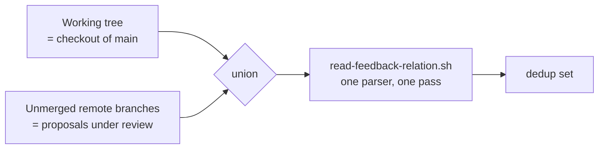

## 1. Overview

The proposal dedup set now answers *has this ask been proposed* rather than the narrower
*has a proposal for it merged*: `list-proposed-refs.sh` unions the `feedback:` refs
carried by artifacts on **unmerged remote branches** alongside the ones it already read
from the working tree.

**Highlights:**

1. Uses the claim protocol's own oracle — an unmerged remote branch — so it needs no `gh`, no auth, and no network beyond the fetch the caller already did.
2. Reads only what a branch *adds* (a two-dot tree diff), because materialising every archived ticket on every branch took over two minutes here.
3. Errs toward including a ref, and says so on stderr when a shallow clone forces the choice.

## 2. Motivation

At the capture seam the working tree this walks is the publish tree — a checkout of
`origin/main` — so it saw merged artifacts only. A proposal sitting in an open pull
request had its refs on a branch nobody read, and the seam concluded the ask had never
been answered. On 2026-08-05 issue #242 restated an ask already proposed ten minutes
earlier in open pull request #241; the scripted dedup missed it, and the duplicate was
caught only because the reviewing session happened to list open pull requests by hand.
The run that recorded the gap reproduced it: the record behind #241 was absent from the
set that run's own proposal read.

## 3. Changes

- `list-proposed-refs.sh` resolves the base, walks `refs/remotes/origin`, keeps the
  branches with commits not on the base, and feeds each *added or modified* artifact blob
  into the same single parser as one batch.
- `skills/propose/SKILL.md` and the `/propose` row in `CLAUDE.md` describe the widened set
  and its two consequences.
- Four hermetic cases in `test-workflow-scripts.mjs`, network-free and `gh`-free.

## 4. Outcome

2338 tests pass; `verify.mjs`, `validate-metadata.mjs` and the build are clean. In this
repository the widened scan reports 31 refs in ~4s.

## 5. Concerns

**medium — the cost scales with the branch count, and this repository carries 195 remote
branches of which 194 are merged-but-undeleted.** The scan is ~4s here and would be
~0.2s after a cleanup. The header names `for-each-ref --no-merged` as the fix if it ever
stops being cheap, but branch hygiene is the real answer and it is a human act.

**low — a pull request closed without merging keeps its ask suppressed** until its branch
is deleted. That is decided rather than incidental (it mirrors how deleting a branch
releases a claim), and GitHub offers the delete on the close, so the ordinary path is
already correct — but a branch left behind after a rejection silently blocks re-proposing.

## 6. Successful Development Patterns

**A ticket's provisional Quality Gate can contradict its own Considerations, and the
Considerations win.** The gate asked that a shallow clone never read merged branches as
open; the Considerations argued that over-reading is the safe direction because a
duplicate is the loud failure and a suppressed proposal is silent. The implementation
follows the argument, and the test pins the *deliberateness* — the degradation is named
on stderr while stdout stays exactly the ref list — rather than the retracted criterion.

**Measure the seam before trusting the obvious enumeration.** `git ls-tree` per branch is
the natural way to list a branch's artifacts and it made this script take over two
minutes on a real repository, on a path a reporter is waiting on. A tree diff against the
base is both cheaper and more correct: what a branch shares with the base is already in
the set.

## 7. Notes

Driven attended alongside `work-20260805-180653`; the two units are independent.
