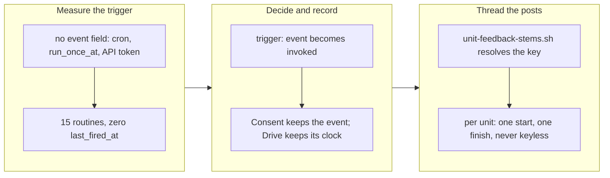

## 1. Overview

The mission asked that a drive run start because a proposal merged, and say so — beginning and end — in that proposal's own thread. The second half is built. The first half turned out to be unbuildable as framed, and the branch's main deliverable is the measurement that shows why, recorded where the next reader will meet it.

**Highlights:**

1. A Claude Code Web routine has no event-subscription field at all; `trigger: event` became `trigger: invoked`, which is what the API supports.
2. `[Propose]` and `[Consent]` have never fired — 15 routines, none once, since 2026-07-31.
3. A unit's start and finish are now per unit and land in the feedback item's thread, resolved by a new `unit-feedback-stems.sh`.

## 2. Motivation

`[Drive]` fires on a clock and takes whatever the survey offers, so a proposal's merge and the run that implements it were unrelated events reported in unrelated places. Joining them meant answering a capability question first — what can a routine trigger key on? — and the answer, read back from the live account rather than assumed, was *nothing*: the record carries `cron_expression`, `run_once_at`, and an API token for an external caller, and no field naming a repository, a pull request or a merge. The same read showed that the two routines the project calls event-driven have never run at all, because nothing holds a token to invoke them.

The reporting half had a separate and smaller defect: the postable set was per *run*, and "a run started" names no item, so there was no thread it could land in and the line went to top level — the scattering the one-thread-per-item model exists to end.

## 3. Changes

The branch measured the trigger surface, made the three decisions the first ticket scoped and wrote each beside the thing it governs, then built the resolution path the second ticket needed and settled its three open cases.

### 3-1. Start the drive routine on a merged proposal ([f38e5378](https://github.com/qmu/workaholic/commit/f38e5378))

Established that a routine cannot key on a repository event, renamed the templates' trigger to `invoked`, gave `[Consent]` ownership of the merged-pull-request case with the reason in its own template, and kept `[Drive]`'s clock with the reason beside the trigger. The measurement is recorded once in the `workaholify` skill; CLAUDE.md and both runbooks drop their event-driven claims.

### 3-2. Report drive start and finish in the item's thread ([bdc40435](https://github.com/qmu/workaholic/commit/bdc40435))

Made the start and finish posts per unit and keyed to the feedback item, adding `drive/scripts/unit-feedback-stems.sh` to resolve a unit's artifacts to deduped stems through the existing single reader. Several stems post into each thread, no stem keys on `unit:<unit-id>`, and a handoff is the finish rather than a third post.

## 4. Outcome

Both mission acceptance criteria are met (2/2). The reporting half works as asked; the triggering half is answered with a measurement and a decision rather than a change, and the work it does need — an invoker — is queued as `20260805223514-stand-up-an-invoker-for-the-unscheduled-routines.md` rather than attempted here, since standing up a standing outward-facing process is a human act.

## 5. Concerns

### Two loops the project believes it runs do not run

- **Severity:** high
- **Description:** `[Propose]` and `[Consent]` have never fired in any repository — 8 and 7 routines respectively, no `last_fired_at` since 2026-07-31 — because a routine with no schedule waits to be invoked and nothing holds a token to invoke it. A routine that cannot fire is indistinguishable from a healthy idle one in the routines list, which is why this was invisible.
- **How to Fix:** Ticket `20260805223514-stand-up-an-invoker-for-the-unscheduled-routines.md` designs the invoker and, separately, makes "never fired" visible in `/setup-routines` output.

### The mission's queue is not drained by this branch

- **Severity:** low
- **Description:** The minted invoker ticket inherits the mission's relation, so merging this PR leaves the mission claimable with one queued ticket. That is the honest state — both acceptance criteria are met and more work exists — but a reader seeing 2/2 may expect the mission to be closeable.
- **How to Fix:** Decide at close time whether the invoker belongs to this mission or to a successor; `/mission close --successor` exists for the latter.

## 6. Successful Development Patterns

- Reading the live account before designing against it turned a design question into a one-call measurement, and contradicted prose in five documents.
- `last_fired_at` being **absent** rather than null is the cheap tell that a scheduled thing has never run — the same shape as `check-deps` treating a missing field as the condition.

## 7. Notes

The bot notifier `claim.sh` uses and the session's Slack connector are two surfaces, and only the second can thread; the distinction is recorded in both skills so the seam is not "fixed" later.

## Correction (2026-08-06)

**Highlight 2 and the second Concern of this story are retracted.** They stated that
`[Propose]` and `[Consent]` have never fired — 15 routines, none once since 2026-07-31 —
on the strength of an absent `last_fired_at` key. The key does not carry that weight.

The contradicting observation arrived the next morning, and it predates the story by a few
hours: on 2026-08-05 a Claude Code **web container** session ran against this repository
between 13:20Z and 13:32Z, turned issue #260 into a feedback record, opened PR #261 and
posted to `dev-workaholic` — the `[Propose]` routine's exact job, while that routine was
the only one of its kind here and was `enabled` — with `last_fired_at` still absent. Either
the routine fired and the field is never populated for it, or the session was started some
other way; the field cannot distinguish those, which is the point.

What survives is only the record-level observation: a routine carries **no
event-subscription field**, so nothing in it explains how an unscheduled routine runs. The
inference drawn from it — *therefore nothing can invoke them* — did not survive.

The `[Drive]` clock decision is unaffected: it rests on handoff resumption, lapsed claims
and `/ticket`-written tickets having no merge event to key on, which is independent of all
of this. The minted invoker ticket was rewritten from *Stand up an invoker* to *Establish
how an unscheduled routine is invoked*. The current-truth documents (`CLAUDE.md`, both
runbooks, `README.md`, the two templates and the `workaholify` SKILL) were corrected in
place; the archived tickets keep their original text, as history.

**Method note, since this is the second time the shape has appeared here.** A field's
absence was read as a measurement and written into six documents and a ticket within one
run. `check-deps` treats a missing key as the condition it is looking for, deliberately and
with a stated reason; that pattern is safe only when the absence is *defined* to mean the
condition. Here it was merely observed.
