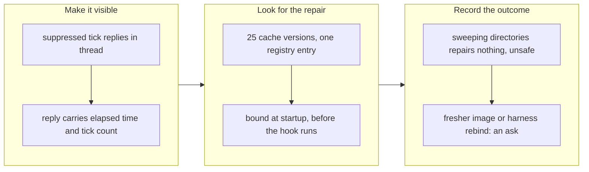

## 1. Overview

Two answers to one measured outage: four consecutive hourly ticks that produced nothing while the Slack channel read as a healthy idle fleet. One ticket makes a persisting failure visible; the other went looking for its repair and found there is none inside the plugin, which is recorded with its evidence rather than worked around.

**Highlights:**

1. A suppressed tick now replies in the alert's thread, carrying elapsed time and a tick count.
2. The superseded binding is not a wrong directory choice — 25 cache versions, one registry entry, bound before the hook runs.
3. The gate that detects it is structurally unreachable in its own invocation; minted as its own ticket.

## 2. Motivation

The red-alert dedup rule was written against a failure that *repeated* and suppressed it correctly. It did not anticipate one that *persists* through the whole 24-hour cool-down: the operator sees one alert in the morning and then a channel indistinguishable from a working fleet with nothing to do. On 2026-08-05 that was four ticks with two claimable tickets queued, noticed only because a developer asked what was running.

The failure underneath was the superseded plugin binding, which `/drive` detects correctly and cannot clear. A gate a runner cannot pass is an outage however correctly it is detected, so the second ticket asked for the repair half — and explicitly allowed "no safe repair exists" as an outcome if the investigation reached it.

## 3. Changes

The branch amended one notification rule, then investigated the failure that rule now surfaces and recorded why the plugin cannot fix it.

### 3-1. Restate a persisting failure inside its cool-down ([e2e5da9c](https://github.com/qmu/workaholic/commit/e2e5da9c))

While a signature is suppressed, a tick posts one threaded reply on the existing alert rather than going silent. The top-level suppression, the changed-signature root, the first-report guarantee and the fail-open direction are all unchanged; the reply's rate is decided (every tick) with the backoff alternative named and rejected.

### 3-2. Repair a superseded plugin binding, not just report it ([784da959](https://github.com/qmu/workaholic/commit/784da959))

Observed the origin rather than inferring it, rejected the obvious repair on that evidence, and recorded the finding in the bootstrap hook's header, CLAUDE.md and the runbook — whose "start a fresh session" advice is corrected, since a fresh cloud container re-inherits the same stale image.

## 4. Outcome

Both tickets are archived. The interim safety is in place: a persisting outage no longer reads as a healthy idle tick. The outage's own cause is answered with a finding and an ask rather than a workaround, and two follow-ups are queued.

## 5. Concerns

### The superseded-binding gate cannot fire through its own invocation

- **Severity:** high
- **Description:** `check.sh` computes the loaded-vs-registry axis only when `${CLAUDE_PLUGIN_ROOT}` is in the **shell environment**, and the harness expands that token inside plugin markdown at load time instead of exporting it. Measured on Claude Code 2.1.222, `commands/drive.md` step 0's exact invocation returns `registry_version: ""` with both flags false, which `/drive` §1 reads as "no drift". The one stop in the pre-flight has never fired; the 2026-08-04 incident it was written from was caught by a hand cross-check.
- **How to Fix:** Ticket `20260805225604-make-the-superseded-binding-gate-reachable.md`. The silence is a decided, test-pinned behavior, so re-deciding it belongs in its own change.

### A ticket's `## Policies` list can name policies that do not exist

- **Severity:** moderate
- **Description:** Both tickets on this branch named policy files that are absent — `design/policies/ux.md`, `operation/policies/observability.md`, `operation/policies/failure-recovery.md`, `implementation/policies/failure-design.md`. Nothing validates the slugs at ticket time, so a driving session is pointed at policies it cannot read.
- **How to Fix:** Have `validate-ticket.sh` resolve each `## Policies` entry against the pillar skills' `policies/` directories, or have the ticket writer pick from the generated policy index.

## 6. Successful Development Patterns

- Reading the actual cache and registry turned "which repair?" into "no repair, and here is why" in one observation — 25 directories against one registry entry settled it.
- Naming the rejected alternative beside the decision (the reply backoff; the directory sweep) is what stops the same idea being re-proposed by the next reader.

## 7. Notes

This repository's own installed bootstrap hook copy was refreshed alongside the canonical one, so `check-bootstrap.sh` reports `matches_canonical: true`.
