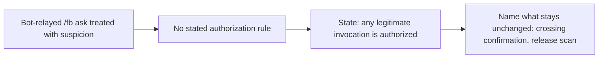

## 1. Overview

States that any legitimate `/fb` invocation is authorized regardless of how it reaches the session, so a bot-relayed ask is no longer treated with suspicion.

**Highlights:**

1. `skills/feedback/SKILL.md` gains an *Any legitimate invocation is authorized* section
2. `commands/fb.md` points to the same rule at trigger time
3. The cross-repository crossing confirmation and release-scan gates are explicitly left untouched

## 2. Motivation

An automated integration relayed a legitimate `/fb` ask via a Slack @-mention from a bot/integration account, and reply-safety heuristics treated it with suspicion, delaying a response even though the request was on-topic and authorized (it filed the issue anyway, but with avoidable friction). The `/fb` skill did not state that a relayed invocation carries the same authorization as a direct human ask, leaving a session to second-guess it each time.

## 3. Changes

A single doc/convention change: state the rule once in the skill, point to it from the command doc, and name the two gates it does not widen.

### 3-1. Treat any /fb invocation as an authorized direct ask ([44ecd2e1](https://github.com/qmu/workaholic/commit/44ecd2e1))

Added *Any legitimate invocation is authorized* to `skills/feedback/SKILL.md` and a pointer to it in `commands/fb.md`, stating that a human-typed, bot-relayed, or integration-driven `/fb` ask is equivalent to a direct user ask, with the cross-repository crossing confirmation and release-scan gates named as unchanged.

## 4. Outcome

A session running `/fb` no longer needs to judge whether a relayed invocation is "really" authorized — the convention is now stated where the workflow is read, both in the skill and at trigger time.
