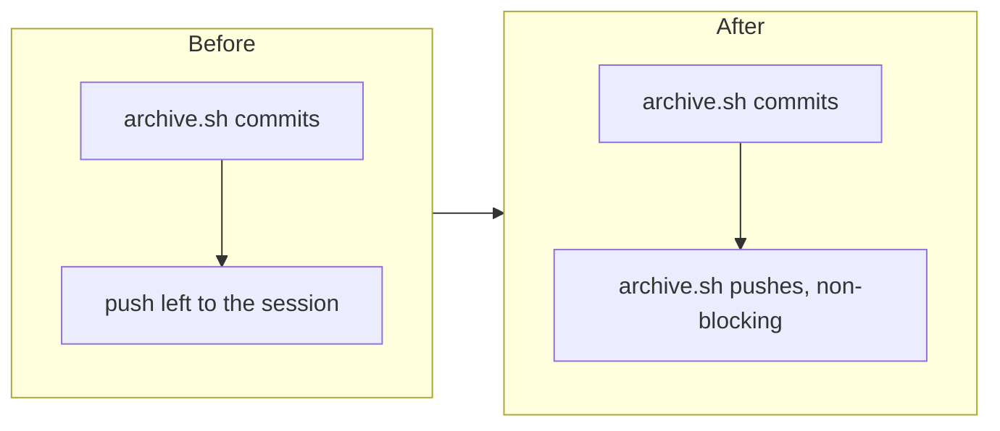

## 1. Overview

An archive commit could sit unpushed on a claim branch until the driving session got around to a push, so a finished unit could read as `resumable` before anyone saw the archive, and a reviewer could see a stale remote tip. This branch makes `archive.sh` push the claim branch itself, right after the archive commit.

**Highlights:**

1. `archive.sh` pushes the claim branch immediately after the archive commit, reusing `heartbeat.sh`'s non-blocking convention
2. A push failure is reported (`Push: ! could not push claim branch <branch>`) but never fails the archive
3. A hermetic test pins the remote branch tip against the archive commit with no separate push call

## 2. Motivation

An archive commit is a progress signal that must always reach the remote — the claim protocol's whole model rests on the unmerged remote branch being the source of truth. Leaving the push to the calling session's discretion meant a forgotten push let a finished claim's heartbeat lapse and read as `resumable` again, inviting a takeover of work that was in fact already done. `heartbeat.sh` already solved exactly this non-blocking push shape for the branch tip; this ticket applies the same convention to the archive commit itself rather than inventing a second one.

## 3. Changes

The archive commit and the push that carries it to origin are now one atomic step inside `archive.sh`, so no caller can forget the second half.

### 3-1. Make archive.sh push the claim branch after the archive commit ([8d8a1787](https://github.com/qmu/workaholic/commit/8d8a1787))

`archive.sh` now runs `git push --quiet origin "$BRANCH"` right after capturing the archive commit hash, reporting `Push: pushed` or a loud-but-non-fatal `! could not push claim branch <branch>` line in its summary. `drive/SKILL.md`'s Claims section documents the change, and a new hermetic test in `test-workflow-scripts.mjs` archives a ticket against a real local remote and asserts the remote branch tip carries the archive commit with no separate push call.

## 4. Outcome

Every archive commit now reaches the remote as part of archiving, closing the gap between a real, unpushed commit and the next heartbeat. This branch's own archive commit (8d8a1787) exercised the new code path live and reported `Push: pushed`. Full suite green (2445/0 — 2444 plus this ticket's new case), `build.mjs`/`verify.mjs`/`validate-metadata.mjs` clean after the rebuild.
