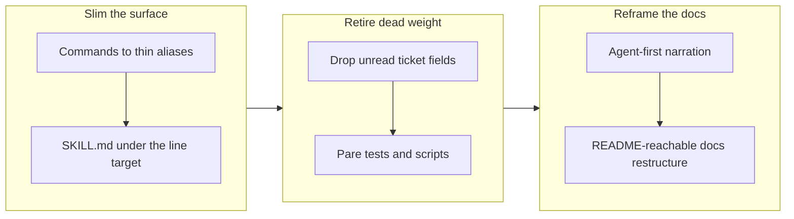

## 1. Overview

The branch slimmed the whole plugin surface for its primary reader — the AI agent that runs it. Fourteen commands became thin skill-aliases, sixteen oversized SKILL.md files went from 6,040 to 2,219 lines with detail relocated into `reference/` companions, five unread ticket frontmatter fields were retired, and the tests, scripts, and README-reachable docs were pared and restructured to match.

**Highlights:**

1. Commands are orchestration-free aliases (850 → 203 lines); every flow now lives in its owning skill
2. SKILL.md files carry an index plus hard rules; incident narration folded into per-skill Caveats and `reference/` files
3. README and CLAUDE.md now address the agent as primary user and the developer as operator, with a navigable docs tree

## 2. Motivation

The plugin had accreted developer-era weight: commands duplicating their skills' prose, SKILL.md files narrating past incidents at full length, ticket frontmatter fields nothing read, tests pinning prose addresses rather than rules, and a docs tree the README never linked. Each layer taxed the agents that load this content on every session and routine tick, so the mission cut all of it in one coordinated pass — deletion over compression, with externally referenced section headings preserved as the hard floor.

A prior branch had already reduced the loop to two routines and one behaviour per command; this branch extends that same direction from the command set into every surface an agent reads — skills, schema, tests, and documentation.

## 3. Changes

The work ran surface-inward: first the command layer collapsed into skill-aliases, then the skills themselves were cut with relocated detail, then the schema and test weight behind them was retired, and finally the documentation was reframed and rewired for the audience that actually reads it — with a minted hook fix closing a validation defect the drive itself surfaced.

### 3-1. Make every command a thin skill-alias ([4aed98fe](https://github.com/qmu/workaholic/commit/4aed98fe))

All 14 commands are now 12–18-line aliases naming the skill and section to run; unique orchestration moved into the owning skills (`mission/reference/command-flows.md`, `create-ticket/reference/publishing.md`, `propose/reference/workflow.md`, feedback's crossing routing), and the routine templates kept their machine-read parts byte-identical.

### 3-2. Drop obsolete ticket front-matter fields ([410cc792](https://github.com/qmu/workaholic/commit/410cc792))

`type`, `layer`, `effort`, `commit_hash`, and `category` left the ticket schema across writers, the validation hook, drive's ordering/policy logic, and every reader, making the commit `Category:` trailer the single category source; existing tickets are grandfathered byte-untouched.

### 3-3. Cut every SKILL.md under the line target ([183ef250](https://github.com/qmu/workaholic/commit/183ef250))

Sixteen oversized SKILL.md files went 6,040 → 2,219 lines by deleting what was no longer needed and moving genuinely needed detail into `reference/` companions; the seven files still above ~100 lines each name their reason, and every externally referenced section heading survives.

### 3-4. Pare tests and shell scripts to the load-bearing set ([2d9201b9](https://github.com/qmu/workaholic/commit/2d9201b9))

A full caller map over the 151 shell scripts found exactly one orphan (deleted with its generated copies), and the 58 test failures left by the relocations were resolved by retargeting 54 prose pins to the files now carrying the rules — 2,415 passed, 0 failed, no live rule lost.

### 3-5. Reframe the plugin for AI-agent use first ([bbdb0c7e](https://github.com/qmu/workaholic/commit/bbdb0c7e))

README and CLAUDE.md open with the same audience contract — AI agents are the primary users, the developer is the operator — while every "developer" that states a decided behaviour contract (PR-merge approval, `--developer-present`, crossing confirmation) was deliberately left untouched.

### 3-6. Restructure README-reachable docs to the current spec ([c95ef0f8](https://github.com/qmu/workaholic/commit/c95ef0f8))

The README, which previously linked no `docs/` page at all, gained a Documentation section navigating to an accurate set — decision log, the two operator runbooks, the OKF record, the artifacts hub — with one stale page deleted and drifted restatements trimmed; all links resolve repo-wide.

### 3-7. Let Final Report edits pass on foreign-authored tickets ([426e9069](https://github.com/qmu/workaholic/commit/426e9069))

`validate-ticket.sh`'s @anthropic.com author rejection is now scoped to a new (git-untracked) ticket, so a drive run appending its Final Report to a routine-authored ticket passes with provenance intact; two test cases pin both directions.

## 4. Outcome

The plugin's whole agent-facing surface is smaller and single-sourced: commands alias skills, skills index `reference/` detail, the ticket schema carries only what is read, and the docs tree is reachable and truthful. The suite pins rules at their new addresses (2,415 passed), and the caller map from ticket 3-4 is a reusable audit for future restructurings.

## 5. Successful Development Patterns

- A referenced section heading is the real floor under a SKILL.md's size — grow `reference/` files, never the SKILL.md, because external names pin the sections that remain
- A deletion has to build the caller map first: the pare ticket found the multiplication lived in prose pins, not scripts, which redirected the whole cut to where the weight actually was

## 6. Release Preparation

**Verdict**: Ready for release

- **Concern:** The branch-safety scan reports two override-tier size findings — 189 files changed (> 100) and commit [183ef250](https://github.com/qmu/workaholic/commit/183ef250) adding 3,261 implementation lines (> 500) — the expected shape of a repo-wide slim whose relocations and `outputs/` regeneration count as additions
- **Before release:** `/ship` will ask for the conscious size override; confirm the oversize is relocation plus regeneration and nothing else before overriding

## 7. Notes

One non-ticket change rode the branch on operator instruction ([f84be645](https://github.com/qmu/workaholic/commit/f84be645)): threaded unit Slack posts are scoped to the unattended `/implement` run — an attended `/drive` session posts nothing, since the threads exist for an absent operator.
