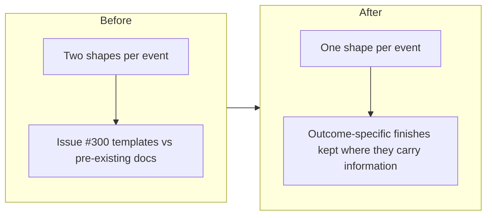

## 1. Overview

Issue #300 supplied the literal `/propose` and `/implement` start/finish notification templates, but `workaholic:notify` still documented an older, overlapping shape set for the same events. This branch encodes issue #300's four templates as the sole sanctioned formats and reconciles them with what predated them.

**Highlights:**

1. 📐 Designing for.../📐 Proposed retire the earlier 🟢 Proposed root shape
2. 🛠️ Implementing for.../🛠️ Implemented retire 🟠 drive started and 🟢 Merge Requested
3. The four outcome-specific finish shapes (auto merge, human merge, handoff, blocked) survive unchanged, now built on Implemented's simpler base

## 2. Motivation

Issue #298/#299 established that an agent must not self-authorize a notification format beyond what its routine prompt specifies. Issue #300 answered that for `/propose` and `/implement` with exact literal templates, but leaving `reference/notifications.md` untouched would have left two shapes that could each look authoritative for the same start/finish events — exactly the ambiguity issue #298 exists to close. This ticket makes the skill state one contract instead of two.

## 3. Changes

The reconciliation kept every outcome-specific shape that carries information a generic finish line would lose (a merge and who approved it, a handoff, a named blocker) while retiring the shapes that duplicated issue #300's templates outright.

### 3-1. Encode the notify templates for /propose and /implement in workaholic:notify ([1637c1b6](https://github.com/qmu/workaholic/commit/1637c1b6))

`reference/notifications.md` and `SKILL.md` now state issue #300's four literal templates as the sole `/propose`/`/implement` start/finish formats. `🚀 Auto Merge` and `🟣 Merged by <@U…>` keep their `from-branch → to-branch` body line, now built on `🛠️ Implemented`'s simpler two-line base instead of the retired `🟢 Merge Requested`. Both routine templates under `skills/workaholify/routines/` gain a cross-reference note: the literal formats stay embedded in the prompt (Q2's reasoning — a routine cannot defer its own output contract), but `workaholic:notify` mirrors them verbatim, so a future edit to either copy is a drift to fix rather than a third wording to reconcile.

## 4. Outcome

`/propose` and `/implement` now have exactly one documented start shape and exactly one documented ordinary-finish shape apiece, with the outcome-specific finishes (merge, handoff, blocked) unambiguously distinct from them. Full suite green (2441/0), `build.mjs`/`verify.mjs`/`validate-metadata.mjs` clean after the version bump (`notify` carries no bundled script, so it is not part of the `outputs/workflows` closure and the rebuild produced no diff there).

## 5. QA Evidence

- `node scripts/build-plugins/build.mjs` — clean, zero-diff rebuild (`notify` has no bundled script, so it never enters `outputs/workflows`'s closure).
- `node scripts/build-plugins/verify.mjs` — `All built skills are self-contained.`
- `node scripts/build-plugins/validate-metadata.mjs` — `All Codex plugin metadata is valid and version-aligned.`
- `node scripts/test-workflow-scripts.mjs` — `2441 passed, 0 failed`.
- `bash plugins/workaholic/hooks/layout-doctor.sh .` — `conforming: true` (only pre-existing, unrelated legacy-`trips/` advisories).
- `grep -rn "🟢 Proposed\|🟠 drive started\|🟢 Merge Requested" plugins/workaholic/ outputs/` — no hits outside `reference/notifications.md`'s own "retires" prose: no stale reference to a retired shape survives elsewhere in the plugin.
- Byte-for-byte check of `skills/workaholify/routines/implement.md`'s two literal template blocks against issue #300 — unchanged, and `reference/notifications.md`/`SKILL.md` mirror them verbatim.
- **Live production evidence**: this same session posted both new `/implement` shapes for real, in the target Slack channel, while driving the two tickets this reconciliation covers — [🛠️ Implementing](https://qmu.slack.com/archives/C0BLL9J7FMY/p1786098504990809?thread_ts=1786091846.015459) / [🛠️ Implemented](https://qmu.slack.com/archives/C0BLL9J7FMY/p1786099028784159?thread_ts=1786091846.015459) for this very ticket's own unit, and the same pair for the sibling unit ([PR #302](https://github.com/qmu/workaholic/pull/302)) — confirming the templates render and post correctly outside a synthetic test.
