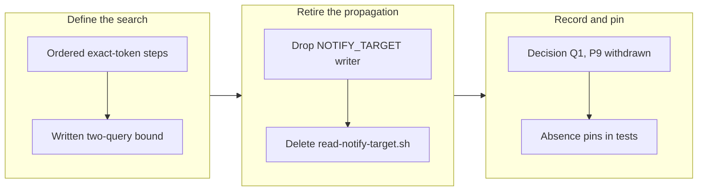

## 1. Overview

The Slack reply target became stateless (decision Q1): `[Propose]` and `[Implement]` each find their own thread through exact-token searches instead of carrying a `Notify-Thread:` line in public pull-request bodies. The search is defined so it cannot guess, and the propagation machinery is retired.

**Highlights:**

1. Thread lookup stated in `workaholic:workaholify` as ordered exact-string searches — trigger message, `fb:<stem>`, Issue/PR URL, else a new keyed root — with fuzzy/recency matching prohibited by name
2. Bound written as numbers: at most two search queries per lookup, results capped, no full-channel read, resolved once per run
3. `WORKAHOLIC_NOTIFY_TARGET` and `read-notify-target.sh` retired; `WORKAHOLIC_PR_TITLE` stays; P9's accepted URL disclosure withdrawn

## 2. Motivation

P4 (2026-08-06) propagated the Slack thread URL through pull-request bodies because re-deriving it by search had put a reply in the wrong place the day before — the search was a guess. The developer ruled the target stateless instead: the cost was a thread URL in every public Issue and PR body, and the fix P4 chose was state carried between routines. Statelessness had to remove the guess a different way — by defining the search so it cannot guess. A lookup that finds no exact match starts a new keyed root rather than picking the closest thing, which is what makes refusing fuzzy matching safe rather than a regression to the 2026-08-05 defect.

## 3. Changes

The work ran in one arc: state the lookup procedure where the routines already load it, delete the propagation it replaces, then pin the retirement so the names cannot return silently.

### 3-1. Find the reply thread instead of propagating it ([41bdd74f](https://github.com/qmu/workaholic/commit/41bdd74f))

Wrote the stateless reply-thread lookup into `workaholic:workaholify`'s *One thread per feedback item* as exact-string searches only, with the two-query bound and the new-keyed-root fallback stated as numbers; retired `WORKAHOLIC_NOTIFY_TARGET` from `publish-tree-pr.sh`, deleted `read-notify-target.sh`, and dropped the reader/writer steps from the drive and propose flows. Both routine prompts stay four lines; decision Q1 appended, superseding P4's propagation half and withdrawing P9.

## 4. Outcome

Nothing writes or reads a notification target any more — a `plugins/`-wide test pin asserts the retired names are absent — while the exactness P4 bought is kept by construction: a lookup either matches an exact token or declares itself by posting a new keyed root. Tests: 2423 passed, 0 failed; build, verify, metadata validation, and layout audit all pass.

## 5. Concerns

### The live chain is unverified

- **Severity:** moderate
- **Description:** The Quality Gate's one-real-chain check — an assigned Issue → proposal PR → merge → implementation reply, all landing in one thread with no target carried between routines — cannot be exercised from a local session (see [41bdd74f](https://github.com/qmu/workaholic/commit/41bdd74f) in plugins/workaholic/skills/workaholify/SKILL.md)
- **How to Fix:** Watch the first real `[Propose]`/`[Implement]` firing after this merges and confirm start and finish land in the ask's thread

### The not-found branch is described, not exercised

- **Severity:** moderate
- **Description:** The gate requires showing that a lookup matching nothing posts a new keyed root rather than falling back to anything; that needs real Slack and remains an open verification item (see [41bdd74f](https://github.com/qmu/workaholic/commit/41bdd74f) in plugins/workaholic/skills/workaholify/SKILL.md)
- **How to Fix:** On the next routine tick for an item with no existing thread, confirm a new root carrying `fb:<stem>` is posted and no unrelated thread receives the reply

## 6. Successful Development Patterns

- Exactness-or-declare beats any similarity heuristic in a notification path: a search that cannot find its thread says so by starting a new keyed root, so a wrong-looking answer is structurally impossible

## 7. Release Preparation

**Verdict**: Ready for release

- **After release:** Observe the first routine chain after merge — it is the natural exercise of both open verification items above
