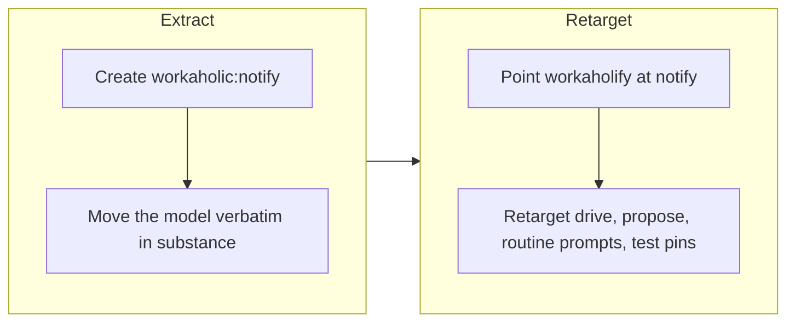

## 1. Overview

The runtime notification model moved out of `workaholic:workaholify`, the environment-setup gateway, into a new dedicated skill, `workaholic:notify`, and shipped as v1.0.137. The model itself is unchanged; what changed is where it lives and what every consumer names.

**Highlights:**

1. New `workaholic:notify` skill (SKILL.md 50 lines + reference/notifications.md 59) holds the whole model: the Q1 stateless thread lookup with its written bounds, per-unit posts, /implement-only scoping, post shapes, mention resolution, red-alert dedup, the bright line, and the withdrawn-P9 history
2. Workaholify shrank 121 → 87 lines to a one-paragraph pointer; its reference/notifications.md is deleted
3. Drive and propose preload the new skill, and every consumer reference — including both four-line routine prompts — names `workaholic:notify`; two relocation pins keep the model from growing back

## 2. Motivation

Workaholify is the environment-setup gateway — bootstrap, CLAUDE.md audit, routine setup sheets — yet it also carried the runtime notification model, so a routine told to "find its reply thread per the workaholic:workaholify lookup" was pointed at a setup skill for a runtime procedure: a category error to anyone meeting it fresh (developer's ruling, 2026-08-07). The move puts the model in a skill whose name says what it holds, leaving workaholify only what is genuinely setup, with the constraint that no rule of the model be lost or weakened in transit.

## 3. Changes

The developer created the new skill first, moving the notification sections whole, then swept every consumer — workaholify's pointer, drive's routing, propose's workflow, both routine prompts (still exactly four lines), and the test pins — before rebuilding the bundles and releasing the result as v1.0.137.

### 3-1. Move the notification model into its own skill ([5cce832b](https://github.com/qmu/workaholic/commit/5cce832b))

Extracted the whole runtime notification model from workaholify into the new prose-only `workaholic:notify` skill and retargeted every consumer reference to it, leaving workaholify a one-paragraph pointer. Two relocation pins assert the model lives in notify and that workaholify no longer states the lookup itself, so it cannot silently grow back.

## 4. Outcome

The notification model now lives where its name says it lives, with every rule surviving verbatim in substance (Q1 bounds, exact-token-only, per-unit posts, /implement-only scoping). Full verification passed: `test-workflow-scripts.mjs` 2425/0 with the retargeted pins, plus `build.mjs`, `verify.mjs`, and `validate-metadata.mjs` at v1.0.137. Details in the ticket's Final Report.

## 5. Successful Development Patterns

- When relocating a body of rules between skills, add a pin asserting the *old* home no longer states them — `computeClosure` follows script references only, so a prose-only skill rides the built bundles as flattened references and nothing else would catch the model growing back into workaholify
