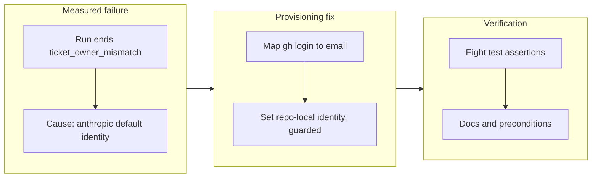

## 1. Overview

The first full routine-chain run failed at the ownership seam: the cloud container pushes and merges as the developer's GitHub account, yet its git identity is the anthropic default, so the developer's own `[Implement]` routine ruled the developer's own ticket `other` and ended 🔴 `ticket_owner_mismatch`. This branch closes that gap at the provisioning seam — the web bootstrap now sets the session's git identity from a committed mapping.

**Highlights:**

1. `session-start.sh` gains step 0b: resolve `gh api user`'s login through `.claude/git-identities` and set the repo-local `git config user.email`/`user.name`
2. Guarded and non-fatal in every branch — a real local identity is never overwritten, a missing mapping keeps the safe blocked behavior
3. Mapping ships with the current developer; workaholify docs and setup-sheet preconditions document it

## 2. Motivation

P6 correctly stamps a proposal's ticket with the triggering issue's assignee, and P2 gave tickets an `assignees` field resolved by `owns.sh` — but the cloud container running the routine has no idea whose session it is. Measured live on 2026-08-07, the very routine that exists to drive a developer's personally-assigned ticket could claim nothing: identity entered every artifact but never the runner. The fix follows the ticket's insight — provision identity exactly where `gh` is provisioned, once per developer, in a committed file whose emails are already public in git history.

## 3. Changes

The work traced a live routine-chain failure to its root — a session that acts as the developer's GitHub account without knowing its git identity — and fixed it at the one seam that owns cloud provisioning, the web bootstrap. The identity step reads a committed `<login>=<email>` mapping, touches only an unset or anthropic-default identity, refuses a malformed login rather than interpolating it, and logs one legible line either way. Eight test assertions pin the three contract cases, and the documentation names the mapping as a setup precondition.

### 3-1. Give cloud sessions the developer's git identity ([d9e9a449](https://github.com/qmu/workaholic/commit/d9e9a449))

The canonical bootstrap and its installed byte-identical copy gain the identity step; `.claude/git-identities` ships with `tamurayoshiya=a@qmu.jp`; workaholify SKILL/reference and `/setup-routines` preconditions document the mapping; three contract cases covered via the suite's gh PATH-shim precedent.

## 4. Outcome

Personally-assigned tickets become drivable by the developer's own cloud routines: a session whose git email is the anthropic default and whose GitHub login is mapped gets the mapped identity before any survey runs, while a real local identity or an unmapped login leaves everything untouched and session start never fails. Full suite green (2433/0), `check-bootstrap.sh` reports the installed copy canonical.

## 5. Concerns

### Each developer must add their own mapping line

- **Severity:** low
- **Description:** `.claude/git-identities` ships with one entry; a colleague's unmapped cloud session keeps failing `ticket_owner_mismatch` on personally-assigned tickets until they add their `<login>=<email>` line (see [d9e9a449](https://github.com/qmu/workaholic/commit/d9e9a449) in `.claude/git-identities`)
- **How to Fix:** Each developer adds one line at onboarding; the safe blocked behavior — never guessing an identity — is deliberate

## 6. Successful Development Patterns

- Mask host git config with `GIT_CONFIG_GLOBAL=/dev/null` in identity tests — the host's global `user.name` otherwise leaks into a "fresh" test repo and an unset-identity test asserts nothing
