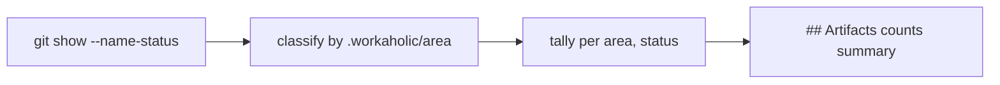

## 1. Overview

`publish-tree-pr.sh`'s `## Artifacts` section listed every touched file as a full-path bullet, which read as noise rather than signal on a proposal pull request. This branch replaces the enumerated list with a counts summary classified by `.workaholic/` area and change status.

**Highlights:**

1. `## Artifacts` now renders `- 3 feedbacks added` / `- 1 mission added` / `- 2 tickets added` instead of a bullet per file path.
2. A path outside `.workaholic/` (or directly under it, with no subdirectory) folds into a generic `- N files changed` line rather than being dropped silently.
3. A renamed or copied path reads by its destination and folds into `modified`/`added` respectively — the artifact did not newly appear.

## 2. Motivation

A reviewer opening a proposal PR wants to know roughly what shape the change is — how many feedback records, missions, and tickets it touched — not the literal path of each one. The prior rendering (`git show --stat --oneline --name-only` piped straight into the body) gave the exact opposite: every path, no shape.

## 3. Changes

The publish-tree-pr script now reads `--name-status` instead of `--name-only`, classifies each changed path by the `.workaholic/<area>/` directory it falls under, tallies counts per (area, status), and renders one line per combination present.

### 3-1. Summarize proposal PR Artifacts section by count instead of listing full file paths ([f2a5aef5](https://github.com/qmu/workaholic/commit/f2a5aef5))

Replaced the file-path bullet list in `publish-tree-pr.sh`'s PR body with an inline `awk` tally over `git show --name-status`, updated `branching/reference/publish-tree.md` to describe the new shape, and extended `test-workflow-scripts.mjs` with a hermetic test that stubs `gh` to capture and assert the rendered body.

## 4. Outcome

Every publish-tree PR (feedback, mission, ticket, and `/propose`'s combined publishes) now opens with a scannable counts summary instead of a raw file listing, with no artifact silently dropped from the section.

## 5. Notes

Renames and copies are folded into `modified`/`added` by destination path rather than getting their own status word — a rename does not represent a newly-added artifact, and no proposal in this repository's history has produced enough renamed `.workaholic/` files at once to make a finer distinction worth the added complexity.
