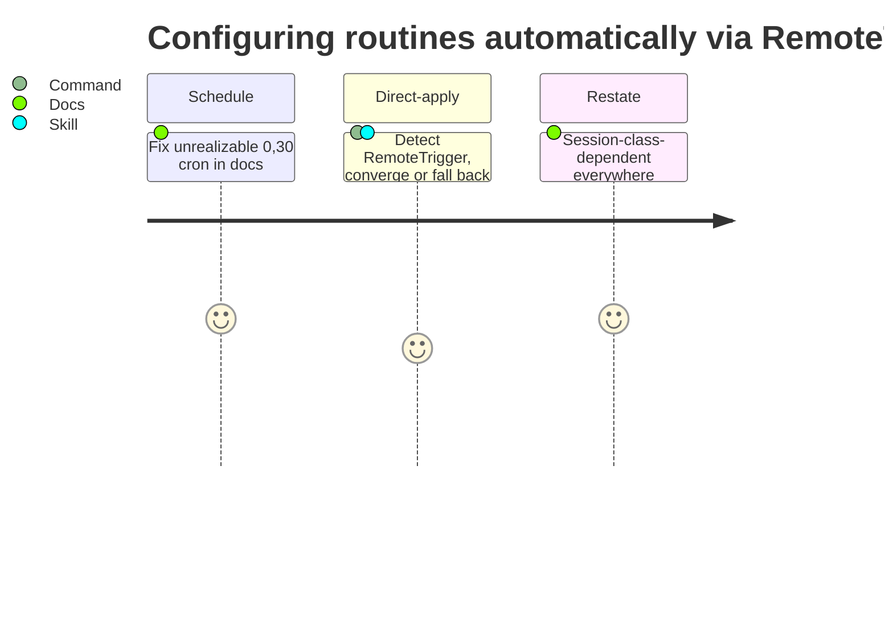

# work-20260810-202951

## 1. Overview

Closed the `configure-routines-automatically-via-remotetrigger` mission: `/setup-routines` now detects a `RemoteTrigger`-family tool per-session and converges routine wiring directly when one is exposed, falls back to the unchanged copy-paste sheet otherwise, and every doc that stated the retired unrealizable `0,30 * * * *` schedule or an unconditional "manages nothing" now reflects the real, session-class-dependent behavior.

**Highlights:**

1. `/setup-routines` branches on `ToolSearch` for a `RemoteTrigger`-family tool: present (interactive session) → list/diff/apply directly and report every field changed; absent (the routine-fired class) → today's sheet, byte-for-byte
2. The two routine templates' already-corrected hourly schedule (`[Propose]` `:15`, `[Implement]` `:30`) is now what every surrounding doc describes, instead of the API-rejected `0,30 * * * *`
3. Driving this mission surfaced an unrelated defect — acceptance-link markers written as a full path instead of a bare filename, so no ticket here could auto-tick its checkbox — captured as a new ticket rather than fixed opportunistically

## 2. Motivation

The "manages nothing" ruling for `/setup-routines` rested on no `RemoteTrigger`-family tool being exposed to any session — true for every unattended, routine-fired check to date, including this one. A live interactive session (FB `20260810214929`) found the ruling stale for its own class: the tool was present, and using it found both of this repository's routines carrying an empty `cron_expression`. The mission scoped three tickets to close the gap: give `/setup-routines` the conditional direct-apply path, fix the templates' unrealizable schedule the interactive check also surfaced, and restate the ruling everywhere as session-class-dependent rather than unconditional.

## 3. Changes

An interactive session had already found the tool and fixed the two live routines directly; this branch closed the loop the plugin's own docs and command needed to catch up — first correcting what the templates should declare, then teaching `/setup-routines` to detect and apply that state itself, then making sure no doc still claimed the command could never do so.

### 3-1. Fix the routine templates' unrealizable 30-minute schedule ([94dd1bf0](https://github.com/qmu/workaholic/commit/94dd1bf0))

The two routine templates already carried the corrected hourly `cron_expression` values from an earlier change; `SKILL.md`, `reference/routines.md`, and `CLAUDE.md`'s `/workaholify` row still described the retired, API-rejected `0,30 * * * *` value as current. Rewrote each to state the realizable cadence, keeping a historical mention only where it explains why the two routines ended up on different minutes.

### 3-2. Apply routine wiring via RemoteTrigger ([2729e52d](https://github.com/qmu/workaholic/commit/2729e52d))

`/setup-routines` now calls `ToolSearch` for a `RemoteTrigger`-family tool before rendering anything. When exposed, it lists the account's routines, diffs each against its template (name/prompt/model/`cron_expression`/connectors), and applies create/update calls to converge — one routine at a time, reporting exactly what changed, no `AskUserQuestion`. When absent, it falls through unchanged to `render-setup-sheet.sh --all <repo-url>`.

### 3-3. Restate manages-nothing as session-class-dependent ([a9b2bee3](https://github.com/qmu/workaholic/commit/a9b2bee3))

Grepped the repository for "manages nothing" and its paraphrases; restated every surviving instance in `CLAUDE.md` and `reference/routines.md` as session-class-dependent, preserving the original 2026-08-06/2026-08-10 evidence verbatim.

## 4. Outcome

All three of the mission's tickets are archived and its acceptance criteria are satisfied in substance (the checklist itself is blocked by the marker-mismatch defect tracked in the new ticket below). `node scripts/test-workflow-scripts.mjs` (2469 passed, 0 failed, including an updated `render-setup-sheet` assertion for the new conditional design), `verify.mjs`, `validate-metadata.mjs`, and `layout-doctor.sh` all pass against the rebuilt `outputs/workflows/`.

## 5. Concerns

### Mission acceptance checklist cannot self-tick

- **Severity:** moderate
- **Description:** This mission's `## Acceptance` items were linked with a full-path marker (`(#.workaholic/tickets/todo/<file>.md)`) instead of the bare filename `tick-acceptance.sh` matches against (see [ceff9790](https://github.com/qmu/workaholic/commit/ceff9790) in `.workaholic/missions/active/configure-routines-automatically-via-remotetrigger/mission.md`), so all three archives reported `no_unchecked_match` and the checklist stayed `0/3` despite every member ticket landing.
- **How to Fix:** Tracked in ticket `20260810203351-fix-acceptance-link-marker-mismatch-full-path-vs-basename.md` — find whichever caller of `link-acceptance.sh` writes a path instead of a filename, fix it, and repair this mission's already-mismatched markers.

## 8. Notes

This session began `unbound_in_claude_session: true` (no `workaholic:*` skill or command resolved via the Skill tool) and drove this unit by checking out a local `main` tracking `origin/main` and invoking the plugin's scripts on their checkout-relative paths rather than `${CLAUDE_PLUGIN_ROOT}`, consistent with `workaholic:drive`'s documented handling of that condition. This session's GitHub interactions are routed through the GitHub MCP server rather than the `gh` CLI, so the PR is opened there instead of through `create-or-update.sh`'s `gh`-based path.
