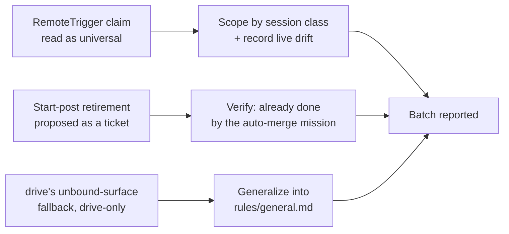

# work-20260810-203952

## 1. Overview

Closed out three loose backlog tickets, all born from the same class of finding: a claim that held for one session class, or one command, was being read (or restated) as if it held everywhere. Scoped the `RemoteTrigger` tool-surface finding by session class and recorded the live drift it uncovered, confirmed the retired start-notification posts had already been reconciled by the auto-merge mission, and generalized `/drive`'s unbound-skill-surface fallback into a rule every unattended entry point can reach.

**Highlights:**

1. `workaholify`'s "no `RemoteTrigger`-family tool" claim now names the session class it was measured in (unattended, routine-fired) and links to the attended-session finding that contradicts it, plus the live drift both routine records have accumulated
2. One ticket needed no code change: the auto-merge mission had already retired the `📐 Proposing`/`🟠 Implementing` start posts before this ticket was driven
3. `plugins/workaholic/rules/general.md` now states the unbound-skill-surface fallback once, generally, with `/drive` pointing at it instead of carrying the only copy

## 2. Motivation

All three tickets trace back to the same live session on 2026-08-10 that measured `RemoteTrigger` present on an attended session's tool surface — the opposite of what `workaholify`'s prose stated unconditionally. That single measurement produced two follow-on tasks (scope the claim, generalize the fallback pattern already applied to `/drive`), and a third ticket surfaced independently from the same day's notification-shape cleanup, arriving after the auto-merge mission had already superseded it.

## 3. Changes

Three independent doc-drift fixes, batched because they touch overlapping surfaces (`workaholify`, `CLAUDE.md`, `drive`'s always-loaded rules) rather than because one depends on another.

### 3-1. Scope the RemoteTrigger session-class claim and record the live routine drift ([881dcf34](https://github.com/qmu/workaholic/commit/881dcf34))

Reworded every unqualified "no `RemoteTrigger`-family tool is exposed to a session" claim in `workaholify/SKILL.md`, `commands/setup-routines.md`, `render-setup-sheet.sh`'s rendered output, and `CLAUDE.md`'s `/workaholify` row to name the session class (unattended, routine-fired) it was measured in, and added a dated addendum to `workaholify/reference/routines.md` recording the contradicting attended-session finding plus the live drift both routine records have accumulated (empty `cron_expression`, stale prompts).

### 3-2. Retire the start notifications, routines post the finish only ([e56559ad](https://github.com/qmu/workaholic/commit/e56559ad))

Verified against the ticket's own acceptance criteria that the auto-merge mission's PR (`359baaa9`) had already retired the `📐 Proposing`/`🟠 Implementing` start posts from both routine templates and `workaholic:notify` before this ticket reached the front of the queue. No code change; archived with a Final Report citing the superseding commit.

### 3-3. State a general fallback rule for an unbound skill surface ([f6348753](https://github.com/qmu/workaholic/commit/f6348753))

Added the general rule to `plugins/workaholic/rules/general.md` ("An unbound skill surface is not, by itself, a reason to stop"), with its two named exceptions, and pointed `/drive`'s existing `unbound_in_claude_session` prose at it while keeping the command-specific detail in place. Cross-referenced from `check-deps/SKILL.md`, `workaholify/SKILL.md`, and `CLAUDE.md`'s `/workaholify` row.

## 4. Outcome

All three tickets closed. `node scripts/build-plugins/build.mjs`, `verify.mjs`, and `validate-metadata.mjs` pass clean against the rebuilt `outputs/workflows/`; `node scripts/test-workflow-scripts.mjs` reports 2468 passed, 0 failed; `bash plugins/workaholic/hooks/layout-doctor.sh .` reports `conforming: true`.

## 8. Notes

This session's `check-deps/scripts/check.sh` reported `unbound_in_claude_session: true` — the very condition ticket 3 generalizes a fallback rule for. Every script in this run was invoked on its checkout-relative path rather than `${CLAUDE_PLUGIN_ROOT}`. Of the 109 open deferred concerns surveyed, none named a topic this narrow, documentation-only branch touches (`RemoteTrigger`, `unbound_in_claude_session`, the retired start-post shapes) — none were judged `resolved`.
