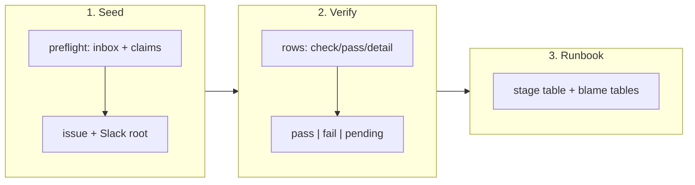

## 1. Overview

The propose–implement loop can now be exercised on demand instead of being tested by its
own hourly failures. One operator script seeds a drill pair, reports its residue, recovers
an aborted run and prints a machine verdict per stage; one runbook covers seed to pass.

**Highlights:**

1. `scripts/e2e/loop-drill.sh` — `seed` / `status` / `reset` / `verify-propose` / `verify-implement`, one JSON line per outcome
2. Three verdicts with distinct exit codes: `pass` (0), `fail` (1), `pending` (5) — a stage nobody fired has not failed
3. `docs/loop-drill-runbook.md` maps every named abort reason of both routines to the one file to read

## 2. Motivation

Measured 2026-08-12, a discovery regression cost a full day of `[Propose]` ticks before a
human read the logs. There was no way to *provoke* a run: seeding an ask meant a
hand-built issue, a hand-written Slack post and afterwards an audit of stray branches,
and "did it work" was answered by reading a session transcript.

The repository already treats artifacts as the only verdict everywhere else — the claim
oracle is unmerged branches, ownership is `assignees`, mission progress is computed. The
drill extends that stance to the loop's own testing, and never reads a transcript, which
records what a run *believed*.

## 3. Changes

Seeding and abort-recovery collapse into single invocations; the two verify stages turn
each routine fire into a machine verdict; the runbook is what an operator follows.

### 3-1. Add the loop drill script (seed / status / reset) ([c44cf032](https://github.com/qmu/workaholic/commit/c44cf032))

`seed` refuses loudly when the drill would be polluted — an open assigned issue would be
taken as the ask (discovery has no title filter), or an unmerged `work-*` branch is both
a live claim and a dedup ref — then mints a marked, assigned issue and the Slack root
carrying its URL verbatim. `reset` recovers an *aborted* run only: it touches nothing it
cannot prove it minted, and never writes under `.workaholic/`.

### 3-2. Add drill verify subcommands for each stage ([492a3992](https://github.com/qmu/workaholic/commit/492a3992))

`verify-propose` and `verify-implement` emit one `{check, pass, detail, bearing}` row per
artifact. Load-bearing rows read the artifacts; Slack rows are advisory and can never
decide a stage. A missing artifact is a failing row naming the ref it expected, not a
script error.

### 3-3. Write the loop drill runbook ([1fbf9bae](https://github.com/qmu/workaholic/commit/1fbf9bae))

`docs/loop-drill-runbook.md` carries the stage table, the cron race windows, the row and
verdict contract, two failure-reason→file blame tables, the abort playbook, and the
residue policy. `CLAUDE.md` and `README.md` name it in the same commit.

## 4. Outcome

The loop is drillable end to end from one command set and every stage answers in JSON.
The mission's three criteria are ticked by their tickets; the **live** two-pass drill is
the operator's to run.

## 5. Concerns

### The live drill cycle has never been run end to end

- **Severity:** moderate
- **Description:** Every check here is hermetic (stub `gh`/`qfs`, a bare local origin). No `seed` → fire → `verify` → fire → `verify` pass has run against real GitHub and real routines, so the REST shapes and the `qfs` mount are assumed correct, not observed (see [c44cf032](https://github.com/qmu/workaholic/commit/c44cf032) in `scripts/e2e/loop-drill.sh`)
- **How to Fix:** An operator runs one full pass on a clean base and files what diverges; the first pass is itself the acceptance evidence.

### Empty middle fields in tab-separated reads are unguarded elsewhere

- **Severity:** moderate
- **Description:** A TAB is an IFS *whitespace* character, so `while IFS="$TAB" read -r …` collapses a run of tabs and shifts every field after an empty one. This bit `read_pulls` (an unmerged pull request's empty `merged_at`); other TSV readers in the plugin escape it only by never emitting an empty middle field (see [492a3992](https://github.com/qmu/workaholic/commit/492a3992) in `scripts/e2e/loop-drill.sh`)
- **How to Fix:** Adopt the `-` sentinel convention in every `@tsv` producer whose middle fields can be empty, or state the rule in `rules/shell.md` so the next reader does not rediscover it.

## 6. Successful Development Patterns

- Asserting a script's *refusals* hermetically and deferring its happy path to a live run: the refusals are what a live drill cannot rehearse safely, and they are where the destructive mistakes live.
- Letting the script correct the test: the first seed test asserted a re-seed succeeds; the script refused it, and the refusal was right — a pass is finished by its issue closing, not by the drill.
- Proving ownership from a branch's *diff* rather than a naming convention, so `reset` can delete its own residue and provably skip a colleague's claim.

## 7. Notes

The `size` scan finding is the per-commit added-lines rule (514 and 720, ceiling 500) —
each commit carries a script plus its hermetic tests. It is the overridable tier and an
unattended run has no override, so this unit is demoted to the PR path.
