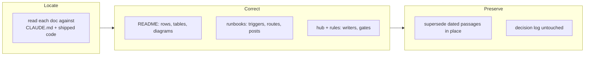

## 1. Overview

The documentation was brought back onto the shipped behavior across four surfaces — the
root README, the two operator runbooks, the artifact hub every consuming repository
inherits, and the rules loaded into every session. Prose only: no command, skill, script
or hook changed.

**Highlights:**

1. `/propose` is documented as clock-fired and self-discovering, and its pull request as merging on opening — the human merge is no longer the approval seam anywhere.
2. `/setup-routines` is documented as configuring the routines, with the copy-paste sheets demoted to the `no_transport` refusal's recovery path.
3. Two dated decision passages were marked superseded in place rather than rewritten, so the record of what was decided when survives the correction.

## 2. Motivation

Documentation drift is a defect here rather than an untidiness: `rules/*.md` is loaded into
every session's context and `.workaholic/README.md` ships to every consuming repository, so a
wrong statement in either is executed rather than merely read. The runbooks carry the sharper
version — they are what an operator opens when a loop misbehaves, under time pressure.

Three changes had landed without their documents: proposal and implement pull requests began
auto-merging on opening with quality gated at the `release/*` QA window (2026-08-11), the start
post was retired the same day, and `/setup-routines` became a configurator. Each document had
drifted in patches rather than wholesale, which is why every ticket made locating the drift its
first step instead of searching for a phrase.

## 3. Changes

Walking each document against `CLAUDE.md` rather than grepping for the drift phrase paid off
twice: one proposal-time claim was not drift at all, and six unlisted contradictions surfaced.
Dated passages were superseded in place, so both genres these files mix — operator procedure and
dated record — survive.

### 3-1. Correct outdated statements in the root README ([25ab7e16](https://github.com/qmu/workaholic/commit/25ab7e16))

Corrected the `/propose`, `/drive` and `/setup-routines` command rows, the feedback-driven
use case and its mermaid edge label, three rows of the artifact lifecycle table, and the full-map
legend. The `/mission` approval-by-merge statements were confirmed still correct and left alone.

### 3-2. Align the docs runbooks with the shipped loops ([28469203](https://github.com/qmu/workaholic/commit/28469203))

Reframed both runbooks around the hourly routines, with the server cron named as the
machine-local fallback it now is; corrected the claim that the loop merges nothing a policy did
not authorize, and replaced the retired start-and-finish posts with the single finish line.

### 3-3. Update the artifact hub and rules docs ([3eda5354](https://github.com/qmu/workaholic/commit/3eda5354))

Added `/propose` to the feedback stream's writers, corrected three clauses of the missions
paragraph against their scripts, and closed two gaps in the always-loaded rules: the OKF `type:`
floor was undocumented, and the list of commands allowed to commit omitted five of them.

## 4. Outcome

The mission stands at 3/3, all acceptance criteria met. The four surfaces now agree with
`CLAUDE.md` and the shipped code on the loop's triggers, merge seams, writers and gates;
`docs/loop-engineering-workflow.md` was deliberately not touched.

## 5. Concerns

### The okf skill contradicts every other source on ticket frontmatter

- **Severity:** moderate
- **Description:** `plugins/workaholic/skills/okf/SKILL.md:15` states tickets carry `type: enhancement|bugfix|refactoring|housekeeping`, while `CLAUDE.md`, `.workaholic/README.md`, `validate-ticket.sh` and every shipped ticket say tickets carry no `type:` (see [3eda5354](https://github.com/qmu/workaholic/commit/3eda5354) in `plugins/workaholic/rules/workaholic.md`)
- **How to Fix:** Ticket `20260813081500-reconcile-the-okf-skill-s-ticket-type-claim.md` is queued for it; its first step confirms the direction of the error, since the reverse reading would be a schema change rather than a prose fix.

### The bound validate-ticket hook enforced a layout retired in August

- **Severity:** low
- **Description:** The harness bound plugin 1.0.133 while the registry and checkout were at 1.0.176, so the active `validate-ticket.sh` rejected a flat `todo/` path and demanded the per-user `todo/<user>/` layout retired by P2 on 2026-08-06; the same hook from the resolved source accepts the file (see [3eda5354](https://github.com/qmu/workaholic/commit/3eda5354) in `.workaholic/tickets/todo/`)
- **How to Fix:** No repository-side fix — the drive skill already documents that a degraded run does not repair its bound hooks. Recorded so the next reader of a spurious hook refusal in this state checks the resolved `src`'s copy before working around it.

## 6. Successful Development Patterns

- Locating drift by reading each document against the reference beat grepping for the drift phrase: `docs/proposal-loop-runbook.md` was correct about the clock in §3 and wrong about it in its opening paragraph 55 lines earlier, so a phrase-level replacement would have produced a self-contradicting page.
- Treating a proposal-time list as evidence to confirm rather than a work list to apply caught one non-drift (`/ticket` and `/mission` PRs keep their human merge; only `/propose` and `/implement` auto-merge) and left six unlisted contradictions to find.
- Superseding a dated passage in a blockquote that keeps its original claim, date and reasoning let a wrong retraction be corrected without erasing the fact that it was made.

## 8. Notes

The runbooks' failure-mode tables aged far better than their prose: each row is keyed to a
machine-emitted string (`no_token`, `shallow: true`), so it goes stale only when that string
changes. What rotted were narrative claims about when something fires or who approves it — facts
with no string behind them, and so nothing to fail when they changed.
