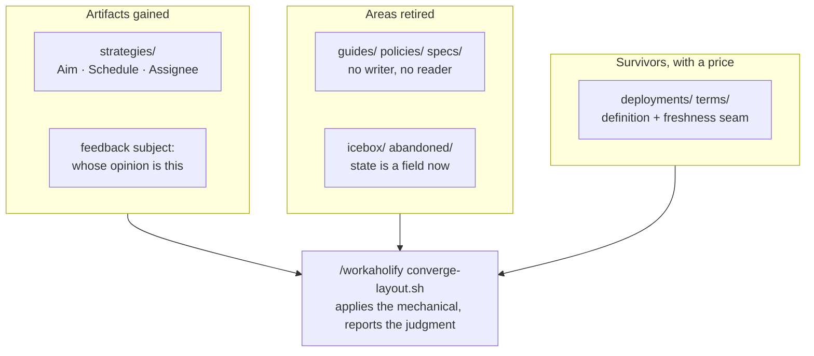

## 1. Overview

Issue #436's six asks reshape `.workaholic/` around one rule: **an area earns its place by having a writer and a reader.** `Strategy` returns as a bounded, dated, owned artifact; feedback records name whose opinion they carry; the three documentation areas nothing maintained are retired; the two hand-maintained survivors get definitions and a staleness seam; ticket state becomes a field instead of a directory; and `/workaholify` converges any repository onto the result.

**Highlights:**

1. `strategies/` is back with a different definition — the retirement's reasoning is answered, not reverted — and the migration that would have silently deleted it is unwired.
2. `guides/`, `policies/` and `specs/` are gone: 17 of their 20 files still described an architecture retired five months earlier, and nothing ever said so.
3. `tickets/` is two-state; `deployments/` and `terms/` have definitions and a check that reports when a record names something the project no longer has.

## 2. Motivation

Issue #436 reads as six unrelated housekeeping asks. Driving them together made the common thread visible: every part of `.workaholic/` that had drifted had drifted for the same reason — **nothing read it.** The allowlist's own header named `guides/` and `policies/` as conventional exceptions to the rule that every area is created or read by a live script, and those exemptions are precisely where five months of silent rot accumulated. `terms/`, the surviving area with no reader, is in the same state today.

The other half of the ask is the mirror image. A `Strategy` was retired in July because two homes for direction would drift, and the ask wants it back — so the work was to state a definition that cannot drift against the feedback stream (outbound-decided versus inbound-said, linked one way) rather than to revert a decision. The same for `subject:` on a feedback record: `source` said which channel and `author` said who ran the capture, and since routines write most of the stream, nothing recorded whose opinion anything was.

## 3. Changes

Two artifacts gained a definition, four areas lost one or changed shape, and one command carries every consuming repository across.

### 3-1. Revive the Strategy artifact ([816f9b1a](https://github.com/qmu/workaholic/commit/816f9b1a))

`Strategy` returns as a flat `strategies/<slug>.md` carrying an **Aim**, a **Schedule** (`target_date`) and an **Assignee** (non-empty `assignees` — the one artifact where empty is a refusal). The `strategy:` mission relation and its ownership hop did **not** return, and `migrate-strategies.sh` plus its `resolve.sh` seam — which erased `strategies/` on every mission-script touch — were unwired before anything could be written into the area.

### 3-2. Record the subject that formed each feedback ([c5dd80f8](https://github.com/qmu/workaholic/commit/c5dd80f8))

Every new feedback record names its subject as `<kind>[:<identity>]` over a closed kind set with a free-text identity. `create.sh` takes it as the `--subject` **option**, so the positional contract every caller quoted did not move, and **refuses** rather than default it — a default would record every opinion in the project as the runner's.

### 3-3. Retire the policies guides and specs areas ([8137f897](https://github.com/qmu/workaholic/commit/8137f897))

The three areas left the repository, the allowlist and the rules table in one commit. The content was deleted rather than relocated on evidence: 17 of 20 files carry 13–45 references each to the retired three-plugin architecture and none has been touched since 2026-05-14. The `"docs" → specs/` request mapping now points at the repository's own `docs/` tree.

### 3-4. Define the deployments and terms areas ([4f5def30](https://github.com/qmu/workaholic/commit/4f5def30))

Each survivor's rules-table row is now a definition — what it holds, what it never holds, who writes it, when it is refreshed — matched by its README, with `type: Deployment` / `type: Term` on the records. `report/scripts/area-freshness.sh` is the upkeep seam: it reports days since last commit and whether a record still names something the repository retired, and it never writes.

### 3-5. Fold ticket states into the archive ([187e028d](https://github.com/qmu/workaholic/commit/187e028d))

`tickets/` holds `todo/` and `archive/` only; a ticket's state is its `status:` field — absent means queued, `done`/`abandoned`/`icebox` mean archived with that outcome. The seven parked tickets moved into the synthetic `archive/unbranched/` with bodies byte-identical, and every enforcement layer and reader still tolerates the retired directories so the migration converges rather than gates.

### 3-6. Converge the layout through workaholify ([8dfb8542](https://github.com/qmu/workaholic/commit/8dfb8542))

`/workaholify` gained `converge-layout.sh`: doctor, apply the mechanical migrations, doctor again, report the delta. It **composes** the existing migration entry points rather than reimplementing them, **stages and never commits**, and reports every judgment it will not make — a retired documentation area, a legacy nested strategy tree, a fold that could not complete.

### 3-7. Re-read the stale terms glossary ([2475e3b4](https://github.com/qmu/workaholic/commit/2475e3b4))

The freshness seam added by 3-4 flagged five of six `terms/` records on its first run, and this drives the ticket that finding minted. All five were rewritten against the shipped system rather than patched, and every retired name — namespaces, areas, agent tiers, commands, workflow concepts — moved into a new `terms/retired-terms.md` with dates and successors. Concentrating them in one deliberately-flagged record is what keeps the seam's blunt name check readable: one expected flag, so any other is a real defect. The conflict ledger dropped from twenty-two entries to the seven that are live today.

## 4. Outcome

`.workaholic/` now holds ten areas, every one of which some script writes or reads, and each hand-maintained survivor carries a definition plus a check. `layout-doctor.sh` reports `conforming: true` with zero findings; the suite is green at 2590 assertions, up 122 from the branch point. The glossary the reshape kept now describes the system the reshape produced: `area-freshness.sh` reports one flagged record out of seven, and that one exists to name the retired vocabulary.

## 5. Concerns

### The retired areas' content survives only in git history

- **Severity:** low
- **Description:** The 20 deleted files were judged stale by measurement, not read line by line (see [8137f897](https://github.com/qmu/workaholic/commit/8137f897)). If any sentence in them was still true and recorded nowhere else, it is now recoverable only via `git log --follow`.
- **How to Fix:** Nothing proactive. If a gap surfaces, recover the specific file from history into the repository's own `docs/` tree rather than restoring the area.

## 6. Successful Development Patterns

- **Measure before honouring a precedent.** "Knowledge survives structure" is this repository's retirement rule, and applying it turned on whether the content *was* knowledge — counting retired-architecture references per file answered in minutes what a debate would not have.
- **Make the new floor tolerate the old shape.** Every layer touched here still accepts the retired directories, which is what keeps a migration convergent instead of turning it into a gate for repositories whose plugin updates before their tree.
- **Let a seam measure the problem it was built for.** `area-freshness.sh` flagged 5 of 6 `terms/` records on its first run against real data — a demo, the evidence for the follow-up ticket, and then the before/after measurement for driving it, with no fixture involved.
- **Arrange the data so a blunt check stays right.** The name check cannot tell "defines a retired thing" from "records that a thing was retired", and the ticket offered a script marker as the remedy. Concentrating the retired vocabulary in one record made the remedy unnecessary: one expected flag beats a special case in the tool.

## 7. Release Preparation

**Verdict**: Ready for release

- **Concern:** The branch-safety scan blocks on two overridable `size` findings (160 files > 100; commit `816f9b1a` at 623 added lines > 500). Both are inherent to a seven-ticket mission that adds a skill, two hooks and three scripts while regenerating `outputs/`; neither is a secret or a leak. The unattended executor cannot override either, which is why this pull request is open rather than merged.
- **Before release:** A human overrides the two `size` findings, or accepts them as the cost of shipping the mission as one merge.
- **After release:** Nothing outstanding. The minted `terms/` content ticket was driven on this branch (3-7), so the freshness seam reports exactly the one flag it is designed to report.

## 8. Notes

The 109 open deferred concerns were left `still_active`: none is resolved by this branch's changes, and the judge prefers `still_active` when in doubt because a false `resolved` loses institutional memory.
