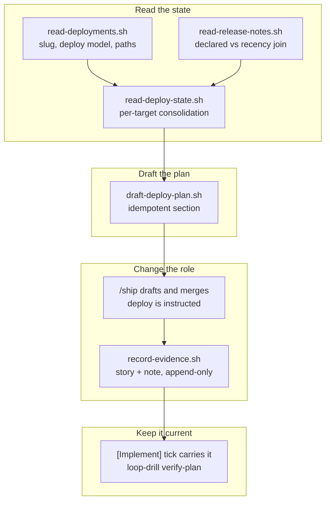

## 1. Overview

`/ship` no longer deploys. It drafts a **deployment plan** into the Release Note — per
target, what is waiting to deploy and the verification required — and merges; the
developer reads it and instructs the deploy, which records its result back into that note.

**Highlights:**

1. A per-target consolidation that reports the strength of every answer it gives
2. A `## Deployment Plan` section that is idempotent by contract, so an hourly carrier commits nothing
3. The pre-merge production confirmation relocated to the `release/*` window — stated, not dropped

## 2. Motivation

`main` became the continuously auto-merged development branch, so a merge stopped meaning
a deployment — but `/ship` still deployed pre-merge and gated the merge on that
confirmation, the last per-unit rule contradicting the release-tier doctrine. Issue #438
asked for the replacement.

The pieces existed, facing the wrong way: `read-deployments.sh` knew how to deploy a
target but nothing about what was pending, 96 release notes had no reader at all, and the
unreleased range was derived only inside `record-release-cut.sh`, for a whole batch.

## 3. Changes

Three readers were built before anything was written, one writer before the doctrine
moved, and the carrier last — because a refresh can only be scheduled once it is proven to
be a no-op against an unchanged base. The doctrine change is the middle ticket and the one
a reviewer should read first: it renegotiates a rule the ship skill calls "none optional",
and the tickets around it are mechanical by comparison.

### 3-1. Consolidate per-target deploy state ([e10cad8f](https://github.com/qmu/workaholic/commit/e10cad8f))

Added one read-only script returning, per `Deployments` target, its contract, its latest
release note and the merged-but-unreleased commit range. Both open decisions — how a
commit is attributed to a target, and what "the latest note" means with no target field —
were resolved by reporting the answer's strength (`attribution`, `note_match`) rather than
hiding a default that happens to work with one target.

### 3-2. Add a deployment plan section to the Release Note ([4338c6d6](https://github.com/qmu/workaholic/commit/4338c6d6))

Gave the note a second tense. The prospective `## Deployment Plan` sits beside the
retrospective narrative, references the target record's procedure and confirmation rather
than copying them, and carries no clock — its datum is the base's commit sha, which is
what makes a re-run byte-identical.

### 3-3. Make ship draft the plan instead of deploying ([16fb7a20](https://github.com/qmu/workaholic/commit/16fb7a20))

Replaced `/ship`'s deploy step with the drafting phase and made deploying a separate,
instructed act no unattended caller can reach. The merge is no longer gated on an executed
production confirmation; that evidence moved to the `release/*` window, which is now the
production gate rather than a second opinion.

### 3-4. Record the verification method and its report ([8c293c20](https://github.com/qmu/workaholic/commit/8c293c20))

Extended the existing evidence writer to fill the note as well as the story, appending one
block per attempt. `not_run` joined the status set so "we could not check" stays
distinguishable from "we checked and it was wrong".

### 3-5. Keep the deploy plan draft current periodically ([9058f405](https://github.com/qmu/workaholic/commit/9058f405))

Resolved the carrier question without a third routine: the refresh rides `[Implement]`'s
existing hourly tick through `/ship`'s drafting phase, commits nothing to `main` outside a
merge, and is provable on demand with `loop-drill.sh verify-plan`.

## 4. Outcome

`/ship` drafts and merges; deploying is instructed. The plan is idempotent, the degraded
read writes nothing, the verification lands in the same document as the plan that asked
for it, and the whole refresh is verifiable in seconds rather than by waiting an hour.
The two-routine rule survived intact.

## 5. Concerns

### The plan refreshes only when an auto unit ships

- **Severity:** moderate
- **Description:** The refresh carrier is `[Implement]`'s tick reaching `/ship`, which only `auto` units do. A repository whose units are all `review` — including this one today — sees the plan refreshed rarely (see [9058f405](https://github.com/qmu/workaholic/commit/9058f405) in `CLAUDE.md`). The limit is written down rather than dropped, but "kept up to date by managed agents" holds to a narrower extent than the ask implies.
- **How to Fix:** Either record `merge_policy: auto` where it is genuinely wanted, or take the developer's ruling on whether a plan refresh on `main` deserves its own surface — the option this run declined to take on its own.

### The pre-merge production gate is gone before the release window is exercised

- **Severity:** moderate
- **Description:** `/ship` no longer executes a production confirmation before merging, and the `release/*` window is now the only production evidence (see [16fb7a20](https://github.com/qmu/workaholic/commit/16fb7a20) in `plugins/workaholic/skills/ship/SKILL.md`). `.workaholic/releases/` is empty — no release window has ever been cut in this repository, so the gate that inherited the responsibility has never run.
- **How to Fix:** Cut one `release/*` window and run its confirmation end to end before relying on the new arrangement in anger.

### The verification recording has no live run behind it

- **Severity:** low
- **Description:** Every property of the note's `## Deployment Verification` block is covered hermetically, but the ticket's own verification asked for a live `gh release view v<version>` recording against `marketplace` (see [8c293c20](https://github.com/qmu/workaholic/commit/8c293c20) in `plugins/workaholic/skills/ship/scripts/record-evidence.sh`). An unattended run has no instruction to deploy, and `/ship` deliberately can no longer start one.
- **How to Fix:** Record the first real instructed deployment through the new sixth argument and check the block reads correctly for a deploy-on-merge target's split confirmation.

## 6. Successful Development Patterns

- Resolving an "unrecommendable" fork by **reporting the answer's strength** (`attribution`, `note_match`) instead of picking a default — it kept the decision honest without blocking on a human, and gives a multi-target repository a clean upgrade path.
- Proving idempotence *before* choosing a carrier, as the last ticket's first step demanded — the self-referential `targets:` bug would otherwise have been discovered as an hourly commit stream.
- Reproducing only the seams that can be reproduced safely, and saying which ones were not — the doctrine change was verified where verification was possible rather than claimed wholesale.

## 7. Release Preparation

**Verdict**: Ready for release

- **After release:** Cut a `release/*` window and exercise its confirmation, which is now the only production gate.

## 8. Notes

The mission carried its ticket set from `/propose` with provisional acceptance criteria;
all three are met and ticked. The layout advisories `layout-doctor.sh` reports concern
legacy `.workaholic/trips/` naming and predate this branch.
